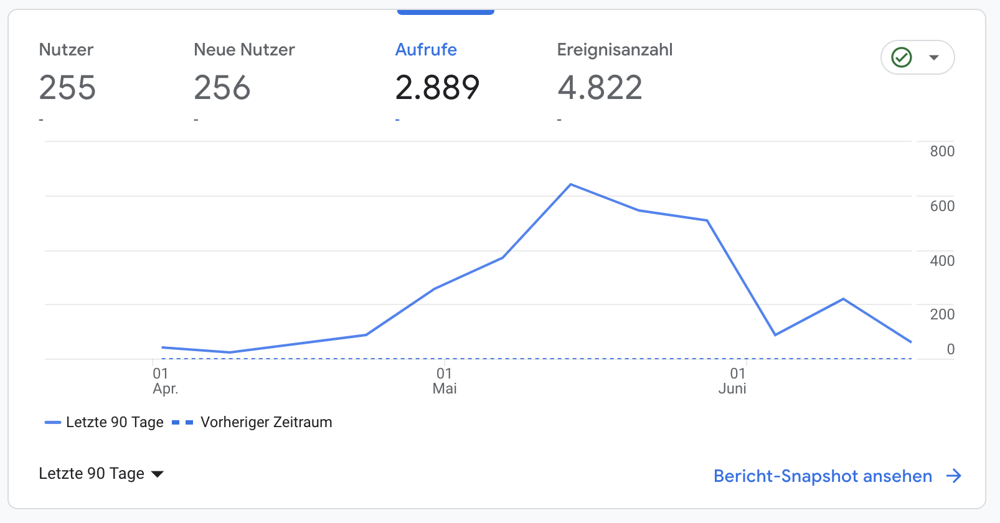

# Polkadot.study Report May/June 2023

The framework for the aimed developer platform has been set as stated in the
proposal 🎉 and has since gained some traction. I have received much positive
feedback from different developers in the ecosystem and made two collaborations
with other w3f grantees (rusty crewmates) as well as the treasury grantee
substrate in bits and integrated them into polkadot.study for more visibility.

I have created a SEO optimized developer tutorial platform that has proven to
offer a simple process for developers to write their tutorials, following the
Tutorial
[How to Write a New Tutorial on polkadot.study](https://polkadot.study/docs/authors/new-tutorial-on-polkadot-study/intro),
that I created for the purpose of making authors lives as easy as possible.
There are 255 unique users in the last 90 days wich is okay for the current
situation and the age of the platform i would say.

During the process I have reviewed all tutorials on github or via mail and
chatted to all authors and provided help with all issued that occured.

The process of aquiring 10 funded authors was harder than anticipated, but I am
confident that the missing 4 tutorials will be written eventually. Of course I
will not keep the treasury funds to myself but wait some more months as I am
sure that I will find interested developers who are willing to write for
polkadot.study.

I will continue working on polkadot.study until the 10th tutorial is published
and all the granted money for tutorial writing was sent to the authors.

See the old reports for detailed information about the development. And at the
bottom of this report ideas for future development of polkadot.study

## Tutorials

### Completed: 4/10

- [Tokengated Website with polkadot.js and next-auth](https://polkadot.study/tutorials/tokengated-polkadot-next-js/intro)
- [Basic Wallet with Polkadot.js API and React with TypeScript.](https://polkadot.study/tutorials/wallet-with-polkadot-js-and-react-with-typescript/intro)
- [Example of usage Inherent Extrinsics on top of node-template + tutorial on Inherents](https://github.com/PolkadotStudy/polkadot.study/issues/15)
- [Add your parachain to the Polkadot Vault (aka Parity Signer)](https://github.com/PolkadotStudy/polkadot.study/issues/6)

### Being Worked On: 2/10

- [Kitties Tutorial Part 2](https://github.com/PolkadotStudy/polkadot.study/issues/8)
- [Decentralized Exchange - smart contract in ink!](https://github.com/PolkadotStudy/polkadot.study/issues/17)

### Grants Available: 4/10

- [Add your parachain to the Polkadot Vault (aka Parity Signer)](https://github.com/PolkadotStudy/polkadot.study/issues/6)

### Being Worked On: 2/10

- [Kitties Tutorial Part 2](https://github.com/PolkadotStudy/polkadot.study/issues/8)
- [Decentralized Exchange - smart contract in ink!](https://github.com/PolkadotStudy/polkadot.study/issues/17)

### Stated Interest 2/10

Two external authors have stated their interest in writng a tutorial, I am in
contact with them.

### Grants Available: 4/10

There are still 4 grants à ~1400USD available for authors of tutorials.

## Accounting

Completed payments for 4 tutorials that are finished and one partially payment
for a started tutorial. All payments are documented on the
[github issue of the respective tutorial](https://github.com/PolkadotStudy/polkadot.study/issues?q=is%3Aissue+label%3A%22%F0%9F%93%8B+New+Tutorial%22+).

## Miscellaneous

- Update Issue template to include a self set deadline for authors for
  accountability
- Added Grill.chat https://grill.chat/polkadot-study
- Contacted WagMedia for first thoughts on decentralization options concerning
  payments for authors / grants / peer reviews
- Tweeted the finished tutorials
- helped authors setup the dev
- reviewed tutorials
- substrate in bits automation
- Tweeted every finished tutorial: https://twitter.com/niftesty
- Sent collab question mail to 12 parachain teams (2h)
- collaborated with Substrate in Bits to release their content on polkadot.study
  (7h)
- Tweet about released tutorials on my account (2h)

## Future

It is likely that the 10 tutorials will not be finished until the end of the
timeframe set for the completion of polkadot.study. However I a

I will not start a new proposal about the remaining funds of **299KSM** until
that milestone of 10 tutorials is completed. As a compensation of the delay I
already put more time into advertising the project than initially intended:

- Sent collab question mail to 12 parachain teams (2h)
- collaborated with Substrate in Bits to release their content on polkadot.study
  (7h)
- Tweet about released tutorials on my account (2h)
- Include

- # write a blog post for the alumni blog
  I soon will write a blog post for the polkdot blockchain academy alumni blog
  and publish it on twitter.
