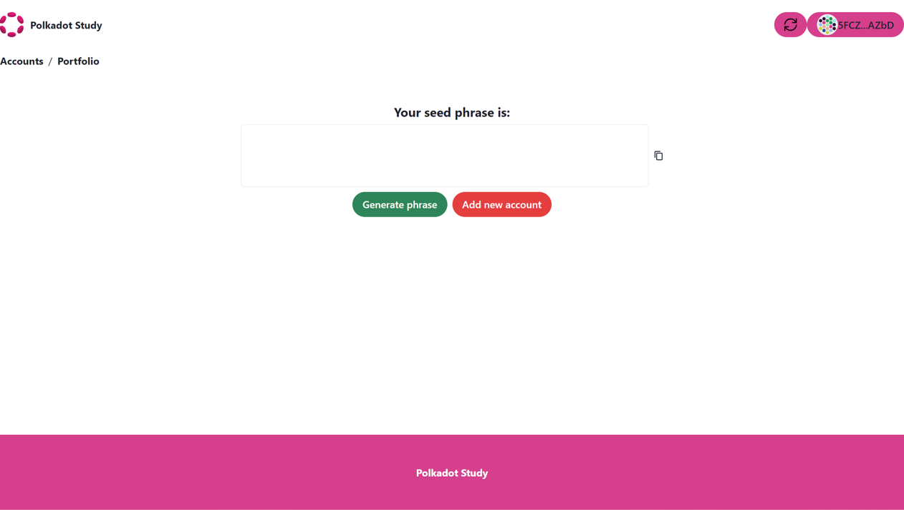
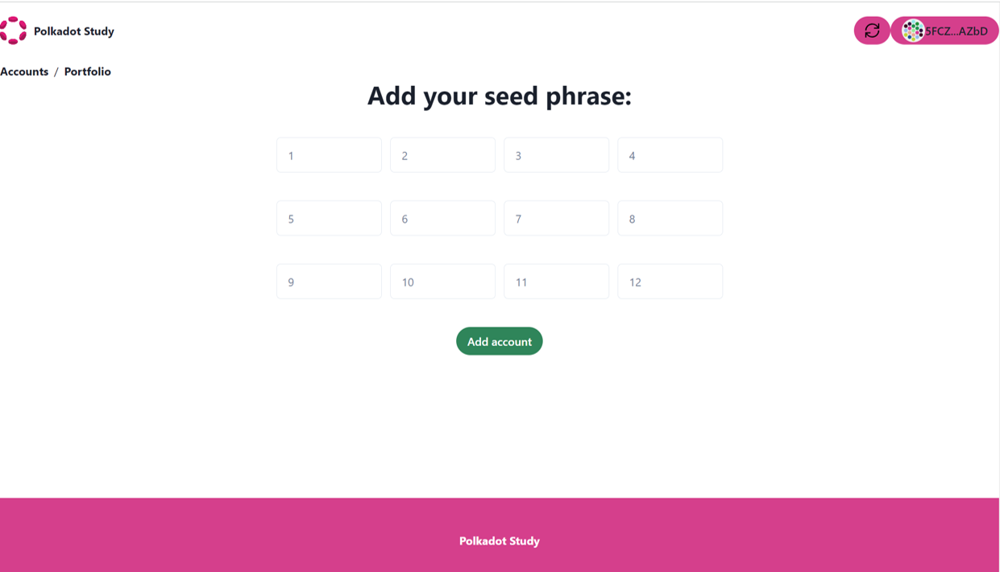

# Create a graphical interface for Wallet with TypeScript.


In this tutorial we will build a graphical user interface using the Chakra UI library and Polkadot-js API in a React Typescript project. Chakra is a React UI component library designed to provide a high-quality and scalable user experience. With Chakra, developers can build stunning and customizable user interfaces using prebuilt and custom components. Chakra is an open-source library and can be used for free in both commercial and non-commercial projects.

To create a React project with Chakra UI library and Polkadot-js API, you can follow these steps:

1. Create a new React project using Create React App with a TypeScript template  by running the following command in your terminal:

```bash

npx create-react-app my-wallet --template typescript
```

his will create a new React project called "my-wallet" in your current directory.

## Install Polkadot-js API

2. Install Polkadot JS API using the following command:

```bash
cd my-wallet
yarn add @polkadot/api

```
## Install Chakra UI

3. Next, you can change to the project directory and install Chakra using npm or yarn:


```bash
npm install @chakra-ui/react @emotion/react@^11 @emotion/styled@^11 framer-motion@^4
```
Or, if you're using Yarn:


```bash
yarn add @chakra-ui/react @emotion/react@^11 @emotion/styled@^11 framer-motion@^4
```
These commands will install Chakra and its dependencies in your React project.

4. After installing Chakra UI, you need to set up the ChakraProvider at the root of your application. This can be either in your index.tsx, index.tsx or App.tsx depending on the framework you use.

```ts

import * as React from 'react'

// 1. import `ChakraProvider` component
import { ChakraProvider } from '@chakra-ui/react'

function App() {
  // 2. Wrap ChakraProvider at the root of your app
  return (
    <ChakraProvider>
      <TheRestOfYourApplication />
    </ChakraProvider>
  )
}

```

5. Once Chakra has been installed, you can import Chakra components into your project and start using them. For example, you can import the Button component and use it in your component like this:
```ts

import { Button } from "@chakra-ui/react";

function MyButton() {
  return <Button colorScheme="blue">Click me</Button>;
}

```
This will create a blue button with the text "Click me". Now, you can continue exploring Chakra's  (https://chakra-ui.com/) and use its components to create a stunning and scalable user interface in your React project.


## Basic concepts.

In cryptography, a **seed phrase** is a string of words used to generate private keys in a cryptocurrency wallet. The seed phrase is essentially a master password that allows the user to access their private key and, therefore, control their funds.

In Polkadot.js API, asymmetric cryptography is used to securely send and receive transactions on the Polkadot network. Public and private keys are used for this purpose. The **private key** is used to sign transactions, while the **public key** is used to verify the authenticity of the signed transactions.

To create a private key in Polkadot.js API, the user first generates a seed phrase using a cryptography algorithm. From the seed phrase, the private key and public key are derived. The private key is kept secret and used to sign transactions, while the public key is shared with other users to verify the authenticity of the signed transactions.


## Create Wallet project.


In this tutorial we will build 3 basic GUI components for a wallet using the Chakra UI and Polkadot-js API, in this first step we will create the graphical interface using the Chakra UI library and in the next section we will add functionality with the Polkadot-js API. these components will be:

**Newaccounts: Create a seed phrase and get public and private keys.**

**Addaccounts: Add an existing seed phrase and get public and private keys.**

**Balances: we will obtain the network balances in a GUI component.**


### 1. Create a new seed phrase and get public and private keys.

The first component that we will create will have the purpose of creating a seed phrase and obtaining the associated public and private keys.

To create this component we will first import the UI components in the Chakra UI library, you can import the components and use it in your component like this:


```ts
import React from 'react';
import { 
    Heading,
    Center,
    Box,
    useDisclosure,
    FormLabel,
    FormControl,
    Modal,
    ModalOverlay,
    ModalContent,
    ModalHeader,
    ModalFooter,
    ModalBody,
    ModalCloseButton,
    Button, 
    VStack,
    Input,
    HStack
     } from '@chakra-ui/react';
```
The second step will be to build a function as a component that we will call **Newaccounts** and use the Chakra-ui components:


```ts

function Newaccounts() {
      
    
   
    const { isOpen, onOpen, onClose } = useDisclosure()
    
    const initialRef = React.useRef(null)
    const finalRef = React.useRef(null)
    

    
     return (
    
        <VStack>
        <Heading size="md" className='center' >
            Your seed phrase  is: 
        </Heading>
          <HStack>
            <Input readOnly w="650px" h="100px" inputMode="text" type="text" className='center' value={text} onChange={(e) => setText(e.target.value)}   />
          </HStack>
          <HStack>
            <Button  colorScheme='green'  className='center' borderRadius="20px" >
                 Generate phrase 
             </Button>
            <Button colorScheme='red' onClick={onOpen} className='center' borderRadius="20px" > 
                 Add new account 
            </Button>
          </HStack>
        <Modal
              size="lg"
              initialFocusRef={initialRef}
              finalFocusRef={finalRef}
              isOpen={isOpen}
              onClose={onClose}  
            >
              <ModalOverlay />
              <ModalContent>
                <ModalHeader >
                    Your Public Address is : 
                </ModalHeader>
                <ModalCloseButton />
                <ModalBody pb={8}>
                  <FormControl mt={6}>
                    <FormLabel>
                        Address:
                        {<p> {valueAddress}</p>} 
                    </FormLabel>
                  </FormControl>
                </ModalBody>
                <Center>
                <ModalFooter>
                 <VStack>
                  <Button colorScheme='blue' borderRadius="20px">
                    Add address
                  </Button>
                 </VStack> 
                </ModalFooter>
                </Center>
              </ModalContent>
        </Modal>
            <Box h="270px" w="100%"/>
        </VStack>   
      )
    }
    
    export {  Newaccounts };
```

Finally at this point our component would look like:


```ts
import React from 'react';
import { 
    Heading,
    Center,
    Box,
    useDisclosure,
    FormLabel,
    FormControl,
    Modal,
    ModalOverlay,
    ModalContent,
    ModalHeader,
    ModalFooter,
    ModalBody,
    ModalCloseButton,
    Button, 
    VStack,
    Input,
    HStack
     } from '@chakra-ui/react';

function Newaccounts() {
      
    
   
    const { isOpen, onOpen, onClose } = useDisclosure()
    
    const initialRef = React.useRef(null)
    const finalRef = React.useRef(null)
    

    
     return (
    
        <VStack>
        <Heading size="md" className='center' >
            Your seed phrase  is: 
        </Heading>
          <HStack>
            <Input readOnly w="650px" h="100px" inputMode="text" type="text" className='center' />
          </HStack>
          <HStack>
            <Button  colorScheme='green'  className='center' borderRadius="20px" >
                 Generate phrase 
             </Button>
            <Button colorScheme='red' onClick={onOpen} className='center' borderRadius="20px" > 
                 Add new account 
            </Button>
          </HStack>
        <Modal
              size="lg"
              initialFocusRef={initialRef}
              finalFocusRef={finalRef}
              isOpen={isOpen}
              onClose={onClose}  
            >
              <ModalOverlay />
              <ModalContent>
                <ModalHeader >
                    Your Public Address is : 
                </ModalHeader>
                <ModalCloseButton />
                <ModalBody pb={8}>
                  <FormControl mt={6}>
                    <FormLabel>
                        Address:
                        
                    </FormLabel>
                  </FormControl>
                </ModalBody>
                <Center>
                <ModalFooter>
                 <VStack>
                  <Button colorScheme='blue' borderRadius="20px">
                    Add address
                  </Button>
                 </VStack> 
                </ModalFooter>
                </Center>
              </ModalContent>
        </Modal>
            <Box h="270px" w="100%"/>
        </VStack>   
      )
    }
    
    export {  Newaccounts };
```

The component would look like this:



---
### 2. Add an existing seed phrase and get public and private keys..

The second component that we will build will be able to take 12 words of a seed phrase and generate the associated public and private key.

As in previous component, to create this component we will first import the UI components into the Chakra UI library, you can import the components and use them in your component like this:

```ts
import React from 'react';
import { 
    Heading, 
    Center,
    Box,
    useDisclosure,
    FormLabel,
    FormControl,
    Modal,
    ModalOverlay,
    ModalContent,
    ModalHeader,
    ModalFooter,
    ModalBody,
    ModalCloseButton,
    Button, 
    VStack,
    Input,
     HStack
      } from '@chakra-ui/react';


```

The second step will be to build a function as a component that we will call Addaccounts and use the Chakra-ui components:

```ts

function Addaccounts() {
   
    
    const { isOpen, onOpen, onClose } = useDisclosure()
    
    const initialRef = React.useRef(null)
    const finalRef = React.useRef(null)
    
    
    // We create the variables for the words of the seed phrase.
    let word1;
    let word2;
    let word3;
    let word4;
    let word5;
    let word6;
    let word7;
    let word8;
    let word9;
    let word10;
    let word11;
    let word12;
    
    
    
      return (
    
        <>
  
      <VStack spacing={10} >
    
      <Heading className='center' size="md" >Add your seed phrase: </Heading>
  
      <HStack className='center' spacing={3}>
    <Input id="1" value={word1} type="text"  placeholder='1'  w="150px" h="50px" />
    <Input id="2" value={word2} type="text" placeholder='2' w="150px" h="50px" />
    <Input id="3" value={word3} type="text" placeholder='3' size='md' w="150px" h="50px" />
    <Input id="4" value={word4} type="text" placeholder='4' size='md' w="150px" h="50px" />
    </HStack>
  
    <HStack className='center' spacing={3}>
    <Input id="5" value={word5} type="text" placeholder='5' size='md' w="150px" h="50px" />
    <Input id="6" value={word6} type="text" placeholder='6' size='md' w="150px" h="50px" />
    <Input id="7" value={word7} type="text"  placeholder='7' size='md' w="150px" h="50px" />
    <Input id="8" value={word8} type="text"  placeholder='8' size='md' w="150px" h="50px" />
    </HStack>
  
    <HStack className='center' spacing={3}>
    <Input id="9" value={word9} type="text" placeholder='9' size='md' w="150px" h="50px" />
    <Input id="10" value={word10} type="text" placeholder='10' size='md' w="150px" h="50px" />
    <Input id="11"  value={word11} type="text" placeholder='11' size='md' w="150px" h="50px" />
    <Input id="12" value={word12} type="text" placeholder='12' size='md' w="150px" h="50px" />
    </HStack>
  
    <Button  colorScheme='green' className='center' borderRadius="20px" > 
        Add account
    </Button>
    
    <Modal
            size="lg"
            initialFocusRef={initialRef}
            finalFocusRef={finalRef}
            isOpen={isOpen}
            onClose={onClose}  
          >
            <ModalOverlay />
            <ModalContent>
              <ModalHeader >Your Public Address is : </ModalHeader>
              <ModalCloseButton />
              <ModalBody pb={8}>
                <FormControl mt={6}>
                  <FormLabel>
                    Address:
                   
                  </FormLabel>
                </FormControl>
              </ModalBody>
              <Center>
                <ModalFooter>
                    <VStack>
                        <Button colorScheme='blue' borderRadius="20px">
                            Add address
                        </Button>
                    </VStack>
                </ModalFooter>
              </Center>
            </ModalContent>
    </Modal>
          <Box h="88px" w="100%"/>
    </VStack>
      </>
      )
    }
    
    export {Addaccounts };

```

Finally at this point our component would look like:


```ts
import React from 'react';
import { 
    Heading, 
    Center,
    Box,
    useDisclosure,
    FormLabel,
    FormControl,
    Modal,
    ModalOverlay,
    ModalContent,
    ModalHeader,
    ModalFooter,
    ModalBody,
    ModalCloseButton,
    Button, 
    VStack,
    Input,
     HStack
      } from '@chakra-ui/react';

function Addaccounts() {
   
    
    const { isOpen, onOpen, onClose } = useDisclosure()
    
    const initialRef = React.useRef(null)
    const finalRef = React.useRef(null)
    
    
    // We create the variables for the words of the seed phrase.
    let word1;
    let word2;
    let word3;
    let word4;
    let word5;
    let word6;
    let word7;
    let word8;
    let word9;
    let word10;
    let word11;
    let word12;
    
    
    
      return (
    
        <>
  
      <VStack spacing={10} >
    
      <Heading className='center' size="md" >Add your seed phrase: </Heading>
  
      <HStack className='center' spacing={3}>
    <Input id="1" value={word1} type="text"  placeholder='1'  w="150px" h="50px" />
    <Input id="2" value={word2} type="text" placeholder='2' w="150px" h="50px" />
    <Input id="3" value={word3} type="text" placeholder='3' size='md' w="150px" h="50px" />
    <Input id="4" value={word4} type="text" placeholder='4' size='md' w="150px" h="50px" />
    </HStack>
  
    <HStack className='center' spacing={3}>
    <Input id="5" value={word5} type="text" placeholder='5' size='md' w="150px" h="50px" />
    <Input id="6" value={word6} type="text" placeholder='6' size='md' w="150px" h="50px" />
    <Input id="7" value={word7} type="text"  placeholder='7' size='md' w="150px" h="50px" />
    <Input id="8" value={word8} type="text"  placeholder='8' size='md' w="150px" h="50px" />
    </HStack>
  
    <HStack className='center' spacing={3}>
    <Input id="9" value={word9} type="text" placeholder='9' size='md' w="150px" h="50px" />
    <Input id="10" value={word10} type="text" placeholder='10' size='md' w="150px" h="50px" />
    <Input id="11"  value={word11} type="text" placeholder='11' size='md' w="150px" h="50px" />
    <Input id="12" value={word12} type="text" placeholder='12' size='md' w="150px" h="50px" />
    </HStack>
  
    <Button  colorScheme='green' className='center' borderRadius="20px" > 
        Add account
    </Button>
    
    <Modal
            size="lg"
            initialFocusRef={initialRef}
            finalFocusRef={finalRef}
            isOpen={isOpen}
            onClose={onClose}  
          >
            <ModalOverlay />
            <ModalContent>
              <ModalHeader >Your Public Address is : </ModalHeader>
              <ModalCloseButton />
              <ModalBody pb={8}>
                <FormControl mt={6}>
                  <FormLabel>
                    Address:
                   
                  </FormLabel>
                </FormControl>
              </ModalBody>
              <Center>
                <ModalFooter>
                    <VStack>
                        <Button colorScheme='blue' borderRadius="20px">
                            Add address
                        </Button>
                    </VStack>
                </ModalFooter>
              </Center>
            </ModalContent>
    </Modal>
          <Box h="88px" w="100%"/>
    </VStack>
      </>
      )
    }
    
    export {Addaccounts };

```

The component would look like this:



---
### 3. Obtain the network balances.


The third component will contain a generic card that will receive the image, network, and token as properties and this component can be customized for different networks. Then we import the Chakra-ui components as follows:

```ts
import { Stack, Divider, Image,Card,CardBody, CardFooter } from '@chakra-ui/react';

const image='https://d33wubrfki0l68.cloudfront.net/6cc043f2cb1fa1b90cf3ae518f2d6b18bfbe2f4a/b22b3/static/hero-anim-token-1b2270fa949ba9dfbd9fcd8ec83da71b.png';


function GenericCard() {

    return(        
<Card alignItems="center" w="300px" h="350px"
      borderColor="gray.400"
      borderRadius="md"
      boxShadow="dark-lg"
      >
  <CardBody>
    <Stack alignItems="center"  mt='6' spacing='3'>
        <Image
        boxSize="80px"
        objectFit="cover"
        alignItems="center" 
        src={image}
        borderRadius='lg'
        />
       
    </Stack>
  </CardBody>
    <Divider />
  <CardFooter  >
    <Stack direction="row" alignItems="center"  spacing='10'>
    
    </Stack>
  </CardFooter>
</Card>  
    )
    
    }
    
    export { GenericCard};
```
Finally with the three graphic components we can build a basic functional wallet as will be shown in the following sections.


import Quiz from '/src/components/quiz';

export const onequestion = { 
  question: "What is a public key ?", 
  answers: [ 
    "A unique identifier used to receive crypto assets", 
    "A secret code used to decrypt sensitive data", 
    "A publicly available cryptographic key used to verify digital signatures",
    "A password used to access a Polkadot account"
  ],
  correctAnswerIdx: [2],
  msgCorrect: "Correct answer. Good job.",
  msgIncorrect: "Incorrect answer. Please try again.",
  explanation: "Correct, a public key is used to verify digital signatures"
}

export const twoquestion = { 
  question: "What is a seed phrase?", 
  answers: [ 
    "A set of words used to generate a private key", 
    "A set of words used to generate a public key", 
    " A set of words used to generate a transaction signature",
    "None of the above"
  ],
  correctAnswerIdx: [2],
  msgCorrect: "Correct answer. Good job.",
  msgIncorrect: "Incorrect answer. Please try again.",
  explanation: "Great, that's right, a seed phrase is a set of words used to generate a transaction signature"
}


export const thirdquestion = { 
  question: "What is a private key ?", 
  answers: [ 
    "A key that is used for authentication purposes only", 
    "A key that is used for encryption purposes only", 
    "A key that is used for both authentication and encryption purposes",
    "None of the above"
  ],
  correctAnswerIdx: [2],
  msgCorrect: "Correct answer. Good job.",
  msgIncorrect: "Incorrect answer. Please try again.",
  explanation: "A Private key is used for both authentication and encryption purposes"
}


<Quiz quizItem={ onequestion } />

<Quiz quizItem={ twoquestion } />

<Quiz quizItem={ thirdquestion } />

