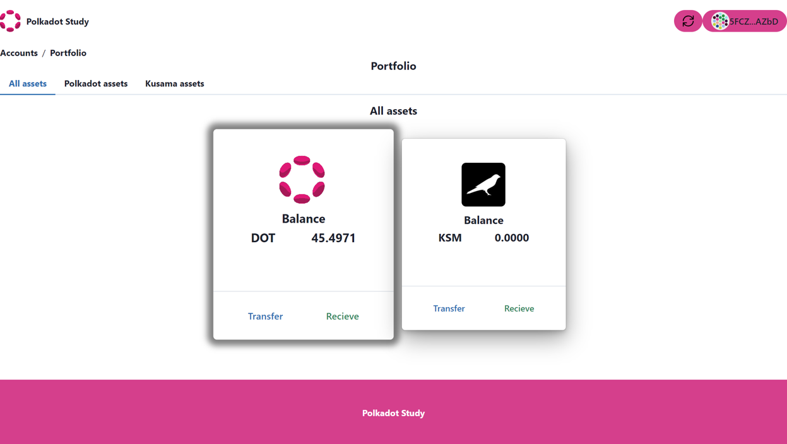

# Control and update balances on Polkadot and Kusama blockchains.

In this section you will understand the basic concepts about Polkadot/Kusama testnets and we will add functionality a generic card component with a balance component.

## Basic concepts.

Polkadot and Kusama offer several testnets that developers can use to experiment and develop their blockchain applications before deploying them on the main network. These testnets include:

**1. Westend Testnet:** This is the Polkadot testnet that developers can use to test their applications before deploying them on the main Polkadot network. It is a stable and secure testnet that supports all the features of the main network.

**2. Rococo Testnet:** Rococo is a parachain testnet that developers can use to test their parachain implementations. It is a canary network that is used to test new features and improvements before they are deployed on the main Polkadot network.

**3. Kusama Testnet:** This is the Kusama testnet that developers can use to test their applications before deploying them on the main Kusama network. It is designed to be more experimental and riskier than the Polkadot testnet, as it allows developers to test new ideas without risking the stability of the main network.

**4. Shell Testnet:** This is a testnet that is used to test new features and improvements before they are deployed on the Kusama network. It is a canary network that is used to test the stability and security of new features.

In this tutorial we will use the **Rococo testnet** to update balances.

## Getting Tokens on the Westend Testnet.

Polkadot's testnet is called Westend and you can obtain its native tokens (called Westies!) by posting !drip <WESTEND_ADDRESS> in the Matrix chatroom #westend_faucet:matrix.org. Your account will be credited with 1 WND by default. You can also specify to get more tokens by !drip <WESTEND_ADDRESS> X, where X is the number of tokens.

## Getting Tokens on the Rococo Testnet.

Rococo is a parachain testnet. Tokens are given directly to teams working on parachains or exploring the cross consensus message passing aspects of this testnet. General users can obtain ROC by posting !drip <ROCOCO_ADDRESS> in the Matrix chatroom #rococo-faucet:matrix.org. 

## Add functionality to GenericCard graphic component using Polkadot-js API.


In the previous section the GenericCard graphic component as shown below.

```ts
import { Stack, Divider, Image,Card,CardBody, CardFooter } from '@chakra-ui/react';

const image='https://d33wubrfki0l68.cloudfront.net/6cc043f2cb1fa1b90cf3ae518f2d6b18bfbe2f4a/b22b3/static/hero-anim-token-1b2270fa949ba9dfbd9fcd8ec83da71b.png';


function GenericCard() {

    return(        
<Card alignItems="center" w="300px" h="350px"
      borderColor="gray.400"
      borderRadius="md"
      boxShadow="dark-lg"
      >
  <CardBody>
    <Stack alignItems="center"  mt='6' spacing='3'>
        <Image
        boxSize="80px"
        objectFit="cover"
        alignItems="center" 
        src={image}
        borderRadius='lg'
        />
       
    </Stack>
  </CardBody>
    <Divider />
  <CardFooter  >
    <Stack direction="row" alignItems="center"  spacing='10'>
    
    </Stack>
  </CardFooter>
</Card>  
    )
    
    }
    
    export { GenericCard};
```

### Create Balance component.

The next step will be to build a new component that we will call balance and it can be used in the genericcard or in some other component of your own projects.

To build the balance component we first import some necessary react elements, Chakra-ui widgets and finally the ApiPromise and WsProvider components of the polkadot-js API.

```ts

import { useState,useEffect } from 'react';
import { 
  Heading,
  Flex, 
  Spacer, 
  Stack  
  } from '@chakra-ui/react'
import { ApiPromise, WsProvider} from '@polkadot/api';

```

The second step will be to build the balance function that will receive the network and the token as properties. So we also add the necessary states to control the balance as mentioned in the code.

```ts

function Balance({wsEndpoint,token}:any) {

  // Get the public key stored in local storage
  const publicKey= localStorage.getItem("Publickey");
  
  // Store the public key in a state
  const [account, setAccount] = useState(publicKey);

  // Create a state for the balance.
  const [Balances, setBalances]= useState(0);

 // Create an instance of the Polkadot network provider
  const wsProvider = new WsProvider(wsEndpoint);


  const Balance = async function (account:any)  {

  // Create an instance of the Polkadot JS API
  const api = await ApiPromise.create({ provider: wsProvider });
  
  // Get the public key stored in local storage
  setAccount(localStorage.getItem("Publickey"));
  
  // Retrieve the initial balance. Since the call has no callback, it is simply a promise
  // that resolves to the current on-chain value
  let { data: { free: previousFree }, nonce: previousNonce }:any = await api.query.system.account(account);
  
  // Read balance on Network
  const amount=Number(previousFree)/1000000000000;
  setBalances(amount) 
  
  // Here we subscribe to any balance changes and update the on-screen value
  api.query.system.account(account, ({ data: { free: currentFree } , nonce: currentNonce }: any) => {


      // Calculate the delta
      const change = currentFree.sub(previousFree  );
  
      // Only display positive value changes (Since we are pulling `previous` above already,
      // the initial balance change will also be zero)
      if (!change.isZero()) {
        
        previousFree = currentFree;
        previousNonce = currentNonce;
        
      // Read balance on Network
      const Newamount=Number(previousFree)/1000000000000;

      // Update state
      setBalances(Newamount) 
      }
    });
  
  }

  // Update balance
  useEffect(() => {
    
    Balance(account)
  });

    return (
    <Stack alignItems="center">
      <Heading size="md"> Balance</Heading>
        <Flex gap="30px">
          <Heading size='md'>{token}</Heading>
            <Spacer/>
          <Heading  size='md'>{Balances}</Heading>
        </Flex>
    </Stack>
     
    )
  }

export {Balance};


```
Note that this component takes the public key stored in local storage and gets the balance. Finally the balance component would be built as shown below:


```ts
import { useState,useEffect } from 'react';
import { 
  Heading,
  Flex, 
  Spacer, 
  Stack  
  } from '@chakra-ui/react'
import { ApiPromise, WsProvider} from '@polkadot/api';


function Balance({wsEndpoint,token}:any) {

  // Get the public key stored in local storage
  const publicKey= localStorage.getItem("Publickey");
  
  // Store the public key in a state
  const [account, setAccount] = useState(publicKey);

  // Create a state for the balance.
  const [Balances, setBalances]= useState(0);

 // Create an instance of the Polkadot network provider
  const wsProvider = new WsProvider(wsEndpoint);


  const Balance = async function (account:any)  {

  // Create an instance of the Polkadot JS API
  const api = await ApiPromise.create({ provider: wsProvider });
  
  // Get the public key stored in local storage
  setAccount(localStorage.getItem("Publickey"));
  
  // Retrieve the initial balance. Since the call has no callback, it is simply a promise
  // that resolves to the current on-chain value
  let { data: { free: previousFree }, nonce: previousNonce }:any = await api.query.system.account(account);
  
  // Read balance on Network
  const amount=Number(previousFree)/1000000000000;
  setBalances(amount) 
  
  // Here we subscribe to any balance changes and update the on-screen value
  api.query.system.account(account, ({ data: { free: currentFree } , nonce: currentNonce }: any) => {


      // Calculate the delta
      const change = currentFree.sub(previousFree  );
  
      // Only display positive value changes (Since we are pulling `previous` above already,
      // the initial balance change will also be zero)
      if (!change.isZero()) {
        
        previousFree = currentFree;
        previousNonce = currentNonce;
        
      // Read balance on Network
      const Newamount=Number(previousFree)/1000000000000;

      // Update state
      setBalances(Newamount) 
      }
    });
  
  }

  // Update balance
  useEffect(() => {
    
    Balance(account)
  });

    return (
    <Stack alignItems="center">
      <Heading size="md"> Balance</Heading>
        <Flex gap="30px">
          <Heading size='md'>{token}</Heading>
            <Spacer/>
          <Heading  size='md'>{Balances}</Heading>
        </Flex>
    </Stack>
     
    )
  }

export {Balance};

```

### Add Balance component on GenericCard component.

In this section we will add the balance component to the genericcard component.

For this we import the balance component with the appropriate path and add it to the body of the GenericCard. The GenericCard component would finally be as follows:


```ts

import { Stack, Divider, Image,Card,CardBody, CardFooter } from '@chakra-ui/react';
import { Balance } from './Balance';

function GenericCard({image,network,token}:any) {

    return(        
<Card alignItems="center" w="300px" h="350px"
      borderColor="gray.400"
      borderRadius="md"
      boxShadow="dark-lg"
      >
  <CardBody>
    <Stack alignItems="center"  mt='6' spacing='3'>
        <Image
        boxSize="80px"
        objectFit="cover"
        alignItems="center" 
        src={image}
        borderRadius='lg'
        />
       <Balance wsEndpoint={network} token={token}/> 
    </Stack>
  </CardBody>
    <Divider />
  <CardFooter  >
    <Stack direction="row" alignItems="center"  spacing='10'/>
      
  </CardFooter>
</Card>  
    )
    
    }
    
    export { GenericCard};

```

You now have a graphical component that you can import and use by passing the image, network, and token properties. In the following example we will use this component by passing the properties for the Polkadot network ('wss://rpc.polkadot.io'), westend ('wss://westend.api.onfinality.io/public-ws') or rococo (wss://rococo-rpc.polkadot.io) testnets.

```ts


import { GenericCard } from './card';

// props for GenericCard component.
const image='https://s2.coinmarketcap.com/static/img/coins/64x64/5034.png';
const network='wss://rpc.polkadot.io';
const token='DOT';


function Example() {


  return (
    
      <GenericCard image={image} network={network} token= {token}/> 
  )
}

export { Example };

```
The component would look like this:




Great !!!, now you have a graphical component that gets the balance of the public key stored in local storage.


import Quiz from '/src/components/quiz';

export const onequestion = { 
  question: "What is the Westend Testnet used for?", 
  answers: [ 
    "Testing parachain implementations", 
    "Testing new features and improvements", 
    "Testing applications before deployment on Polkadot mainnet",
    "Testing applications before deployment on Kusama mainnet"
  ],
  correctAnswerIdx: [2],
  msgCorrect: "Correct answer. Good job.",
  msgIncorrect: "Incorrect answer. Please try again.",
  explanation: "Correct, Westend Testnet is used for testing applications before deployment on Polkadot mainnet"
}

export const twoquestion = { 
  question: "What is the Rococo Testnet used for?", 
  answers: [ 
    "Testing parachain implementations", 
    "Testing new features and improvements", 
    "Testing applications before deployment on Polkadot mainnet",
    "Testing applications before deployment on Kusama mainnet"
  ],
  correctAnswerIdx: [0],
  msgCorrect: "Correct answer. Good job.",
  msgIncorrect: "Incorrect answer. Please try again.",
  explanation: "Correct, Rococo Testnet is used for testing parachain implementations"
}


export const thirdquestion = { 
  question: "What is the Kusama Testnet used for?", 
  answers: [ 
    "Testing parachain implementations", 
    "Testing new features and improvements", 
    "Testing applications before deployment on Polkadot mainnet",
    "Testing applications before deployment on Kusama mainnet"
  ],
  correctAnswerIdx: [3],
  msgCorrect: "Correct answer. Good job.",
  msgIncorrect: "Incorrect answer. Please try again.",
  explanation: "Correct, Kusama Testnet is used for testing applications before deployment on Kusama mainnet"
}


<Quiz quizItem={ onequestion } />

<Quiz quizItem={ twoquestion } />

<Quiz quizItem={ thirdquestion } />