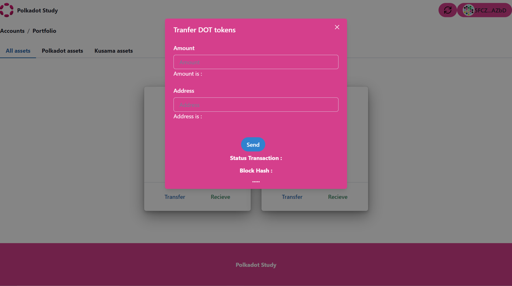
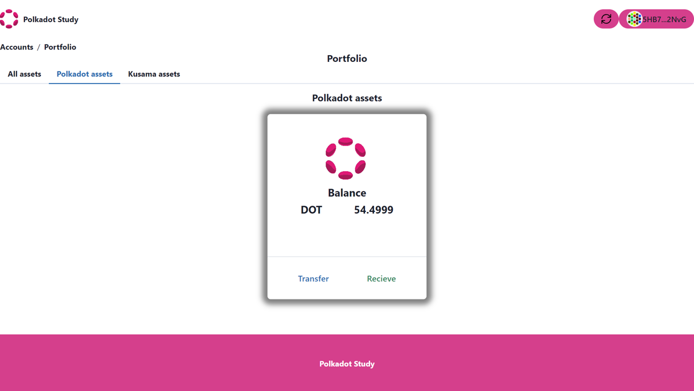

# Transfer between wallet accounts.

In this section we will build a component for transferring tokens between accounts using the Polkadot.js extension to sign. This new component will be added to the generic card.

### Install polkadot/extension-dapp.

Install polkadot/extension-dapp using the following command:

```bash
yarn add @polkadot/extension-dapp
```

### Create Transfer component.

We will call this component send and to create it we will import the following:

```ts
import React, { useState } from 'react';
import {
    useToast,
    Heading,
    Input,
    useDisclosure,
    FormLabel,
    FormControl,
    Button,
    Modal,
    ModalOverlay,
    ModalContent,
    ModalHeader,
    ModalFooter,
    ModalBody,
    ModalCloseButton,
    Center,
    VStack,
  } from '@chakra-ui/react'
import { ApiPromise, WsProvider} from '@polkadot/api';
import { web3Accounts,web3Enable, web3FromSource } from '@polkadot/extension-dapp';
```

The second step will consist of adding the necessary states and the transfer function that will contain the elements as described in the code, this function will be called with a button. The code will look like:


```ts

function Transfer({wsEndpoint, token}:any) {

    const toast = useToast()

  // Create a state for the amount to be transferred
  const [valueAmount, setValueAmount] = useState('');

  const handleChangeAmount = (event:any) => {
    setValueAmount(event.target.value);
  }

  // Create a state for the address
  const [valueAddress, setValueAddress] = useState('');

  const handleChangeAddress = (event:any) => {
    setValueAddress(event.target.value);
  }

  // Create a state for the status transaction
  const [status, setStatus] = useState('');

  const handleStatus = (event:any) => {
    setStatus(event.target.value);
  }
  
  // Create a state for the blockhash
  const [blockhash, setBlockhash] = useState('');

  const handleblockhash = (event:any) => {
    setBlockhash(event.target.value);
  }
  
    const { isOpen, onOpen, onClose } = useDisclosure()
  
    const initialRef = React.useRef(null)
    const finalRef = React.useRef(null)
   
    // Create an instance of the Polkadot network provider
    const wsProvider = new WsProvider(wsEndpoint);

    const transfer = async function main () {

      // Enable connection to the extension
      await web3Enable('my wallet');
 
     // Known account we want to use on Polkadot extension
     const allAccounts = await web3Accounts();

     // Get the first visible account of the polkadot extension.
     const account = allAccounts[0];

     // Store the public key in local storage.
     localStorage.setItem("Publickey",account.address); 

     // Get the public key in local storage.
     const addressaccount:any=localStorage.getItem("Publickey");
         
     // Create an instance of the Polkadot JS API    
     const api = await ApiPromise.create({ provider: wsProvider });
     
     // Create a transfer extrinsic 
     const transferExtrinsic = api.tx.balances.transfer(valueAddress, Number(valueAmount)*1000000000000)
     
    // Reset States
     setValueAmount('')
     setValueAddress('')
     
     // to be able to retrieve the signer interface from this account
     // we can use web3FromSource which will return an InjectedExtension type
     const injector = await web3FromSource(account.meta.source);
          
     // passing the injected account address as the first argument of signAndSend
     // will allow the api to retrieve the signer and the user will see the extension
     // popup asking to sign the balance transfer transaction
     transferExtrinsic.signAndSend(addressaccount, { signer: injector.signer }, ({ status }) => {
     if (status.isInBlock) {
         console.log(`Completed at block hash #${status.asInBlock.toString()}`);
         setBlockhash(status.asInBlock.toString())
         
        
     } else {
         console.log(`Current status: ${status.type}`);
     
         setStatus(status.type)
     
         if (status.type==='Finalized'){
       toast({
       title: 'Successful Transaction',
       duration: 3000,
       status: 'success',
       isClosable: true,
     })

    onClose()

     }
     }
     }).catch((error: any) => {
     console.log(':( transaction failed', error);
     });
 
      };
       
    return (
      <>
       <Button onClick={onOpen}  variant='ghost' colorScheme='blue'>
        Transfer
      </Button>
      <Modal
          size="lg"
          initialFocusRef={initialRef}
          finalFocusRef={finalRef}
          isOpen={isOpen}
          onClose={onClose}  
        >
          <ModalOverlay />
          <ModalContent>
            <ModalHeader >Transfer {token} tokens</ModalHeader>
            <ModalCloseButton />
            <ModalBody pb={8}>
              <FormControl>
                <FormLabel>Amount</FormLabel>
                <Input type="text" value={valueAmount} onChange={handleChangeAmount} placeholder='Amount' />
                <p>Amount is : {valueAmount}</p>
              </FormControl>
  
              <FormControl mt={6}>
                <FormLabel>Address</FormLabel>
                <Input  type="text" value={valueAddress} onChange={handleChangeAddress} placeholder='Address' />
                <p>Address is : {valueAddress}</p>
              </FormControl>
            </ModalBody>
            <Center>
            <ModalFooter>
             <VStack>
             
              <Button onClick={transfer} colorScheme='blue' mr={4}>
                Send
              </Button>
              <Heading size="sm"> Status Transaction :</Heading>
              <Heading size="sm" onChange={handleStatus}>{status}</Heading>
             <Heading size="sm"> Block Hash : </Heading>
             <Heading size="sm" onChange={handleblockhash}>{blockhash.substr(0,20) + '.....'}</Heading>
              </VStack>
              
            </ModalFooter>
            </Center>
          </ModalContent>
        </Modal>
      

        
      </>
    )
  }

  export {Transfer};

```

Finally, the complete component might look like the following:


```ts
import React, { useState } from 'react';
import {
    useToast,
    Heading,
    Input,
    useDisclosure,
    FormLabel,
    FormControl,
    Button,
    Modal,
    ModalOverlay,
    ModalContent,
    ModalHeader,
    ModalFooter,
    ModalBody,
    ModalCloseButton,
    Center,
    VStack,
  } from '@chakra-ui/react'
import { ApiPromise, WsProvider} from '@polkadot/api';
import { web3Accounts,web3Enable, web3FromSource } from '@polkadot/extension-dapp';


function Transfer({wsEndpoint, token}:any) {

    const toast = useToast()

  // Create a state for the amount to be transferred
  const [valueAmount, setValueAmount] = useState('');

  const handleChangeAmount = (event:any) => {
    setValueAmount(event.target.value);
  }

  // Create a state for the address
  const [valueAddress, setValueAddress] = useState('');

  const handleChangeAddress = (event:any) => {
    setValueAddress(event.target.value);
  }

  // Create a state for the status transaction
  const [status, setStatus] = useState('');

  const handleStatus = (event:any) => {
    setStatus(event.target.value);
  }
  
  // Create a state for the blockhash
  const [blockhash, setBlockhash] = useState('');

  const handleblockhash = (event:any) => {
    setBlockhash(event.target.value);
  }
  
    const { isOpen, onOpen, onClose } = useDisclosure()
  
    const initialRef = React.useRef(null)
    const finalRef = React.useRef(null)
   
    // Create an instance of the Polkadot network provider
    const wsProvider = new WsProvider(wsEndpoint);

    const transfer = async function main () {

      // Enable connection to the extension
      await web3Enable('my wallet');
 
     // Known account we want to use on Polkadot extension
     const allAccounts = await web3Accounts();

     // Get the first visible account of the polkadot extension.
     const account = allAccounts[0];

     // Store the public key in local storage.
     localStorage.setItem("Publickey",account.address); 

     // Get the public key in local storage.
     const addressaccount:any=localStorage.getItem("Publickey");
         
     // Create an instance of the Polkadot JS API    
     const api = await ApiPromise.create({ provider: wsProvider });
     
     // Create a transfer extrinsic 
     const transferExtrinsic = api.tx.balances.transfer(valueAddress, Number(valueAmount)*1000000000000)
     
    // Reset States
     setValueAmount('')
     setValueAddress('')
     
     // to be able to retrieve the signer interface from this account
     // we can use web3FromSource which will return an InjectedExtension type
     const injector = await web3FromSource(account.meta.source);
          
     // passing the injected account address as the first argument of signAndSend
     // will allow the api to retrieve the signer and the user will see the extension
     // popup asking to sign the balance transfer transaction
     transferExtrinsic.signAndSend(addressaccount, { signer: injector.signer }, ({ status }) => {
     if (status.isInBlock) {
         console.log(`Completed at block hash #${status.asInBlock.toString()}`);
         setBlockhash(status.asInBlock.toString())
         
        
     } else {
         console.log(`Current status: ${status.type}`);
     
         setStatus(status.type)
     
         if (status.type==='Finalized'){
       toast({
       title: 'Successful Transaction',
       duration: 3000,
       status: 'success',
       isClosable: true,
     })

    onClose()

     }
     }
     }).catch((error: any) => {
     console.log(':( transaction failed', error);
     });
 
      };
       
    return (
      <>
       <Button onClick={onOpen}  variant='ghost' colorScheme='blue'>
        Transfer
      </Button>
      <Modal
          size="lg"
          initialFocusRef={initialRef}
          finalFocusRef={finalRef}
          isOpen={isOpen}
          onClose={onClose}  
        >
          <ModalOverlay />
          <ModalContent>
            <ModalHeader >Transfer {token} tokens</ModalHeader>
            <ModalCloseButton />
            <ModalBody pb={8}>
              <FormControl>
                <FormLabel>Amount</FormLabel>
                <Input type="text" value={valueAmount} onChange={handleChangeAmount} placeholder='Amount' />
                <p>Amount is : {valueAmount}</p>
              </FormControl>
  
              <FormControl mt={6}>
                <FormLabel>Address</FormLabel>
                <Input  type="text" value={valueAddress} onChange={handleChangeAddress} placeholder='Address' />
                <p>Address is : {valueAddress}</p>
              </FormControl>
            </ModalBody>
            <Center>
            <ModalFooter>
             <VStack>
             
              <Button onClick={transfer} colorScheme='blue' mr={4}>
                Send
              </Button>
              <Heading size="sm"> Status Transaction :</Heading>
              <Heading size="sm" onChange={handleStatus}>{status}</Heading>
             <Heading size="sm"> Block Hash : </Heading>
             <Heading size="sm" onChange={handleblockhash}>{blockhash.substr(0,20) + '.....'}</Heading>
              </VStack>
              
            </ModalFooter>
            </Center>
          </ModalContent>
        </Modal> 
      </>
    )
  }

  export {Transfer};
```
Great, now you have a component that has the ability to transfer a token to another address.

The component would look like this:



### Add Transfer component on GenericCard component.

In this section we will add the Transfer component to the genericcard component.

For this we import the Transfer component with the appropriate path and add it to the body of the GenericCard. The GenericCard component would finally be as follows:


```ts
import { Stack, Divider, Image,Card,CardBody, CardFooter } from '@chakra-ui/react';
import { Balance } from './Balance';
import { Transfer} from './Transfer';


function GenericCard({image,network,token}:any) {

    return(        
<Card alignItems="center" w="300px" h="350px"
      borderColor="gray.400"
      borderRadius="md"
      boxShadow="dark-lg"
      >
  <CardBody>
    <Stack alignItems="center"  mt='6' spacing='3'>
        <Image
        boxSize="80px"
        objectFit="cover"
        alignItems="center" 
        src={image}
        borderRadius='lg'
        />
       <Balance wsEndpoint={network} token={token}/> 
    </Stack>
  </CardBody>
    <Divider />
  <CardFooter  >
    <Stack direction="row" alignItems="center"  spacing='10'>
      <Transfer wsEndpoint={network} token={token} />
    </Stack>
  </CardFooter>
</Card>  
    )
    
    }
    
    export { GenericCard};
```

Same as in the previous section,  you now have a graphical component that you can import and use by passing the image, network, and token properties. In the following example we will use this component by passing the properties for the Polkadot network.

```ts


import { GenericCard } from './card';


const image='https://d33wubrfki0l68.cloudfront.net/6cc043f2cb1fa1b90cf3ae518f2d6b18bfbe2f4a/b22b3/static/hero-anim-token-1b2270fa949ba9dfbd9fcd8ec83da71b.png';
const network='wss://rpc.polkadot.io';
const token='DOT';


function Example() {


  return (
    
      <GenericCard image={image} network={network} token= {token}/> 
  )
}

export { Example };

```
The component would look like this:



Great !!, now you have a graphic component that gets the balance of the public key stored in local storage and transfers tokens to another public address.

