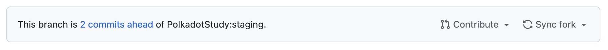
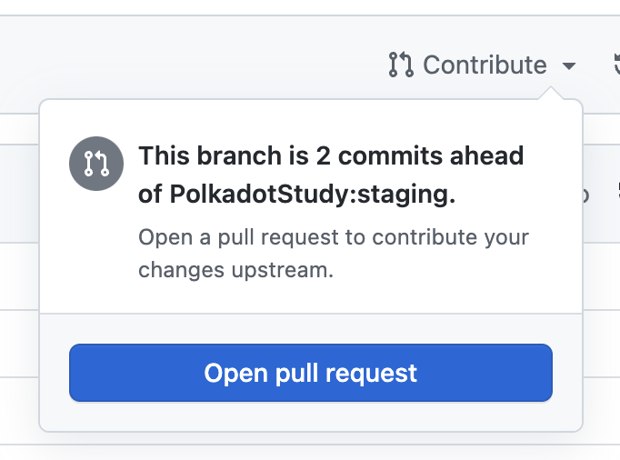
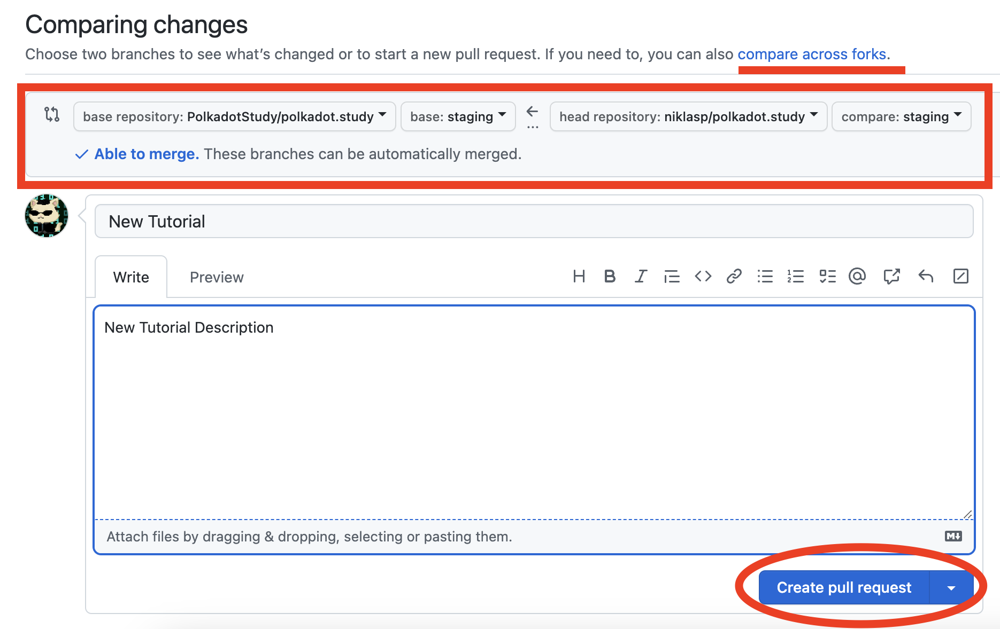

# Submitting the Tutorial

In the first part [Setup the Development Environment](development-environment) you forked the polkadot study repository.
That was the crucial step.

## Submitting a Pull Request from your repo

1. Go to your forked github repo in your browser
1. Make sure you sync your fork. This will update your fork to the latest version of polkadot.study.

1. Run and test your synced version again and make sure you resolve any possible merge conflicts
1. Create a pull request by clicking on contribute

1. Now submit your pull request "across forks"

## Next Steps

Once you have submitted your pull request, a moderator will review your submission. During
that time, you can still make changes to your branch which will be reflected in the Pull Request too.
When the review and the revisions are completetd, our moderators (the ones with write access to the polkadot.study github repository) will merge your tutorial and 
it will automatically appear online on [polkadot.study](https://polkadot.study). If you agreed with polkadot.study to receive funding. You will be paid upon completion.

