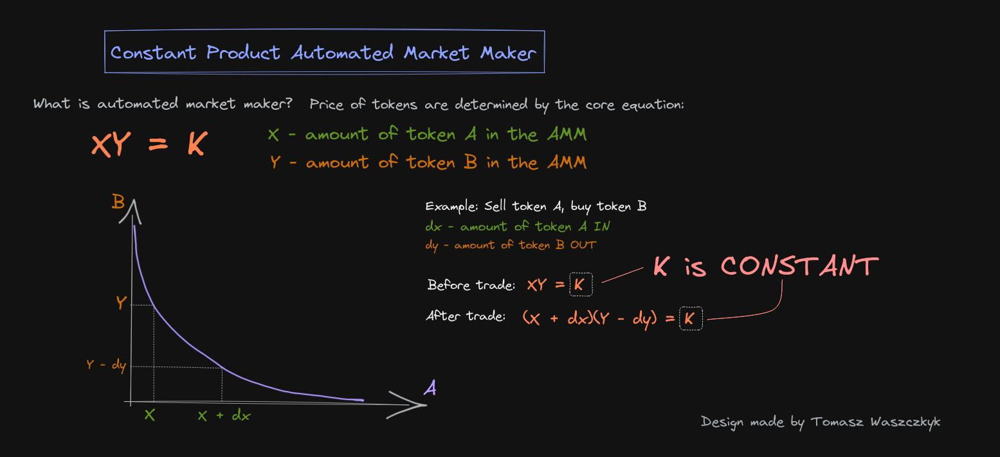

---
tags:
  - ink!
  - rust
  - automated market maker
keywords: [ink!, rust, automated market maker]
description: How to implement decentralized exchange in ink! smart contract language
level: intermediate
duration: 4-8h
author: Tomasz Waszczyk
---

# How to Build Decentralized Exchange in ink! Smart Contract Programming Language

A decentralized exchange (DEX) is a type of cryptocurrency exchange that operates on a blockchain network without the need for intermediaries or a central authority.
It allows users to trade cryptocurrencies directly with each other using smart contracts. DEXs provide increased security and privacy as they eliminate the need to trust a centralized entity with users' funds.
They also offer a more transparent and censorship-resistant trading environment, empowering users to have full control over their assets.

ink! is a programming language specifically designed for developing smart contracts on the Polkadot blockchain ecosystem. It is a statically-typed language that emphasizes safety, correctness, and efficiency.

## What you will build

An Automated Market Maker (AMM) is a decentralized exchange model that relies on a mathematical price formula to facilitate asset trading.
Instead of using a traditional order book and relying on buyers and sellers, AMMs utilize liquidity pools where assets are priced based on a specific algorithm.

Uniswap, for instance, employs the formula `p * q = k`, where `p` represents one token's amount in the pool, and `q` represents the amount of the other token.
The constant `k` ensures that the total liquidity remains unchanged. As an example, when a volatile asset like A is purchased, its price increases due to reduced availability in the pool, while the price of asset B decreases as its availability increases.
The pool maintains balance, with the total value of A always equaling the total value of B, and expands only when new liquidity providers participate.

## Time of completion

- 4-8 hours

## What you'll learn

I do believe that learning by doing and making experiments is the best way to gain more experience that is especially important for delivering smart contracts. The tutorial shows you:

- how works basic decentralized exchange
- how to implement [ink!](https://use.ink) smart contract
- unit testing of the smart contract
- how to handle errors in the smart contracts written in ink! language

## Prerequisites

- basic knowledge of [Rust](https://doc.rust-lang.org/stable/book/) programming language
- `cargo` [build tool](https://doc.rust-lang.org/cargo/)
- preferred Linux-like operating system (optional)
- willingness for learning and curiosity

## Author

- [Tomasz Waszczyk](https://github.com/tomaszWaszczyk/) is a software engineer that is perpetually curious, despite the pain accompanying such curiosity.
