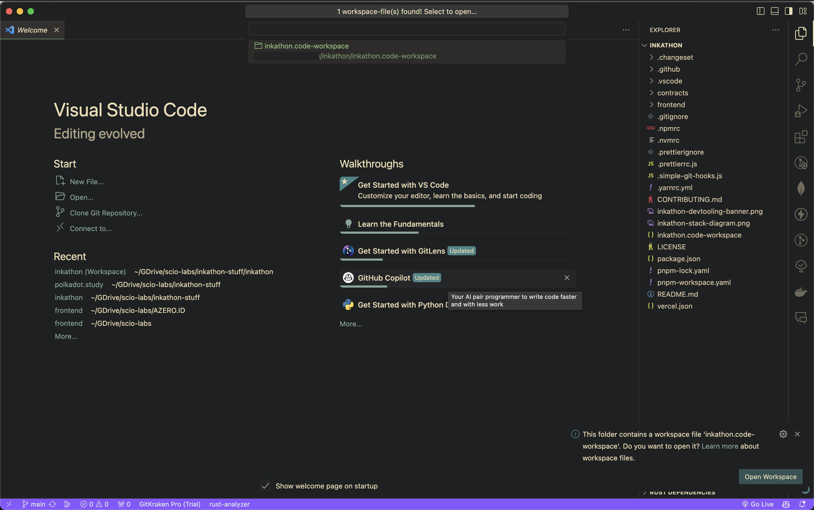
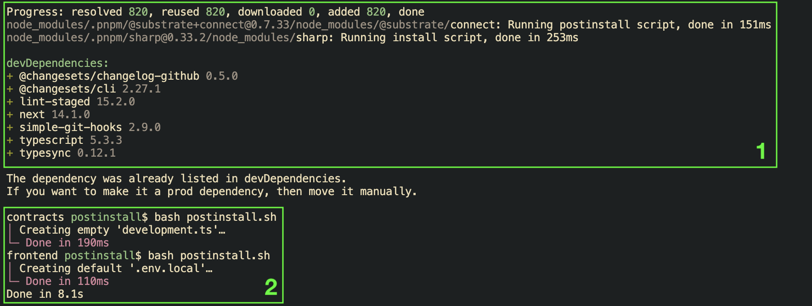
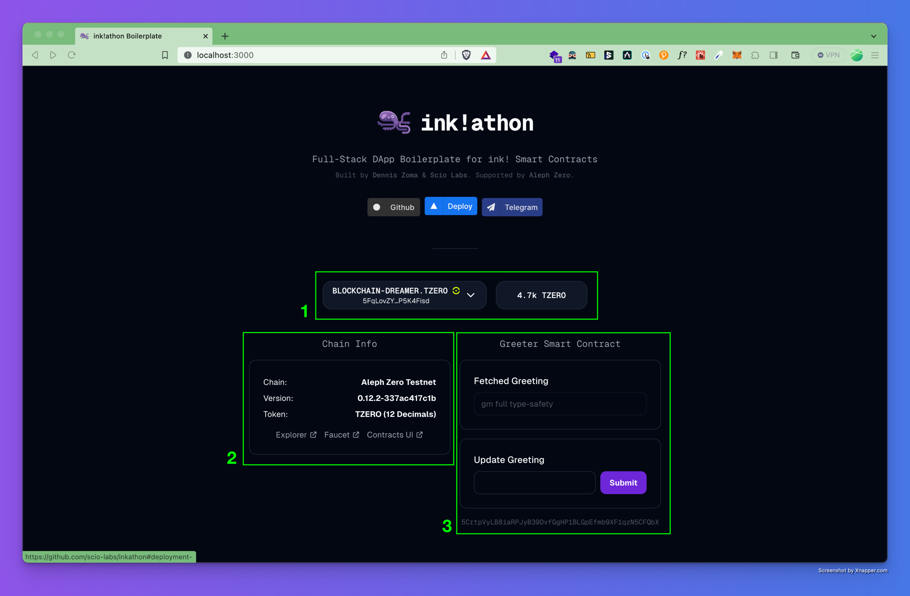

# Initial setup and first launch of dApp
Let’s start with going through the prerequisites and recommended setup to run ink!athon. 
We strongly encourage you to use [VSCode](https://code.visualstudio.com/) as code editor as we will utilise some of its features 
like [workspace](https://code.visualstudio.com/docs/editor/workspaces) and [code snippets](https://code.visualstudio.com/docs/editor/userdefinedsnippets), 
and they are necessary to complete the tutorial. However, any code editor should be able to run the boilerplate easily. 
We also recommend installing one of 
[ecosystem-funded wallets](https://support.polkadot.network/support/solutions/articles/65000068702-where-to-store-dot-polkadot-wallet-options#Treasury-Funded-Wallets) 
on your browser of choice to manage your wallets. In this tutorial, we will be using [Subwallet](https://www.subwallet.app/). 

We will also be using the latest version of macOS (Sonoma 14.2.1) on this guide, 
but again, other OSes should work right out of the box.

⛔ **Pre-requisites:**

- Setup `Node.js` v18+ (recommended via [nvm](https://github.com/nvm-sh/nvm) with `nvm install 18`)
- Install [pnpm](https://pnpm.io/installation) (recommended via [Node.js Corepack](https://nodejs.org/api/corepack.html) or `npm i -g pnpm`)
- A web browser: e.g. [Brave](https://brave.com/download/) (do not forget to turn off Brave Shields)
- Clone [ink!athon repo](https://github.com/scio-labs/inkathon) (make sure to have [git](https://git-scm.com/) installed)

## Let's launch our first dApp!
Once you have `Node.js` and `pnpm` installed, open a terminal and clone the ink!athon repo.

```bash
git clone https://github.com/scio-labs/inkathon.git
```

Then, go to the cloned repo and open VSCode.

```bash
cd inkathon

code .
```

Once opened, VSCode will automatically detect the workspace (as seen below).



Just press Enter or click on `Open Workspace` button at the bottom right to open the workspace. 
VSCode will restart and it will reorganise the project environment, so now there are `Project Root`, `Frontend`, and `Contracts` workspaces.

Let’s open a terminal in the `Project Root` by using the ⌃⇧\` keyboard shortcut. 
Select `Project Root` and a new terminal will appear at the bottom. 

We need to run the install script via `pnpm` on the terminal by running

```bash
pnpm install
```

Once the process is finished, it will show that: the 1) dependencies are installed; 2) `development.ts` and `.env.local` files are created 
(refer to the image below).



Why do we need to create the latter?

 `.env.local` contains environment variables for Next.js app, 
 e.g. the variables for setting the default network `NEXT_PUBLIC_DEFAULT_CHAIN` (mandatory) and other supported networks `NEXT_PUBLIC_SUPPORTED_CHAINS` (optional).

`development.ts` stores `address` and `blockNumber` of the deployed contract on local node (more on this later).

We’re almost there! Execute the command below to get the dApp running on dev mode. 

```bash
pnpm run dev
```

Open https://localhost:3000 on your browser, and voilà! You got the dApp running locally within minutes.


ℹ️ Optionally, to enable `[simple-git-hooks](https://github.com/toplenboren/simple-git-hooks)` (for automatic linting & formatting when committing), 
you can run the following command once: `pnpm simple-git-hooks`.

## So, what does this dApp do?

You must be wondering, “what is showing on this dApp?” or “how do I use it?”. 
Let’s focus a bit on the “web3 components” of the dApp itself to answer these questions.
Refer to the image above for explanation.

On #1, there is `Connect Button` to connect your accounts. If you have connected a wallet before, the view will change into: a `Balance Widget` (on the right) and another widget (on the left) which shows a list of your wallet addresses (with the associated [AZERO.ID](http://AZERO.ID) domains), a chain switcher, and a disconnect button.

On #2, there is `Chain Info Widget` which gives general information of connected chain. There are also some useful links related to connected chain: Explorer (usually Subscan or polkadot.js), Faucets, and [Contracts-UI](https://github.com/paritytech/contracts-ui) (a web app to deploy and interact with ink! smart contracts).

On #3, there are two widgets for interacting with the Greeter Smart Contract. This smart contract simply returns a greeting on the top widget (`Fetched Greeting Widget`), and can be updated via the bottom one (`Update Greeting Widget`). If you want to update the greeting, just type it in there and click Submit, and confirm the transaction with your wallet. A `Toaster` will show up at the bottom right corner confirming the greeting update.

Those are the general ideas about the boilerplate. Now, we are going to play around a bit with the codebase to understand the development workflow completely.
