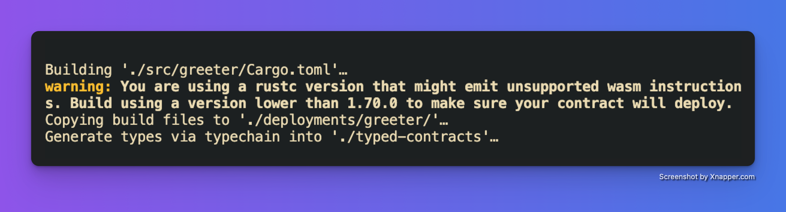
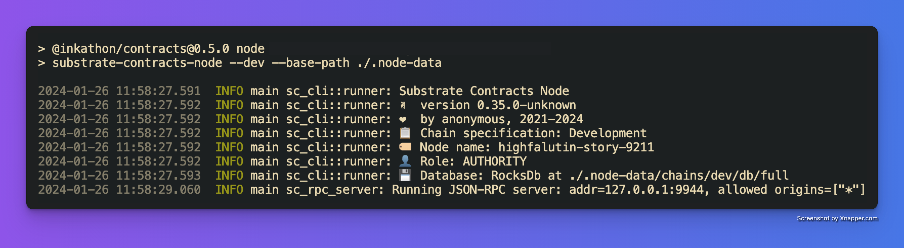
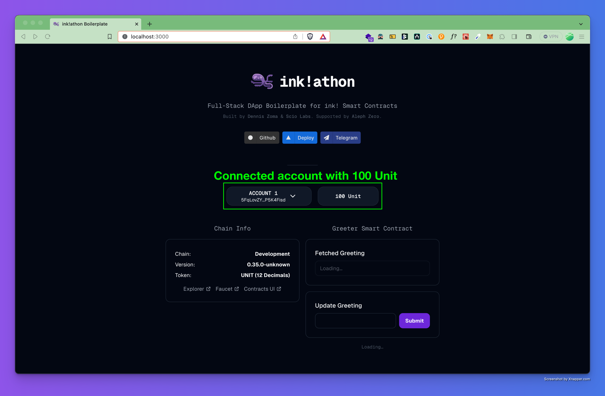

# Build first ink! contract, deploy on a local node, and connect frontend to it
In this part of the tutorial, we are going to build an ink! contract, deploy it on a running local node, and start the dApp by connecting the frontend to it. Make sure that you have the following installed before continuing.

⛔ **Pre-requisites:**

- Install Rust via the [Substrate Docs](https://docs.substrate.io/install/) (skip the "Compile a Substrate node" section)
- Install [cargo contract](https://github.com/paritytech/cargo-contract)
- Install [substrate-contracts-node](https://github.com/paritytech/substrate-contracts-node)

**Note: the installation process may take a while depending on your machine,** 
**so please be patient.**

Once you have everything installed, let’s begin by starting your terminal again. Then, `cd` into [/contracts](https://github.com/scio-labs/inkathon/tree/main/contracts) directory.

ℹ️ If you are the curious type, it is worth checking out [contracts/package.json](https://github.com/scio-labs/inkathon/blob/main/contracts/package.json) which contains shorthand scripts for building, testing, and deploying your contracts.

To build the contract, simply run the build script.

```bash
pnpm run build
```

Once the process is done, the terminal will show some outputs like the image below.



As you can see on the image above, once the build is done, the script copies the generated files to [./deployments/greeter/](https://github.com/scio-labs/inkathon/tree/main/contracts/deployments/greeter). These files are then imported automatically by the frontend so we get a seamless integration between the contract- and the frontend-side. Then, it generates types via [typechain-polkadot](https://github.com/Brushfam/typechain-polkadot) into [./typed-contracts](https://github.com/scio-labs/inkathon/tree/main/contracts/typed-contracts). The generated types ensure full type-safety interactions within the boilerplate.

Now that the contract is ready to be deployed, we must first run a local node. Simply execute the node script.

```bash
pnpm run node
```

The node will run immediately and you will see some outputs as the image below.



The script itself runs `substrate-contracts-node` binary followed with `--dev --base-path ./.node-data` parameters. These parameters switch our local node to *“persistent mode”*, meaning that contracts will stay deployed even when the node is restarted.

Finally, let’s deploy the contract to our local node. Open another terminal (keep the terminal with the local node running) and execute the deploy script.

```bash
pnpm run deploy
```

If the deployment succeeded, you will see an output similar to this one:

```
Initialized API on Development (0.35.0-unknown)

Initialized Account: 5GrwvaEF5zXb26Fz9rcQpDWS57CtERHpNehXCPcNoHGKutQY (1,152,921.5046 Unit)

Contract 'greeter' deployed under 5HUtt31T4VMiW6PS46MKHSrvbrLRedMiaNNiXvpsiHA6mogr at block #1

Exported deployment info to file: deployments/greeter/development.ts
```

Remember the contract address `5HUtt31...HA6mogr` as we will revisit this later.

ℹ️ Alternatively, you can also use Contracts-UI to deploy contracts manually with the browser.

We are done with the contract stuff. Now let’s connect the frontend to recently deployed contract by running `cd ../frontend`.

Open VSCode and edit `.env.local` file. Then set `NEXT_PUBLIC_DEFAULT_CHAIN=development`  and comment `NEXT_PUBLIC_SUPPORTED_CHAINS` line. The app should now be connected to our local node. To prove it, simply run the app on dev mode.

```bash
pnpm dev
```

Amazing! Notice that the UI shows the same contract address (`5HUtt31...HA6mogr`) as shown by the output during deployment.

However, as none of our wallets now have gas to be able to update the greeting, we need to do the following steps to get some gas.

1. Click on `Explorer` link on `Chain Info Widget`. A new tab for `polkadot.js app` will open and connect automatically to the local node (for Brave users, don’t forget to disable Shields). 
2. Go to `Accounts` dropdown menu, click `Transfer`. A transfer dialog will open.
3. Select `Alice` account as sender from `send from accounts` field, select the account that you are going to use with the dApp as receiver on `send to address` field, enter an amount e.g. `100 Unit` .
4. Click on `Make Transfer` button, another window will open. Click on `Sign and Submit`. `100 Unit` will be transferred into the receiver account.
5. Go back to the dApp and make sure to connect with the receiver account, and you can see now that your account is funded with `100 Unit`.



You can now update the greeting the same as you have done before. 

Congratulations, you have made this far! The following parts will be more about explanations on the codebase and how it works. We will start on `Project Root`, then `Frontend`, and we will end it on `Contracts`.