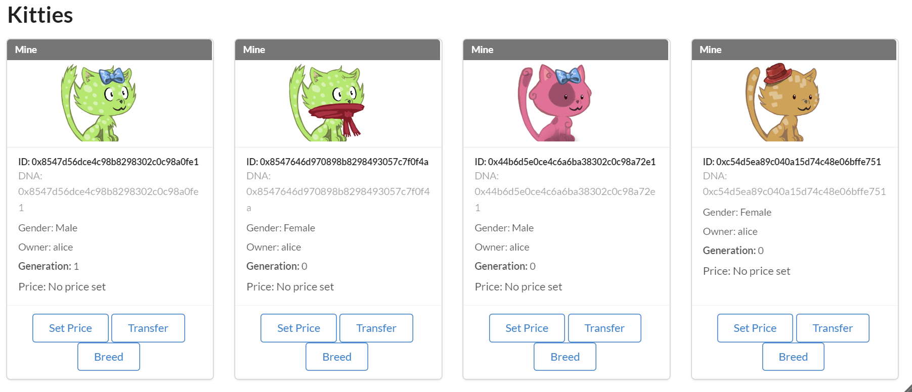

---
tags:
  - pallet
  - polkadot.js
keywords: [pallet, polkadot-js]
description:
  From the substrate node template to a fully functional blockchain that handles kitties NFTs.
level: intermediate
duration: 2h
---

# How to build the Substrate Kitties Chain

Welcome to the Substrate Kitties tutorial part 1. Designed to teach how to build a blockchain that handles 
the creation and ownership management of NFT Kitties.

It will cover various aspects of building the Kitties pallet, including creation, breeding, 
transfer, price setting, and purchasing kitties. Additionally, it will provide guidance on developing the 
front-end UI for interaction with the chain.

This tutorial is an updated/adapted version of two previous tutorials, the [CryptoKitties on Substrate](https://www.shawntabrizi.com/substrate/cryptokitties-on-substrate/)
and the [Build the Substrate Kitties Chain](https://doc.deepernetwork.org/tutorials/v3/kitties/pt1/).

## What we will build?

A substrate based blockchain for Kitties that can do the following:

- Be created either by some original source or by being breed using existing Kitties.
- Be sold at a price set by their owner.
- Be transferred from one owner to another.

## Time of completion

- It should take you around 2 hours to complete this tutorial.

## What you'll learn?

- Learn patterns for building and running a Substrate node.
- Write and integrate a custom FRAME pallet to your runtime.
- Learn how to create and update storage items.
- Write pallet extrinsics and helper functions.
- Use the PolkadotJS API to connect to a Substrate node.

## Prerequisites

- Rust knowledge. If you are new to Rust, check the [rust book](https://doc.rust-lang.org/book/).
- Substrate Knowledge. For instance: what is a pallet, a runtime, a node, etc. If you are new to 
Substrate, check the [Substrate Developer Hub](https://substrate.dev/).

### Author

* [Walquer Valles](https://www.linkedin.com/in/walquerxvallesruiz/)

