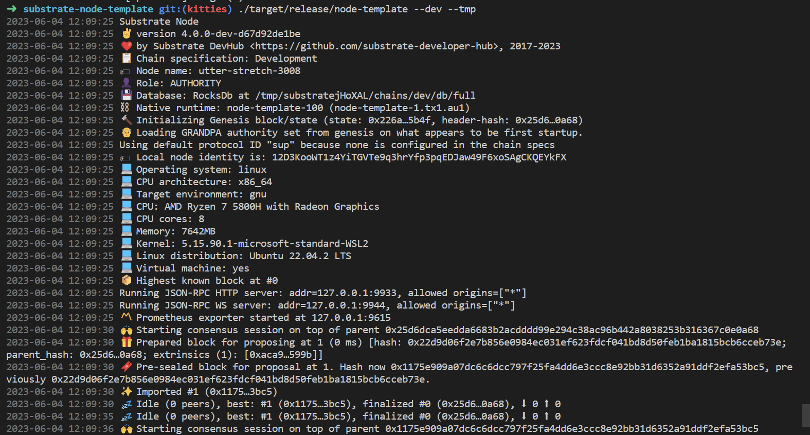

# Node Template Set Up

Before we can start minting Kitties, we need to do some groundwork. This part covers the patterns involved 
with using the Substrate Node Template.

## Pre-requisites

First you need to have rust installed and configured for Substrate development. Do it as described 
[here](https://docs.substrate.io/install/) depending on your OS.

## The template node

The [Substrate Node Template](https://github.com/substrate-developer-hub/substrate-node-template) provides 
us with an "out-of-the-box" blockchain node. Our biggest advantage in using it are that both networking 
and consensus layers are already built and all we need to focus on is building the logic of our 
runtime and pallets.

We have to clone the Substrate Node Template repository, compile it and run it. We will be working with 
node template v0.9.39.

```bash
git clone -b polkadot-v0.9.39 https://github.com/substrate-developer-hub/substrate-node-template.git
```
Create a new branch for your project and switch to it. So to be able to keep the original template code in
case we get lost in the changes.

In the following command we are naming the branch as kitties:

```bash
git checkout -b kitties
```
To compile, do the following. This will take a while. How long it takes depends on your machine specs. 

```bash
cargo build --release
```


As you can see in the previous image, the compilation should complete with a line that looks like this:

```bash
Finished release [optimized] target(s) in 14m 31s
```
To run the node, use the following command, in the same directory where you ran the build command:

```bash
./target/release/node-template --dev
```


Here we are executing the node binary and passing it the --dev argument. This tells the node to run in development 
mode ensuring that you have a clean working state any time you stop and restart the node. You can stop the node by 
pressing Ctrl+C.

## Interacting with the node template

Now is a good moment to play for a while with the node. Use the Polkadot JS Apps UI to connect to your 
local node by going to [polkadot.js Apps UI](https://polkadot.js.org/apps/#/explorer). It should be configured to 
connect to you local node by default. But if not, make sure it looks like this if you click on the upper 
left corner of the page:


Interact with your local node. In special, go to:

```
Developer -> Extrinsics
```

There you can see all the extrinsics that are available in your node by pallet. Check that the pallet 
template (you will find it as templateModule) has only two extrinsics. 

* `do_something`
* `cause_error`

`do_something` stores a `u32` value in the runtime storage. Try setting a value by submiting the extrinsic.
 And then checking the value in the storage.

To check the value in the storage, go to:

```
Developer -> Chain State
```

There select the TemplateModule and the `Something(): Option<u32>` item storage. Click in the `+ sign` on 
the right to query it.


Also check the code in the pallet template. You can find it in the pallets folder. See how the code of the 
extrinsic you just called looks like. In the directory where you compiled the node go to  check the 
`pallets/template/src/lib.rs` file.

There you can find the storage code:

```rust
	// The pallet's runtime storage items.
	// https://docs.substrate.io/main-docs/build/runtime-storage/
	#[pallet::storage]
	#[pallet::getter(fn something)]
	// Learn more about declaring storage items:
	// https://docs.substrate.io/main-docs/build/runtime-storage/#declaring-storage-items
	pub type Something<T> = StorageValue<_, u32>;
```

And the extrinsics code:

```rust
		/// An example dispatchable that takes a singles value as a parameter, writes the value to
		/// storage and emits an event. This function must be dispatched by a signed extrinsic.
		#[pallet::call_index(0)]
		#[pallet::weight(10_000 + T::DbWeight::get().writes(1).ref_time())]
		pub fn do_something(origin: OriginFor<T>, something: u32) -> DispatchResult {
			// Check that the extrinsic was signed and get the signer.
			// This function will return an error if the extrinsic is not signed.
			// https://docs.substrate.io/main-docs/build/origins/
			let who = ensure_signed(origin)?;

			// Update storage.
			<Something<T>>::put(something);

			// Emit an event.
			Self::deposit_event(Event::SomethingStored { something, who });
			// Return a successful DispatchResultWithPostInfo
			Ok(())
		}
```

With this you can start getting a feeling of how you can store a value in the runtime storage and how you can create an extrinsic
to do it.
