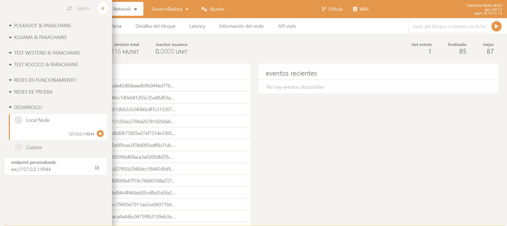

# Renaming the TemplateModule Pallet

We will copy and rename the template pallet so to have it renamed as `kitties`. This implies making some 
changes along side the pallet and the runtime.

- Go to the pallets folder and make a duplicate of the template pallet folder and rename it to `kitties`.

```bash
cd pallets
cp -r ./template ./kitties
```
- Inside kitties folder modify the `cargo.toml` file to have `pallet-kitties` as the pallet name.

```toml
[package]
name = "pallet-kitties"
version = "4.0.0-dev"
description = "FRAME pallet template for defining custom runtime logic."
authors = ["Substrate DevHub <https://github.com/substrate-developer-hub>"]
homepage = "https://substrate.io"
edition = "2021"
license = "Unlicense"
publish = false
repository = "https://github.com/substrate-developer-hub/substrate-node-template/"
...
```
- Add the `pallet-kitties` to the runtime's `cargo.toml`: Go to `./runtime/cargo.toml` file and add the pallet-kitties in 
the same way the `template-pallet` is added.

```toml
...
# Local Dependencies
pallet-template = { version = "4.0.0-dev", default-features = false, path = "../pallets/template" }
pallet-kitties = { version = "4.0.0-dev", default-features = false, path = "../pallets/kitties" }
...
[features]
default = ["std"]
std = [
	"frame-try-runtime?/std",
	"frame-system-benchmarking?/std",
	"frame-benchmarking?/std",
	"codec/std",
	"scale-info/std",
	"frame-executive/std",
	"frame-support/std",
	"frame-system-rpc-runtime-api/std",
	"frame-system/std",
	"frame-try-runtime/std",
	"pallet-aura/std",
	"pallet-balances/std",
	"pallet-grandpa/std",
	"pallet-insecure-randomness-collective-flip/std",
	"pallet-sudo/std",
	"pallet-template/std",
	"pallet-kitties/std",
...
runtime-benchmarks = [
	"frame-benchmarking/runtime-benchmarks",
	"frame-support/runtime-benchmarks",
	"frame-system-benchmarking/runtime-benchmarks",
	"frame-system/runtime-benchmarks",
	"pallet-balances/runtime-benchmarks",
	"pallet-grandpa/runtime-benchmarks",
	"pallet-template/runtime-benchmarks",
	"pallet-kitties/runtime-benchmarks",
	"pallet-timestamp/runtime-benchmarks",
	"sp-runtime/runtime-benchmarks",
]
...
try-runtime = [
	"frame-try-runtime/try-runtime",
	"frame-executive/try-runtime",
	"frame-system/try-runtime",
	"frame-support/try-runtime",
	"pallet-aura/try-runtime",
	"pallet-balances/try-runtime",
	"pallet-grandpa/try-runtime",
	"pallet-insecure-randomness-collective-flip/try-runtime",
	"pallet-sudo/try-runtime",
	"pallet-template/try-runtime",
	"pallet-kitties/try-runtime",
	"pallet-timestamp/try-runtime",
	"pallet-transaction-payment/try-runtime",
]
```
- Add the `pallet-kitties` to the runtime's `lib.rs`: Go to `./runtime/src/lib.rs` and add the `pallet-kitties` in the same way the `template-pallet` is added.

```rust
// ...

/// Import the template pallet.
pub use pallet_template;

/// import kitties pallet
pub use pallet_kitties;

// ...

/// Configure the pallet-template in pallets/template.
impl pallet_template::Config for Runtime {
	type RuntimeEvent = RuntimeEvent;
}

/// Configure the pallet-kitties in pallets/kitties.
impl pallet_kitties::Config for Runtime {
	type RuntimeEvent = RuntimeEvent;
}

// ...

// Create the runtime by composing the FRAME pallets that were previously configured.
construct_runtime!(
	pub struct Runtime
	where
		Block = Block,
		NodeBlock = opaque::Block,
		UncheckedExtrinsic = UncheckedExtrinsic,
	{
		System: frame_system,
		RandomnessCollectiveFlip: pallet_insecure_randomness_collective_flip,
		Timestamp: pallet_timestamp,
		Aura: pallet_aura,
		Grandpa: pallet_grandpa,
		Balances: pallet_balances,
		TransactionPayment: pallet_transaction_payment,
		Sudo: pallet_sudo,
		// Include the custom logic from the pallet-template in the runtime.
		TemplateModule: pallet_template,
		// Include the custom logic from the pallet-kitties in the runtime.
		KittiesModule: pallet_kitties,
	}
);

// ...
#[cfg(feature = "runtime-benchmarks")]
mod benches {
	define_benchmarks!(
		[frame_benchmarking, BaselineBench::<Runtime>]
		[frame_system, SystemBench::<Runtime>]
		[pallet_balances, Balances]
		[pallet_timestamp, Timestamp]
		[pallet_template, TemplateModule]
		[pallet_kitties, KittiesModule]
	);
}
```
- Compile and run it to check that everything is working as expected: return to the root folder and run:

```bash
cargo build --release
./target/release/node-template --dev
```
You should be able to check in the [polkadot-js app UI](https://polkadot.js.org/apps/#/explorer) 
that the `pallet-kitties` is available in the runtime and has the same extrinsics that the template pallet 
has.


Note: If the [polkadot-js app UI](https://polkadot.js.org/apps/#/explorer) is not conected to your local node, go to the upper left corner 
and select `Local Node` in the `Network` dropdown menu. Like in the following image:




