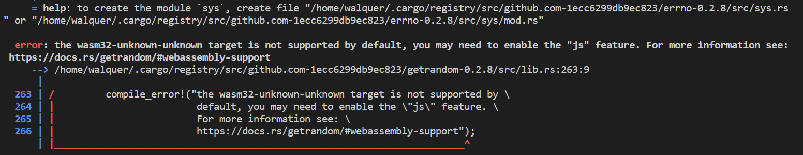

# Kitties pallet: scaffold & main logic

Lets check and enumerate what we want the pallet to be able to do. And lets order it in a logical and 
progressive way, so we can build it step by step.

1. Create a kitty (for first time and by breeding).
2. Change the price of a kitty.
3. Change the owner of a kitty (transfer or buy).

Notice number 2 and 3 are actions that will change some information about the kitty: its price or owner.

:::info
A pallet, at its simplest, is composed of 3 parts:

1. Storage: This is where the pallet stores its data. It is a key-value store.
2. Dispatchable functions: These functions materialize as "extrinsics", which are often compared to 
transactions.
3. Events and errors: Events are used to inform users when important changes are made. Errors inform 
users that something went wrong.
:::

## Kitties pallet scaffold

We'll be spending most of this tutorial in the pallets directory of our template node. 
Let's take a glance at the folder structure in our workspace:

```
substrate-node-template          <--  The name of our project directory
|
+-- node
|
+-- pallets
|   |
|   +-- kitties
|       |
|       +-- Cargo.toml
|       |
|       +-- src
|           |
|           +-- benchmarking.rs     <-- File containing benchmarking functions (ignore it for now). 
|           |
|           +-- lib.rs              <-- Remove contents (We will be working here).
|           |
|           +-- mock.rs             <-- File for mock runtime used in tests and benchmarking (ignore it for now).
|           |
|           +-- tests.rs            <-- File containing unit tests (ignore it for now).
|           |
|           +-- weights.rs          <-- File containing weights for each extrinsic (ignore it for now).
|
+-- Cargo.toml
```
[Pallets](https://doc.deepernetwork.org/v3/runtime/frame/#pallets) in Substrate are used to define runtime
 logic. We will be creating a pallet that manages the logic of our Kitties application.

Let's lay out the basic structure of our pallet by outlining the parts inside `pallets/kitties/src/lib.rs`.

Notice that our pallet's directory `./pallets/kitties/` is not the same as our pallet's name. The name of 
our pallet as Cargo understands it is `pallet-kitties`.

Every FRAME pallet has:

* A set of frame_support and frame_system dependencies.
* Required [attribute macros](https://doc.deepernetwork.org/v3/runtime/macros/#frame-macros-and-attributes)
 (i.e. configuration traits, storage items and function calls).

We'll be including all dependencies necessary for the kitties pallet in the scaffold.

Here's the most bare-bones version of the Kitties pallet we will be building in this tutorial. It contains 
the starting point for adding code for the next sections. It contains comments marked with `TODO` to indicate
code we will be writing later.

Paste the following code in `./pallets/kitties/src/lib.rs`, in place of the code that was there before:

```rust
#![cfg_attr(not(feature = "std"), no_std)]

#[cfg(test)]
pub mod mock;

#[cfg(test)]
mod tests;

pub use pallet::*;

#[frame_support::pallet]
pub mod pallet {
	use super::*;
	use frame_support::{
		pallet_prelude::*,
		traits::{tokens::ExistenceRequirement, Currency, Randomness},
	};
	use frame_system::pallet_prelude::*;
	use scale_info::TypeInfo;
	use sp_io::hashing::blake2_128;
	use sp_runtime::ArithmeticError;

	#[cfg(feature = "std")]
	use frame_support::serde::{Deserialize, Serialize};

	// Handles our pallet's currency abstraction
	type BalanceOf<T> =
		<<T as Config>::Currency as Currency<<T as frame_system::Config>::AccountId>>::Balance;

	// TODO: Struct for holding kitty information

	// TODO: Enum that represents the gender of a kitty.

	#[pallet::pallet]
	pub struct Pallet<T>(_);

	// Configure the pallet by specifying the parameters and types on which it depends.
	#[pallet::config]
	pub trait Config: frame_system::Config {
		/// Because this pallet emits events, it depends on the runtime's definition of an event.
		type RuntimeEvent: From<Event<Self>> + IsType<<Self as frame_system::Config>::RuntimeEvent>;

		/// The Currency handler for the kitties pallet.
		type Currency: Currency<Self::AccountId>;

		/// TODO: The maximum amount of kitties a single account can own.

		/// TODO: The type of Randomness we want to specify for this pallet.
	}

	// TODO: Errors that can occur in the pallet.
	#[pallet::error]
	pub enum Error<T> {
	}

	// TODO: Events that can be emitted by the pallet.
	#[pallet::event]
	#[pallet::generate_deposit(pub(super) fn deposit_event)]
	pub enum Event<T: Config> {
	}

	/// TODO: Storage that keeps track of the number of kitties in existence.

	/// TODO: Storage that maps the kitty struct to the kitty DNA.

	/// TODO: Storage that tracks the kitties owned by each account.

	// TODO: Our pallet's genesis configuration

	#[pallet::call]
	impl<T: Config> Pallet<T> {
		// TODO: Create a new unique kitty.

		// TODO: Breed two kitties to give birth to a new kitty that is a combination of both parents.

		// TODO: Directly transfer a kitty to another recipient.

		// TODO: Buy a kitty that is listed for sale.

		// TODO: Set the price for a kitty.
	}

	//** Our helper functions.**//

	impl<T: Config> Pallet<T> {
		// TODO: Generates and returns DNA and Gender for a new kitty.

		// TODO: Picks from two existing DNA fragments based on a random value.

		// TODO: Generates a new kitty DNA by combining DNA fragments from two parent kitties.

		// TODO: Mint a new kitty and add it to the storage.

		// TODO: Update the storage to transfer a kitty from one owner to another.
	
	}
}
```

Now, try running the following command to build your pallet. We won't build the entire chain just yet 
because we haven't yet implemented the `Currency` type in our runtime. At least we can check that there are 
no errors in our pallet so far:

```bash
cargo build -p pallet-kitties
```
We will get some errors related to imports that we have to fix.

* `sp_io::hashing::blake2_128`:

Move `sp_io` declaration from `[dev-dependencies]` to `[dependencies]` in the `cargo.toml` file of the 
pallet, with `default-features` set to false (if not compilation of the node will fail later). This is
necessary because we are using it in the pallet code. Also Add it to the [`features`](https://doc.rust-lang.org/cargo/reference/features.html) section in the 
`cargo.toml` file of the pallet, as follows:

```toml
[dependencies]
codec = { package = "parity-scale-codec", version = "3.2.2", default-features = false, features = [
	"derive",
] }
scale-info = { version = "2.1.1", default-features = false, features = ["derive"] }
frame-benchmarking = { version = "4.0.0-dev", default-features = false, optional = true, git = "https://github.com/paritytech/substrate.git", branch = "polkadot-v0.9.39" }
frame-support = { version = "4.0.0-dev", default-features = false, git = "https://github.com/paritytech/substrate.git", branch = "polkadot-v0.9.39" }
frame-system = { version = "4.0.0-dev", default-features = false, git = "https://github.com/paritytech/substrate.git", branch = "polkadot-v0.9.39" }
sp-io = { version = "7.0.0",  default-features = false, git = "https://github.com/paritytech/substrate.git", branch = "polkadot-v0.9.39" }

[dev-dependencies]
sp-core = { version = "7.0.0", git = "https://github.com/paritytech/substrate.git", branch = "polkadot-v0.9.39" }
sp-runtime = { version = "7.0.0", git = "https://github.com/paritytech/substrate.git", branch = "polkadot-v0.9.39" }

[features]
default = ["std"]
std = [
	"codec/std",
	"frame-benchmarking?/std",
	"frame-support/std",
	"frame-system/std",
	"scale-info/std",
	"sp-io/std",
]
```

* `sp_runtime::ArithmeticError`

Do the same for `sp_runtime`: move it from `[dev-dependencies]` to `[dependencies]` in the `cargo.toml` 
file of the pallet, with `default-features` set to false. Also add it to the `features` section in the 
`cargo.toml` file of the pallet as follows:

```toml
[dependencies]
codec = { package = "parity-scale-codec", version = "3.2.2", default-features = false, features = [
	"derive",
] }
scale-info = { version = "2.1.1", default-features = false, features = ["derive"] }
frame-benchmarking = { version = "4.0.0-dev", default-features = false, optional = true, git = "https://github.com/paritytech/substrate.git", branch = "polkadot-v0.9.39" }
frame-support = { version = "4.0.0-dev", default-features = false, git = "https://github.com/paritytech/substrate.git", branch = "polkadot-v0.9.39" }
frame-system = { version = "4.0.0-dev", default-features = false, git = "https://github.com/paritytech/substrate.git", branch = "polkadot-v0.9.39" }
sp-io = { version = "7.0.0", default-features = false, git = "https://github.com/paritytech/substrate.git", branch = "polkadot-v0.9.39" }
sp-runtime = { version = "7.0.0", default-features = false, git = "https://github.com/paritytech/substrate.git", branch = "polkadot-v0.9.39" }

[dev-dependencies]
sp-core = { version = "7.0.0", git = "https://github.com/paritytech/substrate.git", branch = "polkadot-v0.9.39" }

[features]
default = ["std"]
std = [
	"codec/std",
	"frame-benchmarking?/std",
	"frame-support/std",
	"frame-system/std",
	"scale-info/std",
	"sp-io/std",
	"sp-runtime/std",
]
```
You'll notice the Rust compiler giving you warnings about unused imports. That's fine! Just ignore them 
— we're going to be using those imports in the later parts of the tutorial.

## Add storage items

Let's start adding the most simple logic we can to our runtime: a function that stores a variable in 
runtime. In our case that variable wil be the number of kitties in existence.

For any storage item we want to declare, we must include the `#[pallet::storage]` macro beforehand.

In `./pallets/kitties/src/lib.rs`, put the following code to replace `TODO: Storage that keeps track of the 
number of kitties in existence`:

```rust
/// Keeps track of the number of kitties in existence.
#[pallet::storage]
pub(super) type CountForKitties<T: Config> = StorageValue<_, u64, ValueQuery>;
```

This creates a storage item for our pallet to keep track of the total count of Kitties in existence.

## Add Currency implementation

Before we proceed with building our node, we need to add the `Currency` type to our pallet's runtime 
implementation. In `./runtime/src/lib.rs`, also remove the benchmarking weights (WeightInfo) implementation, 
since we don´t have that type anymore:

```rust
impl pallet_kitties::Config for Runtime {
    type RuntimeEvent = RuntimeEvent;
    type Currency = Balances; // <-- Add this line
}
```
Now build your node and make sure you don't have any errors. This will take a little while at first.

```bash
cargo build --release
```
At this point, if you get an error like in the following image, it is because you did not set 
`default-features` to false in the `cargo.toml` file of the pallet in previous steps.



Congratulations! You've completed the first part of the tutorial. At this stage, you've learnt the 
various patterns for:

* Customizing the Substrate Node Template and including a custom pallet.
* Building a Substrate chain and checking that a target pallet compiles.
* Declaring a single value `u64` storage item.

