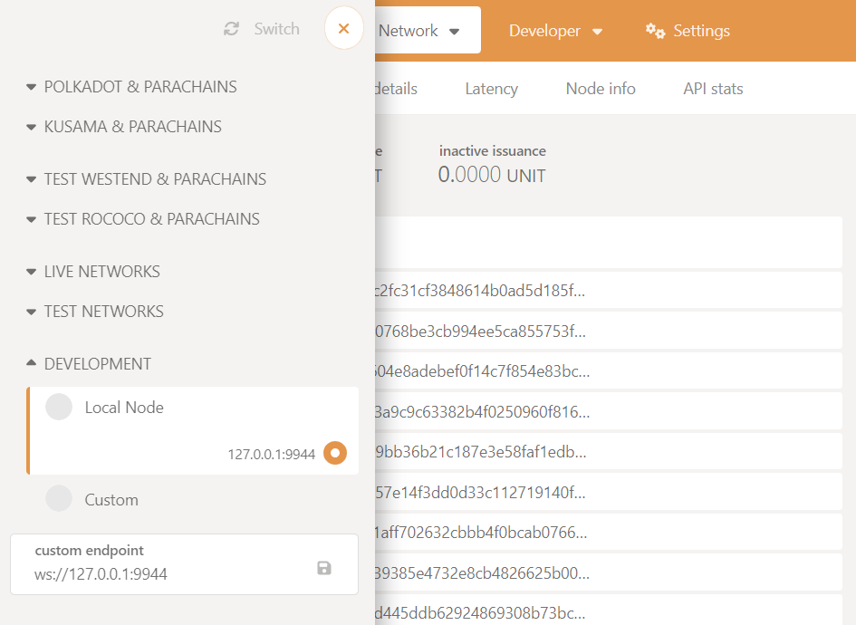
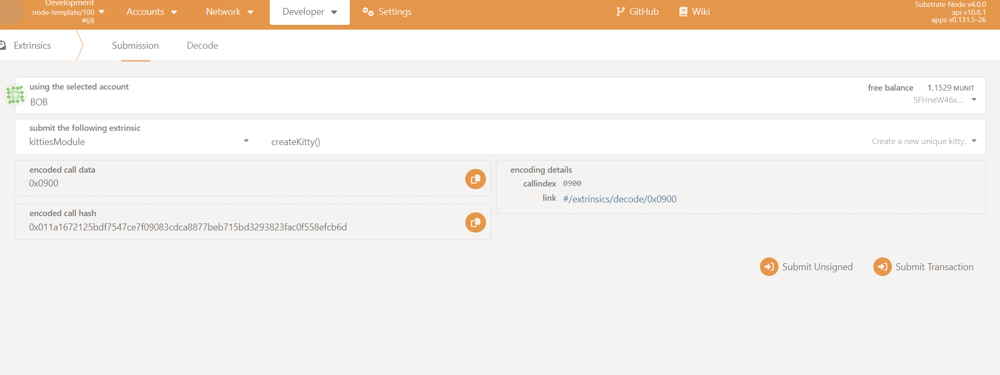
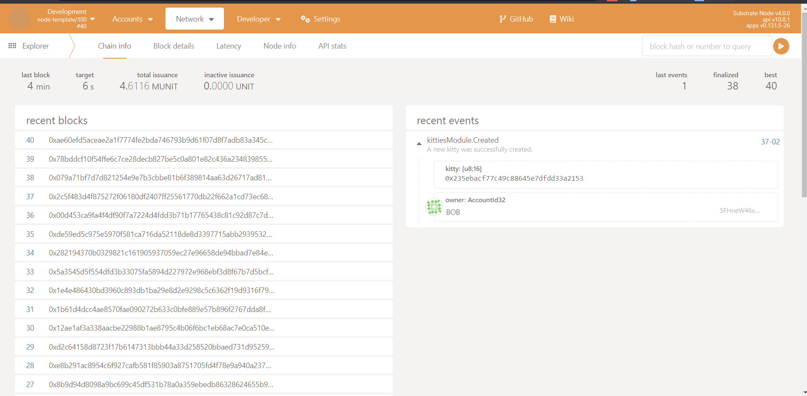
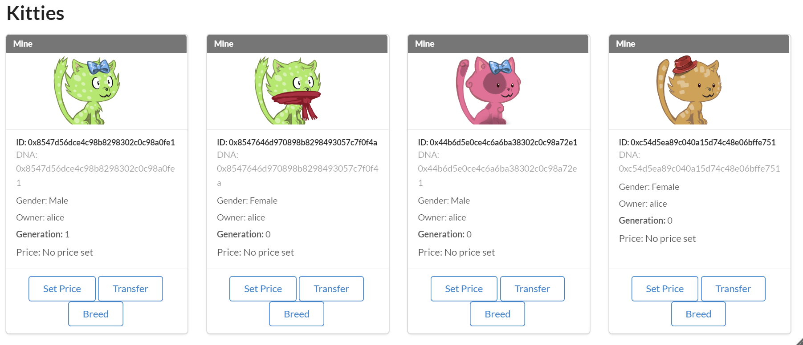

# Writing the Kitties pallet

Lets check and ennumerate what we want the pallet to be able to do. And order it in a logic and 
progressive way, so we can build it step by step.

1. Create a kitty (for first time and by breeding).
2. Change the price of a kitty.
3. Change the owner of a kitty (transfer or buy).

Notice number 2 and 3 are actions that will change some information about the kitty: its price or owner.

:::info
A pallet, at its simplest, is composed of 3 parts:

1. Storage: This is where the pallet stores its data. It is a key-value store.
2. Dispatchable functions: These functions materialize as "extrinsics", which are often compared to 
transactions.
3. Events and errors: Events are used to inform users when important changes are made. Errors inform 
users that something went wrong.
:::

## Kitties pallet scaffold

We'll be spending most of this tutorial in the pallets directory of our template node. 
Let's take a glance at the folder structure in our workspace:

```
substrate-node-template          <--  The name of our project directory
|
+-- node
|
+-- pallets
|   |
|   +-- kitties
|       |
|       +-- Cargo.toml
|       |
|       +-- src
|           |
|           +-- benchmarking.rs     <-- Remove file
|           |
|           +-- lib.rs              <-- Remove contents
|           |
|           +-- mock.rs             <-- Remove file
|           |
|           +-- tests.rs            <-- Remove file
|
+-- Cargo.toml
```
[Pallets](https://doc.deepernetwork.org/v3/runtime/frame/#pallets) in Substrate are used to define runtime
 logic. We will be creating a pallet that manages the logic of our Kitties application.

Let's lay out the basic structure of our pallet by outlining the parts inside `pallets/kitties/src/lib.rs`.

Notice that our pallet's directory `./pallets/kitties/` is not the same as our pallet's name. The name of 
our pallet as Cargo understands it is `pallet-kitties`.

Every FRAME pallet has:

* A set of frame_support and frame_system dependencies.
* Required [attribute macros](https://doc.deepernetwork.org/v3/runtime/macros/#frame-macros-and-attributes)
 (i.e. configuration traits, storage items and function calls).

We'll be including all dependencies necessary for the kitties pallet in the scaffold.

Here's the most bare-bones version of the Kitties pallet we will be building in this tutorial. It contains 
the starting point for adding code for the next sections. It contains comments marked with TODO to indicate
code we will be writing later.

Paste the following code in `./pallets/kitties/src/lib.rs`, in place of the code that was there before:

```rust
#![cfg_attr(not(feature = "std"), no_std)]

#[cfg(test)]
pub mod mock;

#[cfg(test)]
mod tests;

pub use pallet::*;

#[frame_support::pallet]
pub mod pallet {
	use super::*;
	use frame_support::{
		pallet_prelude::*,
		traits::{tokens::ExistenceRequirement, Currency, Randomness},
	};
	use frame_system::pallet_prelude::*;
	use scale_info::TypeInfo;
	use sp_io::hashing::blake2_128;
	use sp_runtime::ArithmeticError;

	#[cfg(feature = "std")]
	use frame_support::serde::{Deserialize, Serialize};

	// Handles our pallet's currency abstraction
	type BalanceOf<T> =
		<<T as Config>::Currency as Currency<<T as frame_system::Config>::AccountId>>::Balance;

	// TODO: Struct for holding kitty information

	// TODO: Enum that represents the gender of a kitty.

	#[pallet::pallet]
	pub struct Pallet<T>(_);

	// Configure the pallet by specifying the parameters and types on which it depends.
	#[pallet::config]
	pub trait Config: frame_system::Config {
		/// Because this pallet emits events, it depends on the runtime's definition of an event.
		type RuntimeEvent: From<Event<Self>> + IsType<<Self as frame_system::Config>::RuntimeEvent>;

		/// The Currency handler for the kitties pallet.
		type Currency: Currency<Self::AccountId>;

		/// TODO: The maximum amount of kitties a single account can own.

		/// TODO: The type of Randomness we want to specify for this pallet.
	}

	// TODO: Errors that can occur in the pallet.
	#[pallet::error]
	pub enum Error<T> {
	}

	// TODO: Events that can be emitted by the pallet.
	#[pallet::event]
	#[pallet::generate_deposit(pub(super) fn deposit_event)]
	pub enum Event<T: Config> {
	}

	/// TODO: Storage that keeps track of the number of kitties in existence.

	/// TODO: Storage that maps the kitty struct to the kitty DNA.

	/// TODO: Storage that tracks the kitties owned by each account.

	// TODO: Our pallet's genesis configuration

	#[pallet::call]
	impl<T: Config> Pallet<T> {
		// TODO: Create a new unique kitty.

		// TODO: Breed two kitties to give birth to a new kitty that is a combination of both parents.

		// TODO: Directly transfer a kitty to another recipient.

		// TODO: Buy a kitty that is listed for sale.

		// TODO: Set the price for a kitty.
	}

	//** Our helper functions.**//

	impl<T: Config> Pallet<T> {
		// TODO: Generates and returns DNA and Gender for a new kitty.

		// TODO: Picks from two existing DNA fragments based on a random value.

		// TODO: Generates a new kitty DNA by combining DNA fragments from two parent kitties.

		// TODO: Mint a new kitty and add it to the storage.

		// TODO: Update the storage to transfer a kitty from one owner to another.
	
	}
}
```

Now try running the following command to build your pallet. We won't build the entire chain just yet 
because we haven't yet implemented the Currency type in our runtime. At least we can check that there are 
no errors in our pallet so far:

```bash
cargo build -p pallet-kitties
```
We will get some errors related to imports that we have to fix.

* sp_io::hashing::blake2_128:

Move `sp_io` declaration from `[dev-dependencies]` to `[dependencies]` in the `cargo.toml` file of the 
pallet, with `default-features` set to false (if not compilation of the node will fail later). This is
necessary because we are using it in the pallet code. Also Add it to the `features` section in the 
`cargo.toml` file of the pallet, as follows:

```toml
[dependencies]
codec = { package = "parity-scale-codec", version = "3.2.2", default-features = false, features = [
	"derive",
] }
scale-info = { version = "2.1.1", default-features = false, features = ["derive"] }
frame-benchmarking = { version = "4.0.0-dev", default-features = false, optional = true, git = "https://github.com/paritytech/substrate.git", branch = "polkadot-v0.9.39" }
frame-support = { version = "4.0.0-dev", default-features = false, git = "https://github.com/paritytech/substrate.git", branch = "polkadot-v0.9.39" }
frame-system = { version = "4.0.0-dev", default-features = false, git = "https://github.com/paritytech/substrate.git", branch = "polkadot-v0.9.39" }
sp-io = { version = "7.0.0",  default-features = false, git = "https://github.com/paritytech/substrate.git", branch = "polkadot-v0.9.39" }

[dev-dependencies]
sp-core = { version = "7.0.0", git = "https://github.com/paritytech/substrate.git", branch = "polkadot-v0.9.39" }
sp-runtime = { version = "7.0.0", git = "https://github.com/paritytech/substrate.git", branch = "polkadot-v0.9.39" }

[features]
default = ["std"]
std = [
	"codec/std",
	"frame-benchmarking?/std",
	"frame-support/std",
	"frame-system/std",
	"scale-info/std",
	"sp-io/std",
]
```

* sp_runtime::ArithmeticError

Do the same for `sp_runtime`: move it from `[dev-dependencies]` to `[dependencies]` in the `cargo.toml` 
file of the pallet, with `default-features` set to false. Also add it to the `features` section in the 
`cargo.toml` file of the pallet as follows:

```toml
[dependencies]
codec = { package = "parity-scale-codec", version = "3.2.2", default-features = false, features = [
	"derive",
] }
scale-info = { version = "2.1.1", default-features = false, features = ["derive"] }
frame-benchmarking = { version = "4.0.0-dev", default-features = false, optional = true, git = "https://github.com/paritytech/substrate.git", branch = "polkadot-v0.9.39" }
frame-support = { version = "4.0.0-dev", default-features = false, git = "https://github.com/paritytech/substrate.git", branch = "polkadot-v0.9.39" }
frame-system = { version = "4.0.0-dev", default-features = false, git = "https://github.com/paritytech/substrate.git", branch = "polkadot-v0.9.39" }
sp-io = { version = "7.0.0", default-features = false, git = "https://github.com/paritytech/substrate.git", branch = "polkadot-v0.9.39" }
sp-runtime = { version = "7.0.0", default-features = false, git = "https://github.com/paritytech/substrate.git", branch = "polkadot-v0.9.39" }

[dev-dependencies]
sp-core = { version = "7.0.0", git = "https://github.com/paritytech/substrate.git", branch = "polkadot-v0.9.39" }

[features]
default = ["std"]
std = [
	"codec/std",
	"frame-benchmarking?/std",
	"frame-support/std",
	"frame-system/std",
	"scale-info/std",
	"sp-io/std",
	"sp-runtime/std",
]
```
You'll notice the Rust compiler giving you warnings about unused imports. That's fine! Just ignore them 
— we're going to be using those imports in the later parts of the tutorial.

## Add storage items

Let's start adding the most simple logic we can to our runtime: a function that stores a variable in 
runtime. In our case that variable wil be the number of kitties in existence.

For any storage item we want to declare, we must include the `#[pallet::storage]` macro beforehand.

In `./pallets/kitties/src/lib.rs`, put the following code to replace "TODO: Storage that keeps track of the 
number of kitties in existence":

```rust
/// Keeps track of the number of kitties in existence.
	#[pallet::storage]
	pub(super) type CountForKitties<T: Config> = StorageValue<_, u64, ValueQuery>;
```

This creates a storage item for our pallet to keep track of the total count of Kitties in existence.

## Add Currency implementation

Before we proceed with building our node, we need to add the `Currency` type to our pallet's runtime 
implementation. In `./runtime/src/lib.rs`, add the following:

```
impl pallet_kitties::Config for Runtime {
    type Event = Event;
    type Currency = Balances; // <-- Add this line
}
```
Now build your node and make sure you don't have any errors. This will take a little while at first.

```bash
cargo build --release
```
At this point, if you get an error like in the following image, it is because you did not set 
`default-features` to false in the `cargo.toml` file of the pallet in previous steps.


Congratulations! You've completed the first part of the tutorial. At this stage, you've learnt the 
various patterns for:

* Customizing the Substrate Node Template and including a custom pallet.
* Building a Substrate chain and checking that a target pallet compiles.
* Declaring a single value `u64` storage item.

## Uniqueness, custom types and storage maps

This section dives into some pillar concepts for developing pallets with FRAME (Framework for Runtime 
Aggregation of Modularized Entities):

- Writing a storage struct.
- Implementing the randomness trait.
- How to use existing types and traits.
- How create your own types like providing your pallet with a Gender type. 

Also, at the end of this part, you will have implemented the remaining two storage items according to the 
logic outlined for the Substrate Kitties application.

### Kitty struct

An Struct in Rust is a useful construct to help store data that have things in common. For our purposes, 
our Kitty will carry multiple properties which we can store in a single struct instead of using separate 
storage items. This comes in handy when trying to optimize for storage reads and writes so our runtime can 
perform less read/writes to update multiple values. Read more about storage best practices 
[here](https://doc.deepernetwork.org/v3/runtime/storage/#best-practices).

#### What information to include?

Let's first go over what information a single Kitty will carry:

* `dna`: the hash used to identify the DNA of a Kitty, which corresponds to its unique features. 
DNA is also used to breed new Kitties. An will be used as key in the storage.
* `price`: this is a balance that corresponds to the amount needed to buy a Kitty and set by its owner.
* `gender`: an enum that can be either Male or Female.
* `owner`: an account ID designating a single owner.
* `generation`: to keep track of the number of generations a Kitty has been bred for.

#### Sketching out the types held by our struct

Looking at the items of our struct from above, we can deduce the following types:

* `[u8; 16]` for dna - to use 16 bytes to represent a Kitty's DNA.
* `BalanceOf` for price - this is a custom type using FRAME's Currency trait.
* `Gender` for gender - we are going to create this!
* `u64` for generation.

So we get the following as our struct kitty struct.

Copy it to replace the TODO for the kitty struct:

```rust
// Struct for holding kitty information
	#[derive(Clone, Encode, Decode, PartialEq, RuntimeDebug, TypeInfo, MaxEncodedLen)]
	#[scale_info(skip_type_params(T))]
	pub struct Kitty<T: Config> {
		// An array of 16 bytes representing the kitty's DNA.
		pub dna: [u8; 16],

		// The price of the kitty, stored as an optional balance.
    	// If set to `None`, it assumes the kitty is not for sale.
		pub price: Option<BalanceOf<T>>,

		// The gender of the kitty.
		pub gender: Gender,

		// The owner of the kitty, stored as the account ID.
		pub owner: T::AccountId,

		// Generation of the kitty, stored as a u64.
		pub generation: u64,
	}
```

Notice how we use the derive macro to include various helper traits for using our struct. We have already
added `TypeInfo` in order to give our struct access to this trait.

For type `Gender`, we will need to build out our own custom enum and helper functions. Now is a good time 
to do that.

### Gender enum

We have just created a struct that requires a custom type called `Gender`. This type will handle an enum 
defining our Kitty's gender. To create it, you'll build out the following parts:

* An enum declaration, which specifies Male and Female values.
* Implement a helper function for our Kitty struct.

1. Declare the custom enum

Replace "TODO: Enum that represents the gender of a kitty" with the following code:

```rust
// Represents the gender of a kitty.
	#[derive(Clone, Encode, Decode, PartialEq, Copy, RuntimeDebug, TypeInfo, MaxEncodedLen)]
	// We need this to pass kitty info for genesis configuration
	#[cfg_attr(feature = "std", derive(Serialize, Deserialize))]
	pub enum Gender {
		Male,
		Female,
	}
```

Notice the use of the derive macro which must precede the enum declaration. This wraps our enum in the 
data structures it will need to interface with other types in our runtime. In order to use `Serialize` and 
 `Deserialize`, you will need to add the serde crate in pallets/kitties/Cargo.toml:

```toml
[dependencies]
serde = { version = "1.0.136", optional = true }

[features]
default = ["std"]
std = [
	"codec/std",
	"frame-benchmarking?/std",
	"frame-support/std",
	"frame-system/std",
	"scale-info/std",
	"sp-io/std",
	"sp-runtime/std",
	"serde",
]
```

Great, we now know how to create a custom struct. But what about providing a way for a Kitty struct to be 
assigned a gender value?

2. Implement a helper function for our Kitty struct

Configuring an struct is useful in order to pre-define a value in our struct. For example, when setting a 
value in relation to what another function returns. In our case we have a similar situation where we need 
to configure our Kitty struct in such a way that sets `Gender` according to a Kitty's DNA.

We'll create a function called gen_dna that returns a tuple of DNA and gender for a kitty.

Replace "TODO: Generates and returns DNA and Gender for a new kitty" with the following:

```rust
// Generates and returns DNA and Gender for a new kitty.
		pub fn gen_dna() -> ([u8; 16], Gender) {
			// Create randomness
			let random = T::KittyRandomness::random(&b"dna"[..]).0;

			// Create randomness payload. Multiple kitties can be generated in the same block,
			// retaining uniqueness.
			let unique_payload = (
				random,
				frame_system::Pallet::<T>::extrinsic_index().unwrap_or_default(),
				frame_system::Pallet::<T>::block_number(),
			);

			// Turns into a byte array
			let encoded_payload = unique_payload.encode();
			let hash = blake2_128(&encoded_payload);

			// Generate Gender
			if hash[0] % 2 == 0 {
				// Males are identified by having a even leading byte
				(hash, Gender::Male)
			} else {
				// Females are identified by having a odd leading byte
				(hash, Gender::Female)
			}
		}
```
### On-chain randomness

If we want to be able to tell these Kitties apart, we need to start giving them unique properties! In 
the previous step, we've made use of KittyRandomness which we haven't actually defined yet. Let's get to 
it.

We'll be using the Randomness trait from frame_support to do this. It will be able to generate a random 
seed which we'll create unique Kitties with as well as breed new ones.

In order to use the Randomness trait for our pallet, we must:

1. Define a new type bound by Randomness trait in our pallet's configuration trait:

The `Randomness` trait from `frame_support` requires specifying it with a paramater to replace the 
`Output` and `BlockNumber` generics. For our purposes, we want the output of functions using this 
trait to be `Blake2 128-bit hash` which you'll notice should already be declared at the top of your 
working codebase.

Replace "TODO: The type of Randomness we want to specify for this pallet." with the following:

```rust
/// The type of Randomness we want to specify for this pallet.
type KittyRandomness: Randomness<Self::Hash, Self::BlockNumber>;
```
2. Specify the actual type in our runtime

Given that we have added a new type in the configuration of our pallet, we need to config our runtime to 
set its concrete type. This could come in handy if ever we want to change the algorithm that 
`KittyRandomness` is using, without needing to modify where it's used inside our pallet.

To showcase this point, we're going to set the `KittyRandomness` type to an instance of FRAME's 
`InsecureRandomnessCollectiveFlip` (It is called insecure because it should not be used in production 
settings). Conveniently, the Node Template already has an instance of the `InsecureRandomnessCollectiveFlip` 
pallet. All you need to do is set the `KittyRandomness` type in your runtime, inside `./runtime/src/lib.rs`:

 ```
/// Configure the pallet-template in pallets/template.
impl pallet_template::Config for Runtime {
	type RuntimeEvent = RuntimeEvent;
	type Currency = Balances;
	type KittyRandomness = RandomnessCollectiveFlip;
}
 ```
### Remaining storage items

1. Understanding storage item logic

To easily track all of our kitties, we're going to standardize our logic to use a unique ID as the global 
key for our storage items. This means that a single unique key will point to our Kitty object (i.e. the 
struct we previously declared).

In order for this to work, we need to make sure that the ID for a new Kitty is always unique. We can do 
this with a new storage item Kitties which will be a mapping from an ID to the Kitty object.

With this object, we can easily check for collisions by simply checking whether this storage item already 
contains a mapping using a particular ID. For example, from inside a dispatchable function we could check 
using:

```rust
ensure!(!<Kitties<T>>::exists(new_id), "This new id already exists");
```

Our runtime needs to be made aware of:

* Unique assets, like currency or Kitties (this will be held by a storage map called `Kitties`)
* Ownership of those assets, like account IDs (this will be handled a new storage map called `KittiesOwned`)

2. Using a StorageMap

To create a storage instance for the Kitty struct, we'll be using a `StorageMap` — a hash-map provided to us
 by FRAME.

Here's what the Kitties storage item looks like:

```rust
/// Maps the kitty struct to the kitty DNA.
#[pallet::storage]
pub(super) type Kitties<T: Config> = StorageMap<
    _, 
    Twox64Concat, 
    [u8; 16], 
    Kitty<T>
>;
```
Breaking it down, we declare the storage type and assign a StorageMap that takes:

* The `Twox64Concat` hashing algorithm.
* A key of type `[u8; 16]`.
* A value of type `Kitty<T>`.

The `KittiesOwned` storage item is similar except that we'll be using a `BoundedVec` to keep track of some 
maximum number of Kitties we'll configure in `./runtime/src/lib.rs`.

```rust
/// Track the kitties owned by each account.
#[pallet::storage]
pub(super) type KittiesOwned<T: Config> = StorageMap<
	_,
	Twox64Concat,
	T::AccountId,
	BoundedVec<[u8; 16], T::MaxKittiesOwned>,
	ValueQuery,
>;
```
Your turn! Copy the two code snippets above to replace "TODO: Storage that maps the kitty struct to the 
kitty DNA." and "TODO: Storage that tracks the kitties owned by each account.".

Before we can check if our pallet compiles, we need to add a new type `MaxKittyOwned` in the `config` 
trait, which is a pallet constant type (similar to `KittyRandomness` in the previous steps). Replace 
"TODO: The maximum amount of kitties a single account can own." with:

```rust
/// The maximum amount of kitties a single account can own.
#[pallet::constant]
type MaxKittiesOwned: Get<u32>;
```
Finally, we define `MaxKittyOwned` type in `./runtime/src/lib.rs`. This is the same pattern as we 
followed for `Currency` and `KittyRandomness` except we'll be adding a fixed `u32` using the 
`parameter_types!` macro:

```rust
parameter_types! { 
	// One can own at most 9,999 Kitties
	pub const MaxKittyOwned: u32 = 9999;
}

/// Configure the pallet-template in pallets/template.
impl pallet_template::Config for Runtime {
	type RuntimeEvent = RuntimeEvent;
	type Currency = Balances;
	type KittyRandomness = RandomnessCollectiveFlip;
	type MaxKittiesOwned = MaxKittyOwned;
}
```
Now is a good time to check that your Kitties blockchain compiles!

```bash
cargo build --release
```
## Dispatchables, events, and errors

In the previous section, we laid down the foundations geared to manage the ownership of our 
Kitties — even though they don't really exist yet! In this part of the tutorial, we'll be putting these 
foundations to use by giving our pallet the ability to create a Kitty using the storage items we've 
declared. Breaking things down, we're going to write:

* `create_kitty`: a dispatchable or publicly callable function allowing an account to mint a Kitty.
* `mint()`: a helper function that updates our pallet's storage items and performs error checks, called by 
`create_kitty`.
* pallet Events: using FRAME's #[pallet::event] attribute.

At the end of this part, we'll check that everything compiles without error and call our `create_kitty` 
extrinsic using the PolkadotJS Apps UI.

### Public and private functions

Before we dive right in, it's important to understand the pallet design decisions we'll be making around 
coding up our Kitty pallet's minting and ownership management capabilities.

We will be breaking up the "heavy lifting" logics into private helper functions. This improves code 
readability and reusability.

Lets paint the big picture of what combining dispatchables and helper functions looks like.

`create_kitty` is a dispatchable function or extrinsic that:

* Make sure the call is from a signed origin.
* Generate unique DNA and Gender using a helper function.
* States the generation as 0.
* Calls a private mint() function.

`mint()` is a private helper function that:

* Check if the kitty does not already exist in our storage map.
* Updates storage with the new Kitty ID (for all Kitties and for the owner's account).
* Updates the new total Kitty count for storage and the new owner's account.
* Deposits an `Event` to signal that a Kitty has succesfully been created.

### create_kitty dispatchable

All pallet dispatchables live under the #[pallet::call] macro. All we need to know here is that they're a 
useful feature of FRAME that minimizes the code required to write for pallets to be properly integrated 
in a Substrate chain's runtime.

### Weights

Every dispatchable function must have an associated weight to it. Weights are an important part of 
developing with Substrate as they provide safe-guards around the amount of computation to fit in a 
block at execution time.

Substrate's weighting system forces developers to think about the computational complexity each extrinsic 
carries before it is called so that a node will account for it's worst case, avoiding lagging the 
network with extrinsics that may take longer than the specified block time. Weights are also 
intimately linked to the fee system for a signed extrinsic.

For this simple application, we're going to default all weights to 0.

Replace "TODO: Create a new unique kitty." with the following:

```rust
/// Create a new unique kitty.
///
/// The actual kitty creation is done in the `mint()` function.
#[pallet::call_index(0)]
#[pallet::weight(0)]
pub fn create_kitty(origin: OriginFor<T>) -> DispatchResult {
    // Make sure the caller is from a signed origin
    let sender = ensure_signed(origin)?;

    // Generate unique DNA and Gender using a helper function
    let (kitty_gen_dna, gender) = Self::gen_dna();

    // Generation is 0 when a kitty is first created
    let generation = 0;

    // Write new kitty to storage by calling helper function
    Self::mint(&sender, kitty_gen_dna, gender, generation)?;

    Ok(())
}
```

#### Write the mint() function

As seen when we wrote `create_kitty` in the previous section, we'll need to create `mint()` for writing our 
new unique Kitty object to the various storage items declared.

The `mint()` function will take the following arguments:

* `owner`: of type `&T::AccountId` - this indicates whom the kitty belongs to.
* `dna`: of type `[u8; 16]` - this specifies the DNA of the kitty going to be minted. If None is passed in, a random DNA will be generated.
* `gender`: of type `Gender`.
* `generation`: a `u64` type.

And it will return `Result<[u8; 16], DispatchError>`.

Paste in the following code snippet to write the `mint()` function, replacing "TODO: Mint a new kitty and 
add it to the storage." in the working codebase:

```rust
// Mint a new kitty and add it to the storage.
pub fn mint(
    owner: &T::AccountId,
    dna: [u8; 16],
    gender: Gender,
    generation: u64,
) -> Result<[u8; 16], DispatchError> {
    // Create a new object
    let kitty = Kitty::<T> { 
        dna, 
        price: None, 
        gender, 
        owner: owner.clone(),
        generation, 
    };

    // Check if the kitty does not already exist in our storage map
    ensure!(!Kitties::<T>::contains_key(&kitty.dna), Error::<T>::DuplicateKitty);

    // Performs this operation first as it may fail
    let count = CountForKitties::<T>::get();
    let new_count = count.checked_add(1).ok_or(ArithmeticError::Overflow)?;

    // Append kitty to KittiesOwned
    KittiesOwned::<T>::try_append(&owner, kitty.dna)
        .map_err(|_| Error::<T>::TooManyOwned)?;

    // Write new kitty to storage
    Kitties::<T>::insert(kitty.dna, kitty);
    CountForKitties::<T>::put(new_count);

    // Deposit our "Created" event.
    Self::deposit_event(Event::Created { kitty: dna, owner: owner.clone() });

    // Returns the DNA of the new kitty if this succeeds
    Ok(dna)
}
```

Let's go over what the above code is doing.

The first thing we're doing is creating a new Kitty object. Then we check if the kitty does not already 
exist in our storage map. If it does, we return an error. If it doesn't, we append the kitty to
`KittiesOwned` and write the new kitty to storage. Finally, we deposit our `Created` event.

### Pallet Events

As you could see in the minting function our pallet can also emit `Events`. This not only reports the 
success of a function's execution, but also tells the "off-chain world" that some particular state 
transition has happened.

FRAME helps us easily manage and declare our pallet's events using the `#[pallet::event]` attribute. With 
FRAME macros, events are just an enum declared like this:

```rust
// this is an example event enum
#[pallet::event]
#[pallet::generate_deposit(pub(super) fn deposit_event)]
pub enum Event<T: Config>{
    /// A function succeeded. [time, day]
    Success(T::Time, T::Day),
}
```
As you can see in the above snippet, we use attribute macro:

`#[pallet::generate_deposit(pub(super) fn deposit_event)]`

This allows us to deposit a specifc event using the pattern below:

```rust
Self::deposit_event(Event::Success(var_time, var_day));
```

In order to use events inside our pallet, we add a the associated type `Event` inside our pallet's 
configuration trait `Config`. Additionally — just as when adding any type to our pallet's Config trait — we 
also needed to define it in our runtime `./runtime/src/lib.rs`.

This pattern is the same as when we added the `KittyRandomness` type to our pallet's configuration trait 
earlier in this tutorial and has already been included from the initial scaffolding of our codebase:

```rust
// Configure the pallet by specifying the parameters and types on which it depends.
	#[pallet::config]
	pub trait Config: frame_system::Config {
		/// Because this pallet emits events, it depends on the runtime's definition of an event.
		type RuntimeEvent: From<Event<Self>> + IsType<<Self as frame_system::Config>::RuntimeEvent>;
        //--snip--//
```
Declare your pallet events by replacing "TODO: Events that can be emitted by the pallet." with:

```rust
// Events that can be emitted by the pallet.
#[pallet::event]
#[pallet::generate_deposit(pub(super) fn deposit_event)]
pub enum Event<T: Config> {
    /// A new kitty was successfully created.
    Created { kitty: [u8; 16], owner: T::AccountId },
    /// The price of a kitty was successfully set.
    PriceSet { kitty: [u8; 16], price: Option<BalanceOf<T>> },
    /// A kitty was successfully transferred.
    Transferred { from: T::AccountId, to: T::AccountId, kitty: [u8; 16] },
    /// A kitty was successfully sold.
    Sold { seller: T::AccountId, buyer: T::AccountId, kitty: [u8; 16], price: BalanceOf<T> },
}
```
### Pallet Errors

FRAME provides us with an error handling system using `[#pallet::errors]` which allows us to specify errors 
for our pallet and use them across our pallet's functions.

Declare all possible errors using the provided FRAME macro under `#[pallet::error]`, replace "TODO: Errors that can occur in the pallet." 
with:

```rust
// Errors that can occur in the pallet.
#[pallet::error]
pub enum Error<T> {
    /// An account may only own `MaxKittiesOwned` kitties.
    TooManyOwned,
    /// Trying to transfer or buy a kitty from oneself.
    TransferToSelf,
    /// This kitty already exists!
    DuplicateKitty,
    /// This kitty does not exist!
    NoKitty,
    /// You are not the owner of this kitty.
    NotOwner,
    /// This kitty is not for sale.
    NotForSale,
    /// Ensures that the buying price is greater than the asking price.
    BidPriceTooLow,
    /// You need to have two cats with different gender to breed.
    CantBreed,
}
```
Now is a good time to see if your chain can compile. Instead of only checking if your pallet compiles, 
run the following command to see if everything can build:

```bash
cargo build --release
```
If you ran into errors, scroll to the first error message in your terminal, identify what line is giving 
an error and check whether you've followed each step correctly. Sometimes a mismatch of curly brackets 
will unleash a whole bunch of errors that are difficult to understand — double check your code!

Did that build fine? Congratulations! That's the core functionality of our Kitties pallet. In the next 
step you'll be able to see everything you've built so far in action.

### Testing with Polkadot-JS Apps UI

Assuming that you successfully built your chain, let's run it and use the [PolkadotJS Apps UI](https://polkadot.js.org/apps/#/explorer) 
to interact with it.

In your chain's project directory, run:

```bash
./target/release/node-template --tmp --dev
```
By doing this, we're specifying to run a temporary chain in developer mode, so as not to need to purge 
storage each time we want to start a fresh chain.

Assuming that blocks are being finalized (which you should be able to see from the terminal in which you 
ran the above command), head over to [Polkadot.js Apps UI](https://polkadot.js.org/apps/#/explorer).

Follow these steps:

* Check that you're connected to the Local Node. Click on the top left circular network icon, open the 
`Development` section, and choose `Local Node`. Your node is default to be 127.0.0.1.:9944.



* Now go to: `Developer -> Extrinsics` and submit a signed extrinsic using `kittiesModule` by calling 
the `createKitty()` dispatchable.



* Check for the associated event `Created` by going to `Network -> Explorer`. You should be able to see 
the events emitted and query their block details.



* Check your newly created Kitty's details by going to `Developer -> Chain State`. Select the 
`kittiesModule` pallet and query Kitties. Be sure to uncheck the `include` option box and you should be 
able to see the details of your newly minted Kitty in the following format:

```rust
kittiesModule.kitties: Option<PalletKittiesKitty>
[
  [
    [
      0x235ebacf77c49c88645e7dfdd33a2153
    ]
    {
      dna: 0x235ebacf77c49c88645e7dfdd33a2153
      price: null
      gender: Female
      owner: 5FHneW46xGXgs5mUiveU4sbTyGBzmstUspZC92UhjJM694ty
      generation: 0
    }
  ]
]
```


* Check that other storage items correctly reflect the creation of additional Kitties.

Congratulations! You're pretty much able to take it from here at this point! We've learnt how to implement 
the key parts of what powers a FRAME pallet and how to put them to use. In the next section we'll be 
building on our knowledge by adding more capabilities to our pallet.

To recap, in this part of the tutorial you've learnt how to:

* Distinguish between implementing a dispatchable function and a private helper function.
* Use `#[pallet::call]`, `#[pallet::event]` and `#[pallet::error]`.
* Implement basic error checking with FRAME.
* Update values in storage with safety checks.
* Implement FRAME events and use them in a function.
* Query storage items and chain state using the PolkadotJS Apps UI.

## Interacting with your Kitties

Up until this point in the tutorial, we've built a chain capable of only creating and tracking the 
ownership of Kitties. Now that that's done, we want to make our runtime more like a game by introducing 
other functions like buying and selling Kitties

We will first need to enable users to mark and update the price of their Kitties. Then we can add 
functionality to enable users to transfer, buy, and breed Kitties.

Since the workflow of what we already done will be repeated for the remaining functions, we'll be giving 
thecode for each new functionality and explaining what each function does in the comments.

### Set price

Replace "TODO: Set the price for a kitty." with:

```rust
// Set the price for a kitty.
///
/// Updates the price of a kitty and updates it in storage.
///
/// # Arguments
///
/// * `origin` - The origin of the call.
/// * `kitty_id` - The DNA of the kitty.
/// * `new_price` - The new price for the kitty.
///
/// # Errors
///
/// Returns an error if:
/// * The caller is not from a signed origin.
/// * The kitty with the given ID does not exist.
/// * The caller is not the owner of the kitty.
#[pallet::call_index(5)]
#[pallet::weight(0)]
pub fn set_price(
    origin: OriginFor<T>,
    kitty_id: [u8; 16],
    new_price: Option<BalanceOf<T>>,
) -> DispatchResult {
    // Make sure the caller is from a signed origin
    let sender = ensure_signed(origin)?;

    // Ensure the kitty exists and is called by the kitty owner
    let mut kitty = Kitties::<T>::get(&kitty_id).ok_or(Error::<T>::NoKitty)?;
    ensure!(kitty.owner == sender, Error::<T>::NotOwner);

    // Set the price in storage
    kitty.price = new_price;
    Kitties::<T>::insert(&kitty_id, kitty);

    // Deposit a "PriceSet" event.
    Self::deposit_event(Event::PriceSet { kitty: kitty_id, price: new_price });

    Ok(())
}
```

### Transfer

Replace "TODO: Directly transfer a kitty to another recipient." with:

```rust
/// Directly transfer a kitty to another recipient.
///
/// Any account that holds a kitty can send it to another account. This will reset the asking price
/// of the kitty, marking it not for sale.
///
/// # Arguments
///
/// * `origin` - The origin of the call.
/// * `to` - The account ID of the recipient.
/// * `kitty_id` - The DNA of the kitty to be transferred.
///
/// # Errors
///
/// Returns an error if:
/// * The caller is not from a signed origin.
/// * The kitty with the given ID does not exist.
/// * The caller is not the owner of the kitty.
#[pallet::call_index(3)]
#[pallet::weight(0)]
pub fn transfer(
    origin: OriginFor<T>,
    to: T::AccountId,
    kitty_id: [u8; 16],
) -> DispatchResult {
    // Make sure the caller is from a signed origin
    let from = ensure_signed(origin)?;
    let kitty = Kitties::<T>::get(&kitty_id).ok_or(Error::<T>::NoKitty)?;
    ensure!(kitty.owner == from, Error::<T>::NotOwner);
    Self::do_transfer(kitty_id, to, None)?;
    Ok(())
}
```
This will need another helper function, `do_transfer`. Replace "TODO: Update the storage to transfer a 
kitty from one owner to another." with:

```rust
/// Update the storage to transfer a kitty from one owner to another.
pub fn do_transfer(
    kitty_id: [u8; 16],
    to: T::AccountId,
    maybe_limit_price: Option<BalanceOf<T>>,
) -> DispatchResult {
    // Get the kitty
    let mut kitty = Kitties::<T>::get(&kitty_id).ok_or(Error::<T>::NoKitty)?;
    let from = kitty.owner;

    ensure!(from != to, Error::<T>::TransferToSelf);
    let mut from_owned = KittiesOwned::<T>::get(&from);

    // Remove kitty from list of owned kitties.
    if let Some(ind) = from_owned.iter().position(|&id| id == kitty_id) {
        from_owned.swap_remove(ind);
    } else {
        return Err(Error::<T>::NoKitty.into());
    }

    // Add kitty to the list of owned kitties.
    let mut to_owned = KittiesOwned::<T>::get(&to);
    to_owned.try_push(kitty_id).map_err(|_| Error::<T>::TooManyOwned)?;

    // Mutating state here via a balance transfer, so nothing is allowed to fail after this.
    // The buyer will always be charged the actual price. The limit_price parameter is just a 
    // protection so the seller isn't able to front-run the transaction.
    if let Some(limit_price) = maybe_limit_price {
        // Current kitty price if for sale
        if let Some(price) = kitty.price {
            ensure!(limit_price >= price, Error::<T>::BidPriceTooLow);
            // Transfer the amount from buyer to seller
            T::Currency::transfer(&to, &from, price, ExistenceRequirement::KeepAlive)?;
            // Deposit sold event
            Self::deposit_event(Event::Sold {
                seller: from.clone(),
                buyer: to.clone(),
                kitty: kitty_id,
                price,
            });
        } else {
            // Kitty price is set to `None` and is not for sale
            return Err(Error::<T>::NotForSale.into());
        }
    }

    // Transfer succeeded, update the kitty owner and reset the price to `None`.
    kitty.owner = to.clone();
    kitty.price = None;

    // Write updates to storage
    Kitties::<T>::insert(&kitty_id, kitty);
    KittiesOwned::<T>::insert(&to, to_owned);
    KittiesOwned::<T>::insert(&from, from_owned);

    Self::deposit_event(Event::Transferred { from, to, kitty: kitty_id });

    Ok(())
}
```
The `do_transfer` function is more complex than is necessary for a transfer. This is because it is already
dealing with the logic of a sale. We'll be using this function again in the next extrinsic.

### Buy

Replace `TODO: Buy a kitty that is listed for sale.` with:

```rust
/// Buy a kitty that is listed for sale.
///
/// The `limit_price` parameter acts as a safeguard against the possibility that the seller front-runs
/// the transaction by setting a high price. A front-end should assume that this value is always equal
/// to the actual price of the kitty. The buyer will always be charged the actual price of the kitty.
///
/// If successful, this dispatchable will reset the price of the kitty to `None`, making it no longer
/// for sale, and handle the balance and kitty transfer between the buyer and seller.
///
/// # Arguments
///
/// * `origin` - The origin of the call.
/// * `kitty_id` - The DNA of the kitty to be purchased.
/// * `limit_price` - The maximum price the buyer is willing to pay.
///
/// # Errors
///
/// Returns an error if:
/// * The caller is not from a signed origin.
#[pallet::call_index(4)]
#[pallet::weight(0)]
pub fn buy_kitty(
    origin: OriginFor<T>,
    kitty_id: [u8; 16],
    limit_price: BalanceOf<T>,
) -> DispatchResult {
    // Make sure the caller is from a signed origin
    let buyer = ensure_signed(origin)?;
    // Transfer the kitty from seller to buyer as a sale
    Self::do_transfer(kitty_id, buyer, Some(limit_price))?;

    Ok(())
}
```
As you can see, the `buy_kitty` function is also using the transfer function. The only difference is 
that the transference is done as a sale or payment gated.

### Breed

Replace "TODO: Breed two kitties to give birth to a new kitty that is a combination of both parents." with:

```rust
/// Breed two kitties to give birth to a new kitty that is a combination of both parents.
///
/// # Arguments
///
/// * `origin` - The origin of the call.
/// * `parent_1` - The DNA of the first parent kitty.
/// * `parent_2` - The DNA of the second parent kitty.
///
/// # Errors
///
/// Returns an error if:
/// * The caller is not from a signed origin.
/// * One or both of the parent kitties do not exist.
/// * The caller is not the owner of both parent kitties.
/// * The parent kitties are not of opposite genders.
#[pallet::call_index(1)]
#[pallet::weight(0)]
pub fn breed_kitty(
    origin: OriginFor<T>,
    parent_1: [u8; 16],
    parent_2: [u8; 16],
) -> DispatchResult {
    // Make sure the caller is from a signed origin
    let sender = ensure_signed(origin)?;

    // Get the kitties.
    let maybe_mom = Kitties::<T>::get(&parent_1).ok_or(Error::<T>::NoKitty)?;
    let maybe_dad = Kitties::<T>::get(&parent_2).ok_or(Error::<T>::NoKitty)?;

    // Check both parents are owned by the caller of this function
    ensure!(maybe_mom.owner == sender, Error::<T>::NotOwner);
    ensure!(maybe_dad.owner == sender, Error::<T>::NotOwner);

    // Parents must be of opposite genders
    ensure!(maybe_mom.gender != maybe_dad.gender, Error::<T>::CantBreed);

    // Create new DNA from these parents
    let (new_dna, new_gender) = Self::breed_dna(&parent_1, &parent_2);

    // Generation is the higher of the two parents' generations + 1
    let generation = maybe_mom.generation.max(maybe_dad.generation) + 1;

    // Mint new kitty
    Self::mint(&sender, new_dna, new_gender, generation)?;
    Ok(())
}
```
This will need another helper function, "breed_dna". Replace "TODO: Generates a new kitty DNA by 
combining DNA fragments from two parent kitties." with:

```rust
// Generates a new kitty DNA by combining DNA fragments from two parent kitties.
pub fn breed_dna(parent1: &[u8; 16], parent2: &[u8; 16]) -> ([u8; 16], Gender) {
    // Call `gen_dna` to generate random kitty DNA
    // We don't know what Gender this kitty is yet
    let (mut new_dna, new_gender) = Self::gen_dna();

    // randomly combine DNA using `mutate_dna_fragment`
    for i in 0..new_dna.len() {
        // At this point, `new_dna` is a randomly generated set of bytes, so we can
        // extract each of its bytes to act as a random value for `mutate_dna_fragment`
        new_dna[i] = Self::mutate_dna_fragment(parent1[i], parent2[i], new_dna[i])
    }
    // return new DNA and gender
    (new_dna, new_gender)
}
```
This is also using another helper function called `mutate_dna_fragment`. Replace "TODO: Picks from two 
existing DNA fragments based on a random value." with:

```rust
// Picks from two existing DNA fragments based on a random value.
fn mutate_dna_fragment(dna_fragment1: u8, dna_fragment2: u8, random_value: u8) -> u8 {
    // Given some random u8
    if random_value % 2 == 0 {
        // either return `dna_fragment1` if its an even value
        dna_fragment1
    } else {
        // or return `dna_fragment2` if its an odd value
        dna_fragment2
    }
}
```
The breeding logic is to randomly pick a DNA fragment from each parent kitty and combine them to form a 
new kitty.

This will make more sense when we look at the UI section. The descendants of a pair of kitties will
have some DNA fragments from each parent kitty.

For example, in the following image, who do you think the parents of the only kitty of generation 1 are?



## Genesis configuration

The final step before our pallet is ready to be used is to set the genesis state of our storage items. 
We'll make use of FRAME's `#[pallet::genesis_config]` to do this. Essentially, this allows us to declare 
what the Kitties object in storage contains in the genesis block.

Copy the following code to replace "TODO: Our pallet's genesis configuration":

```rust
// Our pallet's genesis configuration
#[pallet::genesis_config]
pub struct GenesisConfig<T: Config> {
    pub kitties: Vec<(T::AccountId, [u8; 16], Gender, u64)>,
}

// Required to implement default for GenesisConfig
#[cfg(feature = "std")]
impl<T: Config> Default for GenesisConfig<T> {
    fn default() -> GenesisConfig<T> {
        GenesisConfig { kitties: vec![] }
    }
}

#[pallet::genesis_build]
impl<T: Config> GenesisBuild<T> for GenesisConfig<T> {
    fn build(&self) {
        // When building a kitty from genesis config, we require the DNA and Gender to be
        // supplied
        for (account, dna, gender, generation) in &self.kitties {
            assert!(Pallet::<T>::mint(account, *dna, *gender, *generation).is_ok());
        }
    }
}
```

To let our chain know about our pallet's genesis configuration, we need to modify the `chain_spec.rs` file 
in our project's node folder. It's important you make sure you use the name of the pallet instance in 
`./runtime/src/lib.rs`, which in our case was kitties_module. Go to `./node/src/chain_spec.rs`, add 
`kitties_module: Default::default()` to the `testnet_genesis` function, like so:

```rust
//-- snip --
    sudo: SudoConfig {
        // Assign network admin rights.
        key: Some(root_key),
    },
    transaction_payment: Default::default(),
    kitties_module: Default::default(),
}
```
## Build, run and interact with your Kitties

If you've completed all of the preceding parts and steps of this tutorial, you're ready to run your chain 
and start interacting with all the new capabilities of your Kitties pallet!

Build and run your chain using the following commands:

```bash
cargo build --release
./target/release/node-template --tmp --dev
```
Now check your work using the [Polkadot-JS Apps] (https://polkadot.js.org/apps/#/explorer) just like we 
did previously. Once your chain is running and connected to the PolkadotJS Apps UI, perform these manual 
checks:

* Fund multiple users with tokens so they can all participate.
* Have each user create multiple Kitties.
* Try to transfer a Kitty from one user to another using the right and wrong owner.
* Try to set the price of a Kitty using the right and wrong owner.
* Buy a Kitty using an owner and another user.
* Use too little funds to purchase a Kitty.
* Overspend on the cost of the Kitty and ensure that the balance is reduced appropriately.
* Breed a Kitty and check that the new DNA is a mix of the old and new.

After all of these actions, confirm that all users have the correct number of Kitties; that the total 
Kitty count is correct; and any other storage variables are correctly represented.

## Helper code

If you got lost at some point in the tutorial, you can find the complete code for this tutorial 
[here](https://gist.github.com/WalquerX/978619e208d2cdf7c6a5a0635475d339).


