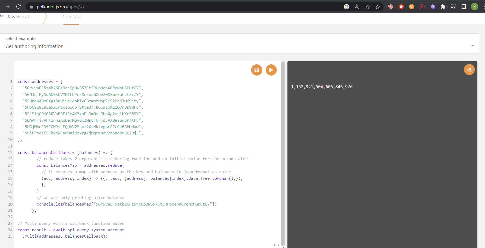

# Substrate Front-end template (paraphrase)

The first step of this tutorial is to familiarize yourself with the Substrate Front-end template. In this step we will go through an 
overview of what our React app will look like and the different components we'll be building. Start by installing the Front-end 
Template from your terminal:

```bash
git clone https://github.com/substrate-developer-hub/substrate-front-end-template.git
cd substrate-front-end-template
yarn install
```
and run It

```bash
yarn start dev
```
after that you should be seeing something similar to the following. It is expecting the node to be running on port 9944. The one we developed
in the first part of the tutorial and not yet started.


So lets start the node. Execute the following command in a new terminal window, in the same directory of the kitties node.

```bash
./target/release/node-template --dev --tmp
```
You can verify now the node frond end is working and already has components reading the data from the template pallets:


Also, Open the template in a code editor. You'll notice the following structure (we've only including the directories we care about for 
this tutorial):

```
substrate-front-end-template
|
+-- public
|   |
|   +-- assets              <-- Kitty avatar PNG files
|
+-- src                     <-- our React components
|   |
|   +-- __tests__
|   |
|   +-- config
|   |
|   +-- substrate-lib       <-- lib to give access to PolkadotJS API 
|   |   |
|   |   +-- components      <-- contains TxButton, used throughout our application
|   |
|   other components        <-- components prebuilt for us in the template (e.g: AccountSelector, Balances...)
...
```
If you explore the ./src directory you can find the components that are already running in the frond end. Checking them you can
have an idea of how the data is being read from the node and displayed in the frond end. For example the following code is
from the ballances component and I will with some comments to explain what is going on:

While checking the code, keep in mind what the frond end looks like and what is doing. It is listing all accounts and its
balances. So we can guess it has to be reading the accounts from the node and then the balances for each account. 

```javascript
// Imports
import React, { useEffect, useState } from 'react'
import { Table, Grid, Button, Label } from 'semantic-ui-react'
import { CopyToClipboard } from 'react-copy-to-clipboard'
import { useSubstrateState } from './substrate-lib'


export default function Main(props) {
  // We use the custom hook here to access the API and 
  // the keyring that contains the accounts
  const { api, keyring } = useSubstrateState()
  const accounts = keyring.getPairs()

  // Set the balances initially to null and fill them in later
  const [balances, setBalances] = useState({})

  // The hook is used to fetch the balances of all accounts
  useEffect(() => {
    // For each account in the keyring get its address
    const addresses = keyring.getPairs().map(account => account.address)
    let unsubscribeAll = null

    // Call the API to get the balances of all accounts
    // notice the how the call is made: api.query.[pallet].[storage].[function]
    // in this case the pallet is system, the storage is account and the function is multi to query all balances at once
    api.query.system.account
      .multi(addresses, balances => {
        const balancesMap = addresses.reduce(
          (acc, address, index) => ({
            ...acc,
            [address]: balances[index].data.free.toHuman(),
          }),
          {}
        )
        setBalances(balancesMap)
      })
      .then(unsub => {
        unsubscribeAll = unsub
      })
      .catch(console.error)

    return () => unsubscribeAll && unsubscribeAll()
  }, [api, keyring, setBalances])

 // The rest of the code is to display the data in a table 
  return (
    <Grid.Column>
      <h1>Balances</h1>
      {accounts.length === 0 ? (
        <Label basic color="yellow">
          No accounts to be shown
        </Label>
      ) : (
        <Table celled striped size="small">
          <Table.Body>
            <Table.Row>
              <Table.Cell width={3} textAlign="right">
                <strong>Name</strong>
              </Table.Cell>
              <Table.Cell width={10}>
                <strong>Address</strong>
              </Table.Cell>
              <Table.Cell width={3}>
                <strong>Balance</strong>
              </Table.Cell>
            </Table.Row>
            {accounts.map(account => (
              <Table.Row key={account.address}>
                <Table.Cell width={3} textAlign="right">
                  {account.meta.name}
                </Table.Cell>
                <Table.Cell width={10}>
                  <span style={{ display: 'inline-block', minWidth: '31em' }}>
                    {account.address}
                  </span>
                  <CopyToClipboard text={account.address}>
                    <Button
                      basic
                      circular
                      compact
                      size="mini"
                      color="blue"
                      icon="copy outline"
                    />
                  </CopyToClipboard>
                </Table.Cell>
                <Table.Cell width={3}>
                  {balances &&
                    balances[account.address] &&
                    balances[account.address]}
                </Table.Cell>
              </Table.Row>
            ))}
          </Table.Body>
        </Table>
      )}
    </Grid.Column>
  )
}

```

In the previous code the most complex part is the call to the API, so lets take a closer look into it, by playing with it
in the javascript console of [polkadot js](https://polkadot.js.org/apps/#/js). This by default will connect to you local 
running node.

In the js console you can execute code to test the API:


Lets try a few snippets to understand how the query is retreiving the balances. But first is necessary to check how the 
storage we are querying looks like:

This is the [accounts storage](https://github.com/paritytech/substrate/blob/8c4b84520cee2d7de53cc33cb67605ce4efefba8/frame/system/src/lib.rs#L530):

```rust
/// The full account information for a particular account ID.
	#[pallet::storage]
	#[pallet::getter(fn account)]
	pub type Account<T: Config> = StorageMap<
		_,
		Blake2_128Concat,
		T::AccountId,
		AccountInfo<T::Index, T::AccountData>,
		ValueQuery,
	>;
```
As the code indicates, it uses a [StorageMap](https://paritytech.github.io/substrate/master/frame_support/storage/trait.StorageMap.html#required-methods), which is a key value storage. The key is the account id and the value is the
account info. The [account info](https://github.com/paritytech/substrate/blob/8c4b84520cee2d7de53cc33cb67605ce4efefba8/frame/system/src/lib.rs#L732) is defined as follows:

```rust
/// Information of an account.
#[derive(Clone, Eq, PartialEq, Default, RuntimeDebug, Encode, Decode, TypeInfo, MaxEncodedLen)]
pub struct AccountInfo<Index, AccountData> {
	/// The number of transactions this account has sent.
	pub nonce: Index,
	/// The number of other modules that currently depend on this account's existence. The account
	/// cannot be reaped until this is zero.
	pub consumers: RefCount,
	/// The number of other modules that allow this account to exist. The account may not be reaped
	/// until this and `sufficients` are both zero.
	pub providers: RefCount,
	/// The number of modules that allow this account to exist for their own purposes only. The
	/// account may not be reaped until this and `providers` are both zero.
	pub sufficients: RefCount,
	/// The additional data that belongs to this account. Used to store the balance(s) in a lot of
	/// chains.
	pub data: AccountData,
}
```
There: 

Index: Account index (aka nonce) type. This stores the number of previous transactions associated with a sender account.
RefCount: A reference count.

AccountData: In the pallet it is defined as a generic type, so it specified in the runtime pallet config. If you check the runtime Config
file you will see it is defined as follows:

```rust
impl frame_system::Config for Runtime {
	// ...
	/// The data to be stored in an account.
	type AccountData = pallet_balances::AccountData<Balance>;
	// ...
}
```
So its form is defined in the [balances pallet](https://github.com/paritytech/substrate/blob/8c4b84520cee2d7de53cc33cb67605ce4efefba8/frame/balances/src/lib.rs#L684) as:

```rust
/// All balance information for an account.
#[derive(Encode, Decode, Clone, PartialEq, Eq, Default, RuntimeDebug, MaxEncodedLen, TypeInfo)]
pub struct AccountData<Balance> {
	/// Non-reserved part of the balance. There may still be restrictions on this, but it is the
	/// total pool what may in principle be transferred, reserved and used for tipping.
	///
	/// This is the only balance that matters in terms of most operations on tokens. It
	/// alone is used to determine the balance when in the contract execution environment.
	pub free: Balance,
	/// Balance which is reserved and may not be used at all.
	///
	/// This can still get slashed, but gets slashed last of all.
	///
	/// This balance is a 'reserve' balance that other subsystems use in order to set aside tokens
	/// that are still 'owned' by the account holder, but which are suspendable.
	/// This includes named reserve and unnamed reserve.
	pub reserved: Balance,
	/// The amount that `free` may not drop below when withdrawing for *anything except transaction
	/// fee payment*.
	pub misc_frozen: Balance,
	/// The amount that `free` may not drop below when withdrawing specifically for transaction
	/// fee payment.
	pub fee_frozen: Balance,
}
```
By checking the description of the fields we can see that the free field is the one we are interested in as Balance for each account.

Now that we understand the storage we are trying to query we can try a few snippets on how to do it:

We need some accounts to be passed to the query since the storage is expecting accounts as keys:

The keys for the default acccounts in the node are:

```
alice -> "5GrwvaEF5zXb26Fz9rcQpDWS57CtERHpNehXCPcNoHGKutQY",
alice_stash -> "5GNJqTPyNqANBkUVMN1LPPrxXnFouWXoe2wNSmmEoLctxiZY",
bob -> "5FHneW46xGXgs5mUiveU4sbTyGBzmstUspZC92UhjJM694ty",
bob_stash -> "5HpG9w8EBLe5XCrbczpwq5TSXvedjrBGCwqxK1iQ7qUsSWFc",
charlie -> "5FLSigC9HGRKVhB9FiEo4Y3koPsNmBmLJbpXg2mp1hXcS59Y",
dave -> "5DAAnrj7VHTznn2AWBemMuyBwZWs6FNFjdyVXUeYum3PTXFy",
eve -> "5HGjWAeFDfFCWPsjFQdVV2Msvz2XtMktvgocEZcCj68kUMaw",
ferdie -> "5CiPPseXPECbkjWCa6MnjNokrgYjMqmKndv2rSnekmSK2DjL",
```

1. Query all entries in the storage:

```javascript
const result = await api.query.system.account.entries()
result.map((entry) => { console.log(entry) })
```
It prints:

```
[0x26aa394eea5630e07c48ae0c9558cef7b99d880ec681799c0cf30e8886371da932a5935f6edc617ae178fef9eb1e211fbe5ddb1579b72e84524fc29e78609e3caf42e85aa118ebfe0b0ad404b5bdd25f, {nonce: 0, consumers: 0, providers: 1, sufficients: 0, data: {free: 1152921504606846976, reserved: 0, miscFrozen: 0, feeFrozen: 0}}]
[0x26aa394eea5630e07c48ae0c9558cef7b99d880ec681799c0cf30e8886371da94f9aea1afa791265fae359272badc1cf8eaf04151687736326c9fea17e25fc5287613693c912909cb226aa4794f26a48, {nonce: 0, consumers: 0, providers: 1, sufficients: 0, data: {free: 1152921504606846976, reserved: 0, miscFrozen: 0, feeFrozen: 0}}]
[0x26aa394eea5630e07c48ae0c9558cef7b99d880ec681799c0cf30e8886371da96f2e33376834a63c86a195bcf685aebbfe65717dad0447d715f660a0a58411de509b42e6efb8375f562f58a554d5860e, {nonce: 0, consumers: 0, providers: 1, sufficients: 0, data: {free: 1152921504606846976, reserved: 0, miscFrozen: 0, feeFrozen: 0}}]
[0x26aa394eea5630e07c48ae0c9558cef7b99d880ec681799c0cf30e8886371da9de1e86a9a8c739864cf3cc5ec2bea59fd43593c715fdd31c61141abd04a99fd6822c8558854ccde39a5684e7a56da27d, {nonce: 0, consumers: 0, providers: 1, sufficients: 0, data: {free: 1152921504606846976, reserved: 0, miscFrozen: 0, feeFrozen: 0}}]
```


2. Query for one account:

```javascript
address = "5GrwvaEF5zXb26Fz9rcQpDWS57CtERHpNehXCPcNoHGKutQY"
const result = await api.query.system.account(address)
console.log(result)
```
It prints:

```
{nonce: 0, consumers: 0, providers: 1, sufficients: 0, data: {free: 1152921504606846976, reserved: 0, miscFrozen: 0, feeFrozen: 0}}
```


3. Query for many accounts in one call:

```javascript
addresses = [
    "5GrwvaEF5zXb26Fz9rcQpDWS57CtERHpNehXCPcNoHGKutQY",
    "5GNJqTPyNqANBkUVMN1LPPrxXnFouWXoe2wNSmmEoLctxiZY",
    "5FHneW46xGXgs5mUiveU4sbTyGBzmstUspZC92UhjJM694ty",
    "5HpG9w8EBLe5XCrbczpwq5TSXvedjrBGCwqxK1iQ7qUsSWFc",
    "5FLSigC9HGRKVhB9FiEo4Y3koPsNmBmLJbpXg2mp1hXcS59Y",
    "5DAAnrj7VHTznn2AWBemMuyBwZWs6FNFjdyVXUeYum3PTXFy",
    "5HGjWAeFDfFCWPsjFQdVV2Msvz2XtMktvgocEZcCj68kUMaw",
    "5CiPPseXPECbkjWCa6MnjNokrgYjMqmKndv2rSnekmSK2DjL",
]
const result = await api.query.system.account.multi(addresses)
result.map((entry) => { console.log(entry)})
```
It prints:

```
{nonce: 0, consumers: 0, providers: 1, sufficients: 0, data: {free: 1152921504606846976, reserved: 0, miscFrozen: 0, feeFrozen: 0}}
{nonce: 0, consumers: 0, providers: 1, sufficients: 0, data: {free: 1152921504606846976, reserved: 0, miscFrozen: 0, feeFrozen: 0}}
{nonce: 0, consumers: 0, providers: 1, sufficients: 0, data: {free: 1152921504606846976, reserved: 0, miscFrozen: 0, feeFrozen: 0}}
{nonce: 0, consumers: 0, providers: 1, sufficients: 0, data: {free: 1152921504606846976, reserved: 0, miscFrozen: 0, feeFrozen: 0}}
{nonce: 0, consumers: 0, providers: 0, sufficients: 0, data: {free: 0, reserved: 0, miscFrozen: 0, feeFrozen: 0}}
{nonce: 0, consumers: 0, providers: 0, sufficients: 0, data: {free: 0, reserved: 0, miscFrozen: 0, feeFrozen: 0}}
{nonce: 0, consumers: 0, providers: 0, sufficients: 0, data: {free: 0, reserved: 0, miscFrozen: 0, feeFrozen: 0}}
{nonce: 0, consumers: 0, providers: 0, sufficients: 0, data: {free: 0, reserved: 0, miscFrozen: 0, feeFrozen: 0}}
```


4. Lets try to get only the balances of the accounts as the balance component does:

```javascript
const addresses = [
  "5GrwvaEF5zXb26Fz9rcQpDWS57CtERHpNehXCPcNoHGKutQY",
  "5GNJqTPyNqANBkUVMN1LPPrxXnFouWXoe2wNSmmEoLctxiZY",
  "5FHneW46xGXgs5mUiveU4sbTyGBzmstUspZC92UhjJM694ty",
  "5HpG9w8EBLe5XCrbczpwq5TSXvedjrBGCwqxK1iQ7qUsSWFc",
  "5FLSigC9HGRKVhB9FiEo4Y3koPsNmBmLJbpXg2mp1hXcS59Y",
  "5DAAnrj7VHTznn2AWBemMuyBwZWs6FNFjdyVXUeYum3PTXFy",
  "5HGjWAeFDfFCWPsjFQdVV2Msvz2XtMktvgocEZcCj68kUMaw",
  "5CiPPseXPECbkjWCa6MnjNokrgYjMqmKndv2rSnekmSK2DjL",
];

const balancesCallback = (balances) => {
        // reduce takes 2 arguments: a reducing function and an initial value for the accumulator.
        const balancesMap = addresses.reduce(
          // it creates a map with address as the key and balances in json format as value
          (acc, address, index) => ({...acc, [address]: balances[index].data.free.toHuman(),}),
          {}
        )
        // We are only printing alice balance
        console.log(balancesMap["5GrwvaEF5zXb26Fz9rcQpDWS57CtERHpNehXCPcNoHGKutQY"])
      };

// Multi query with a callback function added
const result = await api.query.system.account
  .multi(addresses, balancesCallback);
```

It prints:

```
1,152,921,504,606,846,976
```



Note that in a component instead of printing the balance we would be setting it in the state of the component and then displaying it in 
the table.

```javascript
const [balances, setBalances] = useState({}) // Ititialize the state

// ...

setBalances(balancesMap) // Set the state after the query inside a useEffect hook so 
                         // to re do the query when something changes

// ...
return (
    // ...
    <Table.Cell width={3}>
        {balances &&
        balances[account.address] && 
        balances[account.address]} {/*Display the balance from the state*/}
    </Table.Cell>
    // ...
)
```


