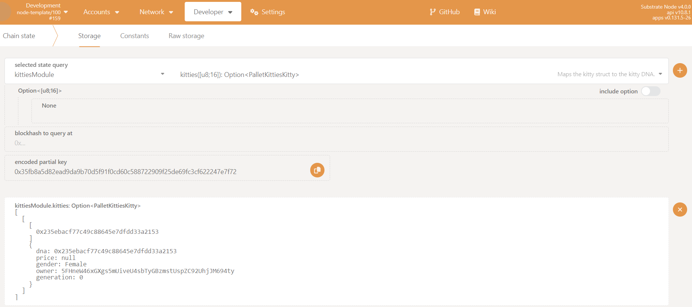

# Kitties pallet: Dispatchables, events, and errors

In the previous section, we laid down the foundations to manage the ownership of our 
Kitties — even though they don't really exist yet! In this part of the tutorial, we'll be giving our pallet the 
ability to create a Kitty using the storage items we've declared. Breaking things down, we're going to write:

* `create_kitty`: a dispatchable or publicly callable function allowing an account to mint a Kitty.
* `mint()`: a helper function that updates our pallet's storage items and performs error checks, called by 
`create_kitty`.
* pallet `Events`: using FRAME's `#[pallet::event]` attribute.

At the end of this part, we'll check that everything compiles without error and call our `create_kitty` 
extrinsic using the PolkadotJS Apps UI.

### Public and private functions

It is important to understand the pallet design decisions we'll be making around 
coding up our Kitty pallet's minting and ownership management capabilities.

We will be breaking up the "heavy lifting" logics into private helper functions. This improves code 
readability and reusability.

Let's paint the big picture of what combining dispatchables and helper functions looks like.

`create_kitty` is a dispatchable function or extrinsic that:

* Make sure the call is from a signed origin.
* Generate unique DNA and Gender using a helper function.
* States the generation as 0.
* Calls a private mint() function.

`mint()` is a private helper function that:

* Check if the kitty does not already exist in our storage map.
* Updates storage with the new Kitty ID (for all Kitties and for the owner's account).
* Updates the new total Kitty count for storage and the new owner's account.
* Deposits an `Event` to signal that a Kitty has succesfully been created.

#### `create_kitty` dispatchable

All pallet dispatchables live under the `#[pallet::call]` macro. All we [need to know](https://docs.substrate.io/reference/frame-macros/) here is that they're a 
useful feature of FRAME that minimizes the code required to write for pallets to be properly integrated 
in a Substrate chain's runtime.

#### Weights

Every dispatchable function must have an associated weight to it. Weights are an important part of 
developing with Substrate as they provide safe-guards around the amount of computation to fit in a 
block at execution time.

Substrate's weighting system forces developers to think about the computational complexity each extrinsic 
carries before it is called so that a node will account for it's worst case, avoiding lagging the 
network with extrinsics that may take longer than the specified block time. Weights are also 
intimately linked to the fee system for a signed extrinsic.

For this application, and since we are developing it for learning purposes, we're going to default all weights to 0. If you're interested in 
learning more about weights, check out the [Substrate Docs](https://docs.substrate.io/reference/how-to-guides/weights/).

Replace `TODO: Create a new unique kitty.` with the following:

```rust
/// Create a new unique kitty.
///
/// The actual kitty creation is done in the `mint()` function.
#[pallet::call_index(0)]
#[pallet::weight(0)]
pub fn create_kitty(origin: OriginFor<T>) -> DispatchResult {
    // Make sure the caller is from a signed origin
    let sender = ensure_signed(origin)?;

    // Generate unique DNA and Gender using a helper function
    let (kitty_gen_dna, gender) = Self::gen_dna();

    // Generation is 0 when a kitty is first created
    let generation = 0;

    // Write new kitty to storage by calling helper function
    Self::mint(&sender, kitty_gen_dna, gender, generation)?;

    Ok(())
}
```

#### Write the mint() function

As seen when we wrote `create_kitty` in the previous section, we'll need to create `mint()` for writing our 
new unique Kitty object to the various storage items declared.

The `mint()` function will take the following arguments:

* `owner`: of type `&T::AccountId` - this indicates whom the kitty belongs to.
* `dna`: of type `[u8; 16]` - this specifies the DNA of the kitty going to be minted. If None is passed in, a random DNA will be generated.
* `gender`: of type `Gender`.
* `generation`: a `u64` type.

And it will return `Result<[u8; 16], DispatchError>`.

Paste in the following code snippet to write the `mint()` function, replacing `TODO: Mint a new kitty and add it to the storage.`
 in the working codebase:

```rust
// Mint a new kitty and add it to the storage.
pub fn mint(
    owner: &T::AccountId,
    dna: [u8; 16],
    gender: Gender,
    generation: u64,
) -> Result<[u8; 16], DispatchError> {
    // Create a new object
    let kitty = Kitty::<T> { 
        dna, 
        price: None, 
        gender, 
        owner: owner.clone(),
        generation, 
    };

    // Check if the kitty does not already exist in our storage map
    ensure!(!Kitties::<T>::contains_key(&kitty.dna), Error::<T>::DuplicateKitty);

    // Performs this operation first as it may fail
    let count = CountForKitties::<T>::get();
    let new_count = count.checked_add(1).ok_or(ArithmeticError::Overflow)?;

    // Append kitty to KittiesOwned
    KittiesOwned::<T>::try_append(&owner, kitty.dna)
        .map_err(|_| Error::<T>::TooManyOwned)?;

    // Write new kitty to storage
    Kitties::<T>::insert(kitty.dna, kitty);
    CountForKitties::<T>::put(new_count);

    // Deposit our "Created" event.
    Self::deposit_event(Event::Created { kitty: dna, owner: owner.clone() });

    // Returns the DNA of the new kitty if this succeeds
    Ok(dna)
}
```

Let's go over what the above code is doing.

The first thing we're doing is creating a new Kitty object. Then we check if the kitty does not already 
exist in our storage map. If it does, we return an error. If it doesn't, we append the kitty to
`KittiesOwned` and write the new kitty to storage. Finally, we deposit our `Created` event.

### Pallet Events

As you could see in the minting function our pallet can also emit `Events`. This not only reports the 
success of a function's execution, but also tells the "off-chain world" that some particular state 
transition has happened.

FRAME helps us easily manage and declare our pallet's events using the `#[pallet::event]` attribute. With 
FRAME macros, events are just an enum declared like this:

```rust
// this is an example event enum
#[pallet::event]
#[pallet::generate_deposit(pub(super) fn deposit_event)]
pub enum Event<T: Config>{
    /// A function succeeded. [time, day]
    Success(T::Time, T::Day),
}
```
As you can see in the above snippet, we use attribute macro:

`#[pallet::generate_deposit(pub(super) fn deposit_event)]`

This allows us to deposit a specifc event using the pattern below:

```rust
Self::deposit_event(Event::Success(var_time, var_day));
```

In order to use events inside our pallet, we add the associated type `Event` inside our pallet's 
configuration trait `Config`. Additionally — just as when adding any type to our pallet's Config trait — we 
also needed to define it in our runtime `./runtime/src/lib.rs`.

This pattern is the same as when we added the `KittyRandomness` type to our pallet's configuration trait 
earlier in this tutorial and has already been included from the initial scaffolding of our codebase:

```rust
// Configure the pallet by specifying the parameters and types on which it depends.
	#[pallet::config]
	pub trait Config: frame_system::Config {
		/// Because this pallet emits events, it depends on the runtime's definition of an event.
		type RuntimeEvent: From<Event<Self>> + IsType<<Self as frame_system::Config>::RuntimeEvent>;
        //--snip--//
```
Declare your pallet events by replacing `TODO: Events that can be emitted by the pallet.` with:

```rust
// Events that can be emitted by the pallet.
#[pallet::event]
#[pallet::generate_deposit(pub(super) fn deposit_event)]
pub enum Event<T: Config> {
    /// A new kitty was successfully created.
    Created { kitty: [u8; 16], owner: T::AccountId },
    /// The price of a kitty was successfully set.
    PriceSet { kitty: [u8; 16], price: Option<BalanceOf<T>> },
    /// A kitty was successfully transferred.
    Transferred { from: T::AccountId, to: T::AccountId, kitty: [u8; 16] },
    /// A kitty was successfully sold.
    Sold { seller: T::AccountId, buyer: T::AccountId, kitty: [u8; 16], price: BalanceOf<T> },
}
```
### Pallet Errors

FRAME provides us with an error handling system using `[#pallet::errors]` which allows us to specify errors 
for our pallet and use them across our pallet's functions.

Declare all possible errors using the provided FRAME macro under `#[pallet::error]`, replace `TODO: Errors that can occur in the pallet.` 
with:

```rust
// Errors that can occur in the pallet.
#[pallet::error]
pub enum Error<T> {
    /// An account may only own `MaxKittiesOwned` kitties.
    TooManyOwned,
    /// Trying to transfer or buy a kitty from oneself.
    TransferToSelf,
    /// This kitty already exists!
    DuplicateKitty,
    /// This kitty does not exist!
    NoKitty,
    /// You are not the owner of this kitty.
    NotOwner,
    /// This kitty is not for sale.
    NotForSale,
    /// Ensures that the buying price is greater than the asking price.
    BidPriceTooLow,
    /// You need to have two cats with different gender to breed.
    CantBreed,
}
```
Now is a good time to see if your chain can compile. Instead of only checking if your pallet compiles, 
run the following command to see if everything can build:

```bash
cargo build --release
```
If you ran into errors, scroll to the first error message in your terminal, identify what line is giving 
an error and check whether you've followed each step correctly. Sometimes a mismatch of curly brackets 
will unleash a whole bunch of errors that are difficult to understand — double check your code!

Did that build fine? Congratulations! That's the core functionality of the Kitties pallet. In the next 
step you'll be able to see everything you've built so far in action.

### Testing with Polkadot-JS Apps UI

Assuming that you successfully built your chain, let's run it and use the [PolkadotJS Apps UI](https://polkadot.js.org/apps/#/explorer) 
to interact with it.

In your chain's project directory, run:

```bash
./target/release/node-template --tmp --dev
```
By doing this, we're specifying to run a temporary chain in developer mode, so as not to need to purge 
storage each time we want to start a fresh chain.

Assuming that blocks are being finalized (which you should be able to see from the terminal in which you 
ran the above command), head over to [Polkadot.js Apps UI](https://polkadot.js.org/apps/#/explorer).

Follow these steps:

* Check that you're connected to the Local Node. Click on the top left circular network icon, open the 
`Development` section, and choose `Local Node`. Your node is default to be 127.0.0.1.:9944.


* Now go to: `Developer -> Extrinsics` and submit a signed extrinsic using `kittiesModule` by calling 
the `createKitty()` dispatchable.


* Check for the associated event `Created` by going to `Network -> Explorer`. You should be able to see 
the events emitted and query their block details.


* Check your newly created Kitty's details by going to `Developer -> Chain State`. Select the 
`kittiesModule` pallet and query Kitties. Be sure to uncheck the `include` option box and you should be 
able to see the details of your newly minted Kitty in the following format:

```rust
kittiesModule.kitties: Option<PalletKittiesKitty>
[
  [
    [
      0x235ebacf77c49c88645e7dfdd33a2153
    ]
    {
      dna: 0x235ebacf77c49c88645e7dfdd33a2153
      price: null
      gender: Female
      owner: 5FHneW46xGXgs5mUiveU4sbTyGBzmstUspZC92UhjJM694ty
      generation: 0
    }
  ]
]
```



* Check that other storage items correctly reflect the creation of additional Kitties.

Congratulations! We've learnt how to implement the key parts of what powers a FRAME pallet and how to put them to use. In the next 
section we'll be building on our knowledge by adding more capabilities to our pallet.

To recap, in this part of the tutorial you've learnt how to:

* Distinguish between implementing a dispatchable function and a private helper function.
* Use `#[pallet::call]`, `#[pallet::event]` and `#[pallet::error]`.
* Implement basic error checking with FRAME.
* Update values in storage with safety checks.
* Implement FRAME events and use them in a function.
* Query storage items and chain state using the PolkadotJS Apps UI.

