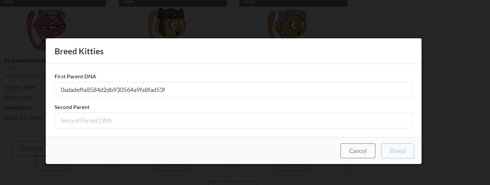

# The Kitties components

## Sketching out our components

[Substrate Frontend Template](https://github.com/substrate-developer-hub/substrate-front-end-template) components use Polkadot-JS API and 
an RPC endpoints to communicate with a Substrate node. This allows us to read storage items, and make extrinsics by calling our 
pallet's dispatchable functions. Before we get to that, let's sketch out the different parts of our application.

We'll be building out a total of 3 components:

1. `Kitties.js`: this will render the Kitties panel, and contains the logics of fetching all kitties information from the connected Substrate 
node.


2. `KittyCards.js`: this will render a React card component containing a Kitty's relevant information, avatar and buttons to interact with 
it.

3. `KittyAvatar.js`: this will handle the logic to map Kitty DNA to the library of PNGs we're using to create unique Kitty avatars.

4. `SetPriceModal.js`: this will render a modal to allow users to set a price for their Kitty.


5. `BuyModal.js`: this will render a modal to allow users to buy a Kitty.


6. `BreedModal.js`: this will render a modal to allow users to breed two Kitties.



7. `TransferModal.js`: this will render a modal to allow users to transfer a Kitty to another user.


## Polkadot JS API Basics

Before moving on to the next section, we reccommend you read a little Polkadot JS API documentation to understand the basics of how we 
will be querying storage and triggering transactions. Here are some good resources:

- [Basics and Metadata](https://polkadot.js.org/docs/api/start/basics/)
- [RPC queries](https://polkadot.js.org/docs/api/start/api.rpc/)
- [Storage methods](https://polkadot.js.org/docs/substrate/storage/) such as `api.query.<pallet>.<method>` to access a pallet instance in a
 runtime
- [Extrinsics methods](https://polkadot.js.org/docs/substrate/extrinsics/) such as `api.tx.<pallet>.<method>` to trigger a transaction.

## Creating custom components

### Create `Kitties.js`

This is the component that will get rendered by `Apps.js`, the top-most level component. So it does the heavy lifting, with the help of 
`KittyAvatar.js` and `KittCards.js`.

1. Start by creating a file called `Kitties.js` in src and paste the following imports:

```js
import React, { useEffect, useState } from 'react';
import { Form, Grid } from 'semantic-ui-react';

import { useSubstrateState } from './substrate-lib';
import { TxButton } from './substrate-lib/components';

import KittyCards from './KittyCards';

export default function Kitties() {
      // Here will all our code go
}
```
The way our custom components make use of Polkadot-JS API is by using `substrate-lib`, which is a wrapper around [Polkadot JS API instance](https://polkadot.js.org/docs/api/start/create/) 
and allows us to retrieve account keys from the [Polkadot-JS keyring](https://polkadot.js.org/docs/api/start/keyring/). This is why we use
 `useSubstrate` which is exported by `src/substrate-lib/SubstrateContext.js` and used to create the wrapper.

2. Proceed by pasting in the following code snippet inside the `Kitties` function:

```js
// snip
  const { api, keyring, currentAccount } = useSubstrateState();

  const [kittyDNAs, setKittyDNAs] = useState([]);
  const [kitties, setKitties] = useState([]);
  const [status, setStatus] = useState('');

  // Function to construct a kitty object from the values returned by the API
  const constructKitty = (hash, { dna, price, gender, owner, generation }) => ({
    id: hash,
    dna,
    price: price.toJSON(),
    gender: gender.toJSON(),
    owner: owner.toJSON(),
    generation: generation.toJSON()
  });

  // Function to extract DNA from entry
  const getDna = entry => JSON.parse(entry[1]).dna;
// snip
```
The above code handles a few important things for our application:

- `constructKitty` is a function to create a kitty object.
- `getDna` is a function to extract DNA from an entry.
- `kittyDNAs` is an array of all the DNAs of our kitties.
- `kitties` is an array of all the kitty objects.
- `status` is a string to display the status of our transactions.

We'll use `api.query.kittiesModule.countForKitties` to listen for a change in the amount of Kitties, which will query `countForKitties` 
from our Kitties pallet storage item. Then, we'll use the [entries()](https://polkadot.js.org/docs/api/start/api.query.other#map-keys--entries) 
method from Polkadot-JS API to get Kitty IDs and transform them with the `getDna` function.

3. To enable this, paste the following snippet:

```js
// useEffect to fetch and set the kitty DNAs
  useEffect( () => {
      let unsubscribeAll = null;

      // Fetch and set the kitty DNAs
      api.query.kittiesModule.countForKitties(async cnt => { 
        const entries = await api.query.kittiesModule.kitties.entries(),
        kittiesDnas = entries.map(getDna);
        setKittyDNAs(kittiesDnas);
      })
      .then(unsub => {
        unsubscribeAll = unsub
      })
      .catch(console.error)

      return () => {
        unsubscribeAll && unsubscribeAll();
      };
    }, [api, keyring]);
```
`entries()` is a Polkadot-JS API function that gives us the entire storage map of Kitties. If there's nothing in  the storage, it returns 
None. All functions that interact with a chain will always return a Promise in Polkadot-JS API. So we wait for it to be resolved, and 
return us all the map keys and objects.

You can see this in action if you go to the console of your browser running a node Front-end and entering entries, or get the first Kitty 
object in storage by doing: `entries[0][1].toJSON()`.

4. Similarly to subscribe to the kitties, paste the following code snippet:

```js
// useEffect to subscribe to and update the kitties
  useEffect( () => {
    let unsubscribeAll = null;

    // Subscribe to and update the kitties
    api.query.kittiesModule.kitties
      .multi(kittyDNAs, kitties => {
      const kittyArr = kitties.map((kitty, ind) => 
        constructKitty(kittyDNAs[ind], kitty.value)
      );
      setKitties(kittyArr);
    })
    .then(unsub => {
      unsubscribeAll = unsub
    })
    .catch(console.error)

    return () => {
      unsubscribeAll && unsubscribeAll();
    }
  }, [api, kittyDNAs, kitties]);
```
A Substrate storage item key is composed of a concatenation of the hash of the pallet name, the hash of the storage item name, and finally 
the hash of the key used in the map.

We have subscribed to the `Kitties` storage. When the component is teared down, we want to make sure the subscription is cleaned up 
(unsubscribed). So we return a clean up function for the effect hook. Refer to [Effects with Cleanup](https://react.dev/learn/synchronizing-with-effects#step-3-add-cleanup-if-needed) 
to learn more about cleanup functions.

We have setup the ground work of accessing the chain and saving all Kitty information internally using React. We'll come 
back to the Kitties.js component later once we create all the missing components of our application to complete it.

### Create `KittyAvatar.js`

In this component, all we're doing is mapping a library of PNG images to the bytes of our Kitty DNA. Since it's mostly all Javascript, 
we won't be going into much detail.

1. Create a file called `KittyAvatar.js` in the src folder of your project and paste in the following code:

```js
import React from 'react';

// Generate an array [start, start + 1, ..., end] inclusively
const genArray = (start, end) =>
  Array.from(Array(end - start + 1).keys()).map(v => v + start);

const IMAGES = {
  accessory: genArray(1, 20).map(n =>
    `${process.env.PUBLIC_URL}/assets/KittyAvatar/accessorie_${n}.png`),
  body: genArray(1, 15).map(n =>
    `${process.env.PUBLIC_URL}/assets/KittyAvatar/body_${n}.png`),
  eyes: genArray(1, 15).map(n =>
    `${process.env.PUBLIC_URL}/assets/KittyAvatar/eyes_${n}.png`),
  mouth: genArray(1, 10).map(n =>
    `${process.env.PUBLIC_URL}/assets/KittyAvatar/mouth_${n}.png`),
  fur: genArray(1, 10).map(n =>
    `${process.env.PUBLIC_URL}/assets/KittyAvatar/fur_${n}.png`)
};

const dnaToAttributes = dna => {
  const attribute = (index, type) => IMAGES[type][dna[index] % IMAGES[type].length];

  return {
    body: attribute(0, 'body'),
    eyes: attribute(1, 'eyes'),
    accessory: attribute(2, 'accessory'),
    fur: attribute(3, 'fur'),
    mouth: attribute(4, 'mouth')
  };
};

const KittyAvatar = props => {
  const outerStyle = { height: '110px', position: 'relative', width: '50%' };
  const innerStyle = { height: '100px', position: 'absolute', top: '3%', left: '50%' };
  const { dna } = props;

  if (!dna) return null;

  const cat = dnaToAttributes(dna);
  return <div style={outerStyle}>
    
    
    
    
    
  </div>;
};

export default KittyAvatar;
```
Notice that the only properties being passed in is dna, which will be passed from `KittyCards.js`.

The logic in this component is based on a specific Cat Avatar library of PNGs. [Download it](https://framagit.org/Deevad/cat-avatar-generator/-/tree/master/avatars/cat) 
and paste the contents of avatars/cat inside a new folder called "KittyAvatar" in your project's public/assets folder.


4. Save and close `KittyAvatar.js`.

### Create `KittyCards.js`

This component is a simple one because it just renders a React card component for each Kitty. All the logic of buttons and transactions
will be inside KittyCard.js.

1. Create a file called `KittyCards.js` in the src folder of your project and paste in the following code:

```js
import React from 'react';
import { Grid, Message } from 'semantic-ui-react';

import KittyCard from './KittyCard';

const KittyCards = ({ kitties, currentAccount, setStatus }) => {
  // Check if kitties array is empty
  if (kitties.length === 0) {
    // Render a message when no kitties are found
    return (
    <Message info>
      <Message.Header>
        No Kitty found here... Create one now!&nbsp;
        <span role='img' aria-label='point-down'>
          👇
        </span>
      </Message.Header>
    </Message>
    );
  }

// Map the kitties array to KittyCard components  
const renderedKitties = kitties.map((kitty, i) => (
  <Grid.Column key={`kitty-${i}`}>
    <KittyCard kitty={kitty} currentAccount={currentAccount} setStatus={setStatus} />
  </Grid.Column>
));

// Render the Grid component with the mapped KittyCard components
return <Grid columns={4}>{renderedKitties}</Grid>;
};

export default KittyCards;
```
Notice that the only properties being passed in is kitties, currentAccount and setStatus, which will be passed from `Kitties.js`.

Also it is showing a message when no kitties are found. A condition is added to check if kitties array is empty.

### Create `KittyCard.js`

This component is the most important one because it handles all the logic of buttons and transactions. It also renders the KittyAvatar.

1. Create a file called `KittyCard.js` in the src folder of your project and paste in the following code:

```js
import React from 'react';
import { Card, Label } from 'semantic-ui-react';

import { useSubstrateState } from './substrate-lib';

import KittyAvatar from './KittyAvatar';
import TransferModal from './TransferModal';
import SetPriceModal from './SetPriceModal';
import BuyModal from './BuyModal';
import BreedModal from './BreedModal';

// Function to get the account address
const getAccountAddress = account => (account ? account.address : '')

// Component representing a single Kitty Card
const KittyCard = ({ kitty, currentAccount, setStatus }) => {

    const { keyring } = useSubstrateState()

    const { id, dna, owner, gender, price, generation} = kitty;
    const displayDna = dna && dna.toJSON();
    const isOwner = getAccountAddress(currentAccount) === owner;
    const isPrice = price !== null;
    // const bool that represent that isOwner and isPrice
    const isNotOwnerAndPrice = !isOwner && isPrice;

    const ownerName = keyring.getPairs().find(account => account.address === owner).meta.name;

    return (
        <Card className="card" style={{height: '100%'}}>
            {/* Render a label indicating ownership */}
            {isOwner && <Label color='grey'>Mine</Label>}

            {/* Render the Kitty Avatar */}
            <KittyAvatar dna={dna.toU8a()} />

            <Card.Content>
                {/* Display the Kitty ID */}
                <Card.Header style={{ fontSize: '.8em', overflowWrap: 'break-word' }}>
                    ID: {id}
                </Card.Header>

                {/* Display the Kitty DNA */}
                <Card.Meta style={{ fontSize: '.9em', overflowWrap: 'break-word' }}>
                    DNA: {displayDna}
                </Card.Meta>

                <Card.Description>
                    {/* Display the Kitty Gender */}
                    <p style={{ fontSize: '.9em', overflowWrap: 'break-word' }}>
                        Gender: {gender}
                    </p>

                    {/* Display the Kitty Owner */}
                    <p style={{ fontSize: '.9em', overflowWrap: 'break-word' }}>
                        Owner: {ownerName}
                    </p>

                     {/* Display the Kitty Generation */}
                     <p style={{ fontSize: '.9em', overflowWrap: 'break-word' }}>
                     <span style={{ fontWeight: 'bold' }}>Generation:</span> {generation}
                    </p>

                    {/* Display the Kitty Price or a fallback message */}
                    <p style={{ overflowWrap: 'break-word' }}>
                        {price != null ? <span>Price:</span> : 'Price:'} {price ? price : 'No price set'}
                        {price != null && <span> Units</span>}
                    </p>
                </Card.Description>
            </Card.Content>

            <Card.Content extra style={{ textAlign: 'center' }}>
                {/* Render the TransferModal and SetPriceModal or BuyModal */}
                { isOwner 
                ? (
                    <div>
                    <SetPriceModal kitty={kitty} setStatus={setStatus} />
                    <TransferModal kitty={kitty} setStatus={setStatus} />
                    <BreedModal kitty={kitty} setStatus={setStatus} />
                    </div>
                ) : ( 
                    isNotOwnerAndPrice 
                    ?(
                    <BuyModal kitty={kitty} currentAccount={currentAccount} setStatus={setStatus} />
                    ): null
                    )
                }
            </Card.Content>
        </Card>
    );
 };

 export default KittyCard;
```
Notice most of the code is just rendering the `KittyCard` component. What we are doing is importing the different modals we need to render
and based on conditionals we are rendering them.

For example:

- Only the owner can set a price, transfer or breed a kitty.
- Only the non-owner can buy a kitty if the owner has already set a price.

Now we have to define the modals we are importing.

### Create `SetPriceModal.js`

This modal will allow users to set a price for their Kitty.

Create a file called `SetPriceModal.js` in the src folder of your project and paste in the following code:

```js
import React, { useState } from 'react';
import { Button, Modal, Form } from 'semantic-ui-react';

import { TxButton } from './substrate-lib/components';

const SetPriceModal = ({ kitty, setStatus }) => {

    // State for controlling the modal open/close state and form value
    const [open, setOpen] = useState(false);
    const [formValue, setFormValue] = useState({});
  
    // Event handler for form input changes
    const formChange = key => (event, element) => {
      setFormValue({ ...formValue, [key]: element.value });
    };

    // Event handler for confirming and closing the modal
    const confirmAndClose = () => {
        setOpen(false);
    };
    
    // Event handler for opening the modal
    const handleOpen = () => {
        setOpen(true);
    };
    
    // Event handler for closing the modal
    const handleClose = () => {
        setOpen(false);
    };
    
    // Event handler for cancel button click
    const handleCancel = () => {
        handleClose();
    };

    return (
        <>
        {/* Modal component */}
        <Modal onClose={handleClose} onOpen={handleOpen} open={open} 
        trigger={<Button basic color='blue'>Set Price</Button>}>
            
            {/* Modal header */}
            <Modal.Header>Set Kitty Price</Modal.Header>
            <Modal.Content><Form>

                {/* Form inputs */}
                <Form.Input 
                    fluid 
                    label='Kitty ID' 
                    readOnly 
                    value={kitty.id}
                />
                <Form.Input 
                    fluid 
                    label='New Price' 
                    placeholder='Kitty Price' 
                    onChange={formChange('price')}
                />

            </Form></Modal.Content>
  
            <Modal.Actions>

                {/* Cancel button */}
                <Button basic color='grey' onClick={handleCancel}>
                    Cancel
                </Button>

                {/* Transaction button */}
                <TxButton
                    label='Set Price'
                    type='SIGNED-TX'
                    setStatus={setStatus}
                    txOnClickHandler={confirmAndClose}
                    attrs={{
                        palletRpc: 'kittiesModule',
                        callable: 'setPrice',
                        inputParams: [kitty.id, formValue.price],
                        paramFields: [true, true]
                    }}
                />
            </Modal.Actions>
        </Modal>
        </>
    );
  };

export default SetPriceModal;
```
The main feature of this modal is the use of the `TxButton` that allow us send a transaction to the chain.

### Create `BuyModal.js`

This modal will allow users to buy a Kitty.

Create a file called `BuyModal.js` in the src folder of your project and paste in the following code:

```js
import React, { useState } from 'react';
import { Button, Modal, Form } from 'semantic-ui-react';

import { TxButton } from './substrate-lib/components';

const BuyModal = ({ kitty, currentAccount, setStatus }) => {

    // State for controlling the modal open/close state and form value
    const [open, setOpen] = useState(false);

    // Event handler for confirming and closing the modal
    const confirmAndClose = () => {
        setOpen(false);
    };
    
    // Event handler for opening the modal
    const handleOpen = () => {
        setOpen(true);
    };
    
    // Event handler for closing the modal
    const handleClose = () => {
        setOpen(false);
    };
    
    // Event handler for cancel button click
    const handleCancel = () => {
        handleClose();
    };

    return (
        <>
        {/* Modal component */}
        <Modal onClose={handleClose} onOpen={handleOpen} open={open} 
        trigger={<Button basic color='blue'>Buy Kitty</Button>}>
            
            {/* Modal header */}
            <Modal.Header>Buy Kitty</Modal.Header>
            <Modal.Content><Form>

                {/* Form inputs */}
                <Form.Input 
                    fluid 
                    label='Kitty ID' 
                    readOnly 
                    value={kitty.id}
                />
                <Form.Input 
                    fluid 
                    label='New Price' 
                    readOnly 
                    value={kitty.price}
                />

            </Form></Modal.Content>
  
            <Modal.Actions>

                {/* Cancel button */}
                <Button basic color='grey' onClick={handleCancel}>
                    Cancel
                </Button>

                {/* Transaction button */}
                <TxButton
                    label='Buy Kitty'
                    type='SIGNED-TX'
                    setStatus={setStatus}
                    txOnClickHandler={confirmAndClose}
                    attrs={{
                        palletRpc: 'kittiesModule',
                        callable: 'buyKitty',
                        inputParams: [kitty.id, kitty.price],
                        paramFields: [true, true]
                    }}
                />
            </Modal.Actions>
        </Modal>
        </>
    );
  };

export default BuyModal;
```
It has the same pattern as the `SetPriceModal`.

### Create `BreedModal.js`

This modal will allow users to breed two Kitties.

Create a file called `BreedModal.js` in the src folder of your project and paste in the following code:

```js
import React, { useState } from 'react';
import { Button, Modal, Form } from 'semantic-ui-react';

import { TxButton } from './substrate-lib/components';

const BreedModal = ({ kitty, setStatus }) => {

    // State for controlling the modal open/close state and form value
    const [open, setOpen] = useState(false);
    const [formValue, setFormValue] = useState({});
  
    // Event handler for form input changes
    const formChange = key => (event, element) => {
      setFormValue({ ...formValue, [key]: element.value });
    };

    // Event handler for confirming and closing the modal
    const confirmAndClose = () => {
        setOpen(false);
      };
    
    // Event handler for opening the modal
    const handleOpen = () => {
        setOpen(true);
    };
    
    // Event handler for closing the modal
    const handleClose = () => {
        setOpen(false);
    };
    
    // Event handler for cancel button click
    const handleCancel = () => {
        handleClose();
    };

    return (
        <>
        {/* Modal component */}
        <Modal onClose={handleClose} onOpen={handleOpen} open={open} 
        trigger={<Button basic color='blue'>Breed</Button>}>
            
            {/* Modal header */}
            <Modal.Header>Breed Kitties</Modal.Header>
            <Modal.Content><Form>

                {/* Form inputs */}
                <Form.Input 
                    fluid 
                    label='First Parent DNA' 
                    readOnly 
                    value={kitty.dna}
                />
                <Form.Input 
                    fluid 
                    label='Second Parent' 
                    placeholder='Second Parent DNA' 
                    onChange={formChange('dna2')}
                />

            </Form></Modal.Content>
  
            <Modal.Actions>

                {/* Cancel button */}
                <Button basic color='grey' onClick={handleCancel}>
                    Cancel
                </Button>

                {/* Transaction button */}
                <TxButton
                    label='Breed'
                    type='SIGNED-TX'
                    setStatus={setStatus}
                    txOnClickHandler={confirmAndClose}
                    attrs={{
                        palletRpc: 'kittiesModule',
                        callable: 'breedKitty',
                        inputParams: [kitty.dna, formValue.dna2],
                        paramFields: [true, true]
                    }}
                />
            </Modal.Actions>
        </Modal>
        </>
    );
  };

export default BreedModal;
```
It has the same pattern as the previous modals.

### Create `TransferModal.js`

This modal will allow users to transfer a Kitty to another user.

Create a file called `TransferModal.js` in the src folder of your project and paste in the following code:

```js
import React, { useState } from 'react'
import { Form, Input, Grid, Label, Icon, Dropdown } from 'semantic-ui-react'
import { TxButton } from './substrate-lib/components'
import { useSubstrateState } from './substrate-lib'

export default function Main(props) {
  const [status, setStatus] = useState(null)
  const [formState, setFormState] = useState({ addressTo: '', amount: 0 })

  const onChange = (_, data) =>
    setFormState(prev => ({ ...prev, [data.state]: data.value }))

  const { addressTo, amount } = formState

  const { keyring } = useSubstrateState()
  const accounts = keyring.getPairs()

  const availableAccounts = []
  accounts.map(account => {
    return availableAccounts.push({
      key: account.meta.name,
      text: account.meta.name,
      value: account.address,
    })
  })

  return (
    <Grid.Column width={8}>
      <h1>Transfer</h1>
      <Form>
        <Form.Field>
          <Label basic color="teal">
            <Icon name="hand point right" />1 Unit = 1000000000000&nbsp;
          </Label>
          <Label
            basic
            color="teal"
            style={{ marginLeft: 0, marginTop: '.5em' }}
          >
            <Icon name="hand point right" />
            Transfer more than the existential amount for account with 0 balance
          </Label>
        </Form.Field>

        <Form.Field>
          <Dropdown
            placeholder="Select from available addresses"
            fluid
            selection
            search
            options={availableAccounts}
            state="addressTo"
            onChange={onChange}
          />
        </Form.Field>

        <Form.Field>
          <Input
            fluid
            label="To"
            type="text"
            placeholder="address"
            value={addressTo}
            state="addressTo"
            onChange={onChange}
          />
        </Form.Field>
        <Form.Field>
          <Input
            fluid
            label="Amount"
            type="number"
            state="amount"
            onChange={onChange}
          />
        </Form.Field>
        <Form.Field style={{ textAlign: 'center' }}>
          <TxButton
            label="Submit"
            type="SIGNED-TX"
            setStatus={setStatus}
            attrs={{
              palletRpc: 'balances',
              callable: 'transfer',
              inputParams: [addressTo, amount],
              paramFields: [true, true],
            }}
          />
        </Form.Field>
        <div style={{ overflowWrap: 'break-word' }}>{status}</div>
      </Form>
    </Grid.Column>
  )
}
```

### Putting it all together

Return to `Kitties.js` and complete the kitties function with a return statement that renders the KittyCards component:

Add the following inside, at the end of the `Kitties` function:

```js
return (
      <Grid.Column width={16}>
        {/* Kitties title */}
        <h1>Kitties</h1>

        {/* Render the KittyCards component */}
        {
          <div className="container">
          <KittyCards kitties={kitties} currentAccount={currentAccount} setStatus={setStatus}/>
          </div>
        }

        {/* Create Kitty form */}
        <Form style={{ margin: '1em 0' }}>
          <Form.Field style={{ textAlign: 'center' }}>
            {/* Transaction button to create a kitty */}
            <TxButton
              label='Create Kitty' 
              type='SIGNED-TX' 
              setStatus={setStatus}
              attrs={{
                  palletRpc: 'kittiesModule',
                  callable: 'createKitty',
                  inputParams: [],
                  paramFields: []
              }}
            />
          </Form.Field>
        </Form>

        {/* Status display */}
        <div style={{ overflowWrap: 'break-word' }}>{status}</div>
      </Grid.Column>
    );
```

Notice it is not only rendering the `KittyCards` component but also a button to create a kitty.

### Adding the Kitties component to the App

Finally make sure to call the `Kitties` component in `App.js`:

```js
{/*Adding Kitties component*/}
<Grid.Row>
  <Kitties />
</Grid.Row>
```

Congratulations! You have finished the Substrate Kitties front-end turorial! Now run yarn start, refresh your browser and you should be 
able to start interacting with your node.

```
yarn start
```
### Helper code

If you got lost at some point in the tutorial, you can find the complete code for this tutorial [here](https://gist.github.com/WalquerX/504bdc0b098fc52f637474673f593f8a).