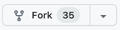

# Setting up Metadata Portal

Metadata Portal is a CLI and a self-hosted web page that shows you the latest metadata for a given network.

This is an important addition to Polkadot Vault, which can update the metadata inside only through a special video QR code without going online.

Parity Technologies hosts its own version of the Portal for Polkadot and Kusama.
https://metadata.parity.io/#/polkadot

External users (chain owners) are be able to deploy their versions of metadata portal if they want.

## Host your own Metadata Portal

### Fork the Portal repository
https://github.com/paritytech/metadata-portal


### Clone the forked repository (replace `<username>` with your GitHub username)
```bash
git clone https://github.com/<username>/metadata-portal.git
```

### Configure the Metadata Portal
Copy the following configuration into `config.toml`:
```toml
data_file = "public/data.json"
public_dir = "public"
qr_dir = "public/qr"

[verifier]
name = "Tutorial"
public_key = ""

[[chains]]
name = "node-template"
rpc_endpoint = "ws://localhost:9944"
color = "#348feb"
```


### Install dependencies
The main requirement is the OpenCV

#### Arch Linux:

OpenCV package in Arch is suitable for this.

`pacman -S clang qt5-base opencv`

#### Ubuntu:

`sudo apt install libopencv-dev clang libclang-dev`

#### MacOs:

`brew install opencv`

For more information, see:
https://github.com/paritytech/metadata-portal#dependencies

4. Build the project
```bash
cargo build --release
```
