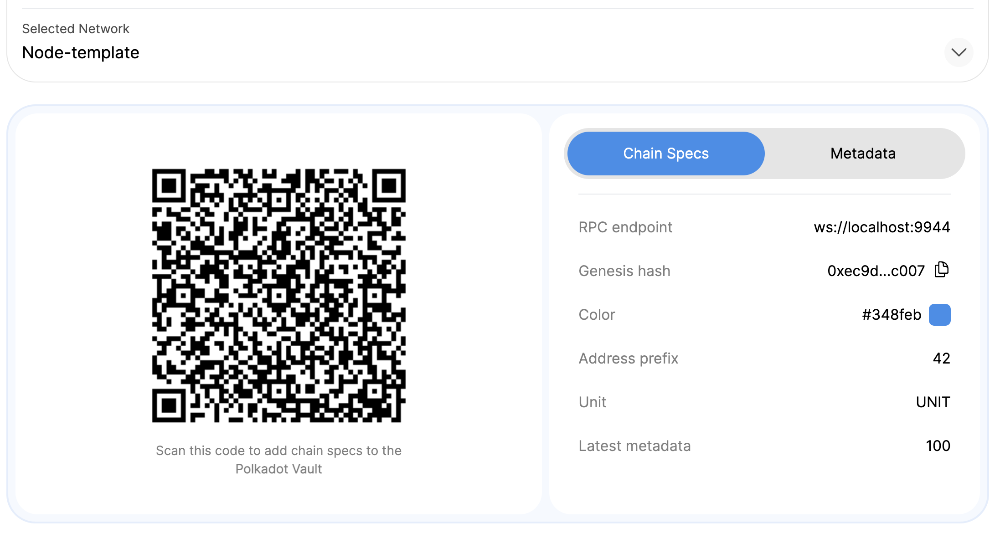

# Fetch & Sign Metadata

### Fetch metadata & chain spec

```bash
make updater
```

This will fetch metadata & chain spec from the network and generate unsigned QR
codes for them.

The output of the command should be similar to this:

```bash
[2023-05-29T07:27:27Z INFO ] ⚙️  Generating unsigned_node-template_specs.png...
[2023-05-29T07:27:27Z INFO ] ⚙️  Generating unsigned_node-template_metadata_100.apng...
```

### Sign metadata & chain spec using Portal CLI and Polkadot Vault

To start to signing process, run the following command:

```bash
make signer
```

1. Select `unsigned_node-template_specs` from the menu.

```bash
✔ Choose file to sign · unsigned_node-template_specs.png
```

2. Scan the QR code using your Polkadot Vault (PV) mobile app.

import add_unsigned_spec from "./assets/add_unsigned_spec.png";

<details>
  <summary>Screenshot</summary>
  <div
    style={{
      display: "flex",
      "flex-direction": "column",
      "align-items": "center",
    }}
  >
    
  </div>
</details>

3. Approve the unsigned spec.

import approve_unsigned_spec from "./assets/approve_unsigned_spec.png";

<details>
  <summary>Screenshot</summary>
  <div
    style={{
      display: "flex",
      "flex-direction": "column",
      "align-items": "center",
    }}
  >
    
  </div>
</details>

4. Go to the `Key Sets` menu and create a new key set you want to use for
   signing.

import empty_keyset from "./assets/empty_keyset.png";
import add_new_keyset from "./assets/add_new_keyset.png";
import keysets from "./assets/keysets.png";

<details>
  <summary>Screenshot</summary>
  <div
    style={{
      display: "flex",
      "flex-direction": "column",
      "align-items": "center",
    }}
  >
    
    
    
  </div>
</details>

5. In PV, go to `Settings -> Networks -> Node-Template -> ...` and select
   `Sign Network Specs`.

import settings from "./assets/settings.png";

<details>
  <summary>Screenshot</summary>
  <div
    style={{
      display: "flex",
      "flex-direction": "column",
      "align-items": "center",
    }}
  >
    
  </div>
</details>

6. Select the key set you want to use for signing, and you'll get a QR code with
   a signature

import select_key_for_signing from "./assets/select_key_for_signing.png";
import spec_signature from "./assets/spec_signature.png";

<details>
  <summary>Screenshot</summary>
  <div
    style={{
      display: "flex",
      "flex-direction": "column",
      "align-items": "center",
    }}
  >
    
    
  </div>
</details>

7. Scan the signature QR code using your computer and will generate a signed
   network QR.

```bash
✔ Ready to scan signature QR? · yes
⚙ generating /Users/pavel/Projects/tutorial-portal/public/qr/node-template_specs.png...
🎉 Signed!
```

8. Next, select `unsigned_node-template_metadata_100` from the menu.

```bash
✔ Choose file to sign · unsigned_node-template_metadata_100.apng
```

9. Scan the QR code using your Polkadot Vault (PV) mobile app and approve the
   unsigned metadata.

import add_unsigned_meta from "./assets/add_unsigned_meta.png";

<details>
  <summary>Screenshot</summary>
  <div style={{ display: "flex", "justify-content": "center" }}>
    
  </div>
</details>

10. In PV, go to `Settings -> Networks -> Node-Template` -> and select
    `Sign this metadata`.

import sign_metadata_menu from "./assets/sign_metadata_menu.png";

<details>
  <summary>Screenshot</summary>
  <div style={{ display: "flex", "justify-content": "center" }}>
    
  </div>
</details>

11. Select the key set you want to use for signing, and you'll get a QR code
    with a signature

import meta_signature from "./assets/meta_signature.png";

<details>
  <summary>Screenshot</summary>
  <div style={{ display: "flex", "justify-content": "center" }}>
    
  </div>
</details>

12. Scan the signature QR code using your computer and will generate a signed
    metadata QR.

```bash
✔ Ready to scan signature QR? · yes
⚙ generating /Users/pavel/Projects/tutorial-portal/public/qr/node-template_metadata_100.png...
🎉 Signed!
```

Perfect! Now you have signed metadata & chain spec 🎉

## Optional steps

### Clean up unused files

Call RPC node to determine what metadata is currently running, so old one can be
marked to removal.

```bash
make collector
```

Remove all unused files from the `public/qr` folder.

```bash
make cleaner
```

### Configure verifier key for Metadata Portal

Metadata portal has a `verify` command, which allows to verify that signature of
signed QR match the verifier. We haven't configured verifier key yet, so let's
do it now.

```bash
make verifier
```

This should throw an error, because we haven't configured verifier key yet.

> [2023-05-29T12:49:21Z ERROR] failed to verify node-template_metadata_100.apng:
> public key mismatch! Expected '', got \<hex_key\>

Put your verifier key in the `config.toml` file.

```toml
[verifier]
name = "Tutorial"
public_key = "<hex_key>"
```

### Run Metadata Portal

You can run Metadata Portal locally and see how it looks for your chain:

```bash
# Install dependencies
yarn
# Run dev server
yarn start
```


