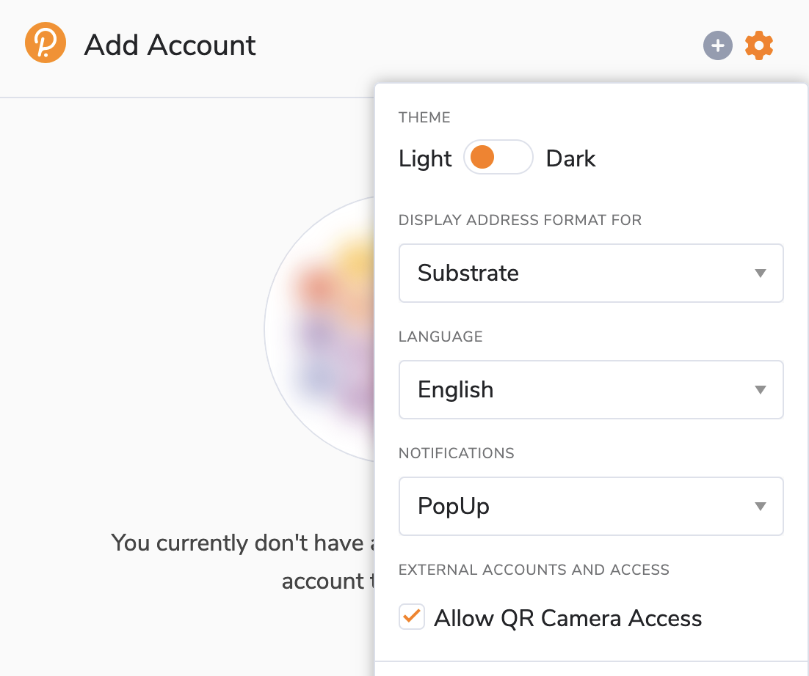
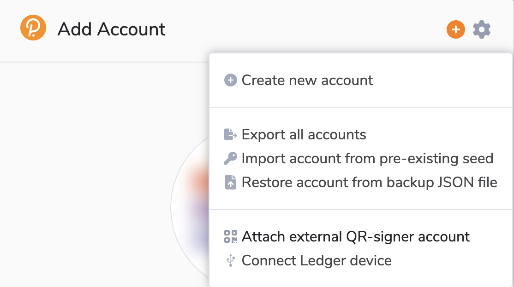
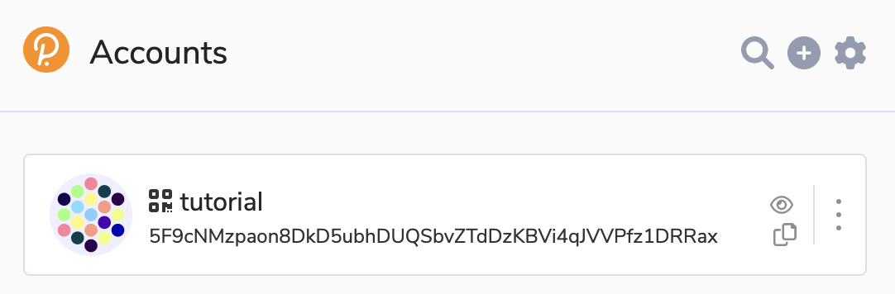
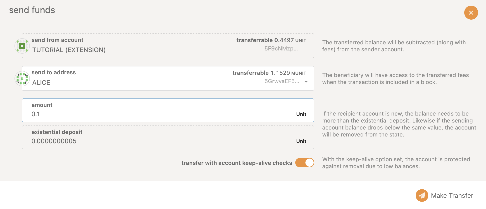

# Use Vault to sign transactions

This section will teach you about how to connect Polkadot Vault to the polkadot
browser extension.

You will be able to send some funds securely to anyone, without transferring
your private key, and without needing any internet connection on your mobile
phone.

## Prerequisites

Install
[Polkadot\{.js\} "developer" extension](https://polkadot.js.org/extension/) in
your browser.

## Export your account from PV to the extension

In PV select a key you'd like to export.

import pjs_key_to_export from "./assets/pjs_key_to_export.png";

  
Screenshot

  

    
  

In polkadot browser extension enable access to the camera.

Then press `+` and select `Attach external QR-signer account`.

Show QR code from PV to the camera of your computer.

## Sign a transaction

Go to
[polkadot.js.org](https://polkadot.js.org/apps/?rpc=ws%3A%2F%2Flocalhost%3A9944#/accounts)
and make sure you see the account you've just imported.

Send some funds to the account from default Alice account.

#### Send funds from the imported account

Select the account to you have to send funds to and click `Make transfer`
button. 

You will now be presented with a QR code that represents the transaction. Since
this transaction is sending funds from your Polkadot Vault mobile app account,
only this account (sitting on your phone) can sign and authorize this
transaction.

We will do this in the next steps:

- From the Polkadot Vault account overview, tap the scan button and scan the QR
  code presented by the Polkadot-js extension.
- Review the transaction addresses and the amount to send on your phone. The
  amount and addresses must match what you've entered in apps. If you got
  phished, this is where you can realize it and reject the transaction.
- Once you're sure, scroll down and click Sign Transaction to enter your pin and
  get the QR code of the scanned transaction.

import pjs_scan from "./assets/pjs_scan.png";

import pjs_sign_transaction from "./assets/pjs_sign_transaction.png";

import pjs_transaction_details from "./assets/pjs_transaction_details.png";

Your phone has now signed the transaction offline using your Polkadot Vault
account private key. The QR code that is now displayed on your phone represents
a signed transaction that can be broadcasted. We will do this in the next steps:

- On Polkadot-js extension, click on Scan Signature QR, this will ask to turn on
  your webcam again.
- Face your phone's display to your webcam for the website to be able to read
  the signed transaction.
- Your transaction is sent automatically.

Congrats you just sent funds from an air-gapped account :)
