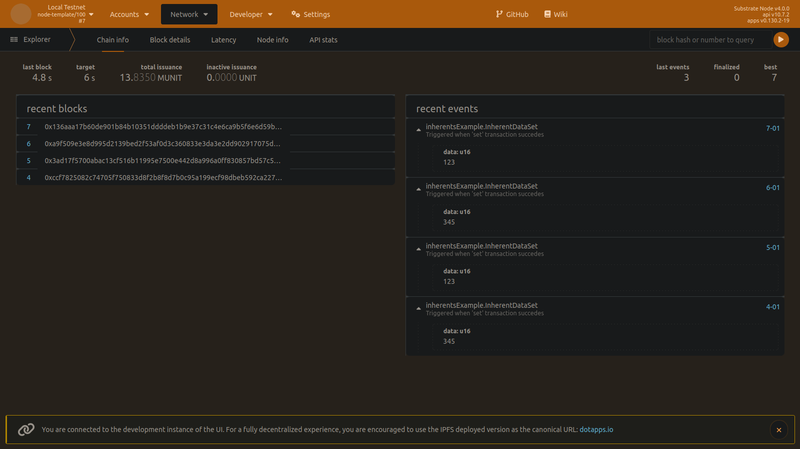

# Running the nodes
At this point the node is expected to compile:
```bash
cargo build --release
```
Please run Alice and Bob nodes in two separate terminals, providing the ```inherent-data``` parameter:
```bash
./node-template --base-path /tmp/alice --chain local --alice --validator --inherent-data 123
```
```bash
./node-template --base-path /tmp/bob --chain local --bob --validator --inherent-data 345
```
Now if you open https://polkadot.js.org/apps/#/explorer connected to the Local Testnet
you'll see emerging InherentDataSet events with alternating data values of 123 and 345
corresponding to the values passed as a parameter to Alice and Bob nodes respectively.

