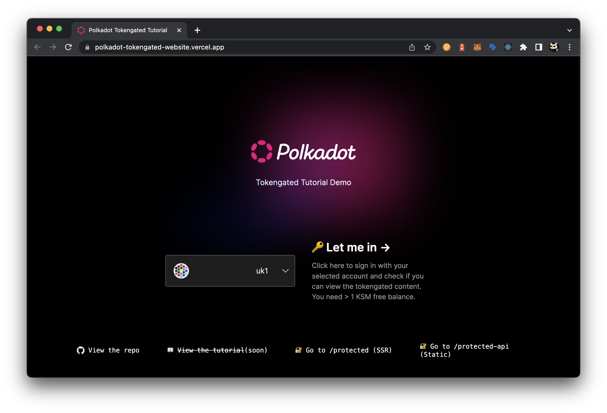

---
tags:
  - polkadot.js
  - next.js
  - tokengate
  - authentication
keywords: [polkadot.js, next, authentication, tokengated]
description: How to write a tokengated website with polkadot.js API and next.js
updated: 2023-03-08
author: niklasp
duration: 3h
level: intermediate
---

# Tokengated Website with polkadot.js and next-auth

In recent years, tokengated websites have become an increasingly popular way to
control access to sensitive information or functionality on a website. With web3
that can now be done without username + password authentication but instead
using a wallet and a browser extension.

The use cases for tokengated websites are diverse, ranging from user
authentication and authorization, to paid content, to API access control. In the
context of Non-Fungible Tokens (NFTs) or other crypto tokens, tokengated
websites can be used to provide exclusive access to content or functionality
based on the ownership of these tokens. This could include early access to new
releases, special events, or other benefits.

In this tutorial, we will walk through the process of creating a tokengated
website that is specifically designed to work with NFTs or other crypto tokens.
We will cover the basics of token authentication in substrate based chains with
the polkadot js API and how to create exclusive content and functionality that
is only accessible to users who own specific tokens.

## What you will build

[Github](https://github.com/niklasp/polkadot-js-tokengated-webssite) |
[Demo](https://polkadot-tokengated-website.vercel.app/)

## Time of completion

- 2-4 hours

## What you'll learn

- To build a nice user interface for account selection
- How to use the polkadot browser extension with next.js
- How to write a convenient hook to just `usePolkadotExtension`
- How to use `Context` and a `ContextProvider` to make all accounts available to
  your components
- How to work with next-auth to create a custom `CredentialsProvider` that
  authenticates users based on their signature.

## Prerequisites

- Basic react + next.js knowledge
- Basic knowledge of JSON Web Tokens (JWT)
- Basic knowledge of the polkadot js API

## Author

niftesty is a freelance frontend developer. He codes anything polkadot related
at the moment and has graduated in the Polkadot Blockchain Academy 2023 in
Buenos Aires.
