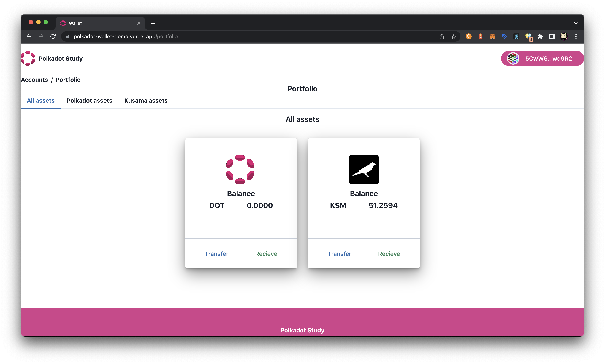

---
tags:
  - polkadot.js
  - wallet
  - react
keywords: [polkadot.js, react, wallet]
description:
  Write a simple wallet with polkadot js that can display balances and transfer
author: A-mont
duration: 2h
level: beginner
---

# Basic Wallet with Polkadot.js API and React with TypeScript.

## What you will build

[Github](https://github.com/A-mont/WalletTutorialExample) |
[Demo](https://polkadot-wallet-demo.vercel.app/portfolio)

## What you'll learn

- Create a simple project based on React and Typescript
- Use the basic functions available on Polkadot js API.
- Integrate the Polkadot and Kusama network on a project.
- Create the public and private keys using the Polkadot.js API.
- Build a simple graphical interface connected to the Polkadot and Kusama
  network.

## Prerequisites

- Basic knowledge about blockchain technology.
- Basic knowledge about the React Framework.
- knowledge about the ecosystem of Polkadot and Kusama.

## Author

- Adrian Montero Github user: A-mont
