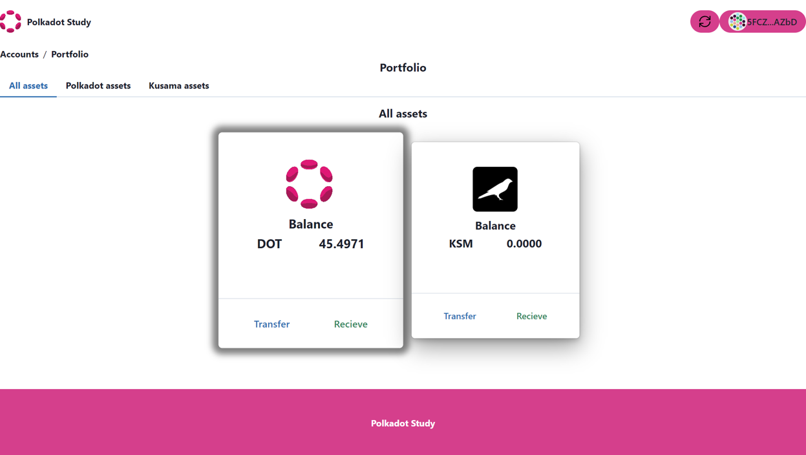

# Control and update balances on Polkadot and Kusama blockchains.

In this section you will understand the basic concepts about Polkadot/Kusama
testnets and we will add functionality a generic card component with a `Balance`
component.

## Basic concepts.

Polkadot and Kusama offer several testnets that developers can use to experiment
and develop their blockchain applications before deploying them on the main
network. These testnets include:

**1. Westend Testnet:** This is the Polkadot testnet that developers can use to
test their applications before deploying them on the main Polkadot network. It
is a stable and secure testnet that supports all the features of the main
network.

**2. Rococo Testnet:** Rococo is a parachain testnet that developers can use to
test their parachain implementations. It is a canary network that is used to
test new features and improvements before they are deployed on the main Polkadot
network.

**3. Kusama Testnet:** This is the Kusama testnet that developers can use to
test their applications before deploying them on the main Kusama network. It is
designed to be more experimental and riskier than the Polkadot testnet, as it
allows developers to test new ideas without risking the stability of the main
network.

**4. Shell Testnet:** This is a testnet that is used to test new features and
improvements before they are deployed on the Kusama network. It is a canary
network that is used to test the stability and security of new features.

In this tutorial we will use the **Rococo testnet** to update balances.

## Getting Tokens on the Westend Testnet.

Polkadot's testnet is called Westend and you can obtain its native tokens
(called Westies!) by posting !drip \<WESTEND_ADDRESS\> in the Matrix chatroom
#westend_faucet:matrix.org. Your account will be credited with 1 WND by default.
You can also specify to get more tokens by !drip \<WESTEND_ADDRESS\> X, where X
is the number of tokens.

## Getting Tokens on the Rococo Testnet.

Rococo is a parachain testnet. Tokens are given directly to teams working on
parachains or exploring the cross consensus message passing aspects of this
testnet. General users can obtain ROC by posting !drip \<ROCOCO_ADDRESS\> in the
Matrix chatroom #rococo-faucet:matrix.org.

## Exercises

This exercise will consist of completing the code in the `Balance` functional
component provided in the cloned example repository.

### 3. Add functionality to GenericCard graphic component using Polkadot-js API.

To add functionality to the GenericCard component we will add the Balance
component. This component updates the available balances for a public address.

#### 1. Import library components

The next step will be to build a new component that we will call balance and it
can be used in the genericcard or in some other component of your own projects.

To add functionality to the balance component we will need to import 2
components from the polkadot-js API, these are:

**WsProvider:** component is used to establish a WebSocket connection with a
Polkadot network node.

**ApiPromise:** component is used to interact with the blockchain node through
the WebSocket connection established with WsProvider.

To build the balance component we first import some necessary react elements and
finally the ApiPromise and WsProvider components of the polkadot-js API.

```ts title=src/pages/portfolio/Balance.tsx
import { useState, useEffect } from "react";
import { ApiPromise, WsProvider } from "@polkadot/api";
```

#### 2. Use local storage.

In this example we use local storage to store the keys generated with the seed
phrase.

In this step we will get the stored public key and get the balance associated
with this public key.

```ts title=src/pages/portfolio/Balance.tsx
// Get the public key stored in local storage
const publicKey = localStorage.getItem("Publickey");
```

#### 3. Create states in React.

We will now add the necessary states using the useState hook.

```ts title=src/pages/portfolio/Balance.tsx
// Store the public key in a state
const [account, setAccount] = useState(publicKey);

// Create a state for the balance.
const [Balances, setBalances] = useState(0);
```

#### 4. Create an instance.

We create an instance called wsProvider, this is a necessary element to obtain
the connection with the node.

```ts title=src/pages/portfolio/Balance.tsx
// Create an instance of the Polkadot network provider
const wsProvider = new WsProvider(wsEndpoint);
```

#### 5. Add Balance function.

In this step we will add the function balance which will create an api called
instance of the Polkadot-js API using ApiPromise. This function will get the
balances and update if necessary.

```ts title=src/pages/portfolio/Balance.tsx
const Balance = async function (account: any) {
  // Create an instance of the Polkadot JS API
  const api = await ApiPromise.create({ provider: wsProvider });

  // Get the public key stored in local storage
  setAccount(localStorage.getItem("Publickey"));

  // Retrieve the initial balance. Since the call has no callback, it is simply a promise
  // that resolves to the current on-chain value
  let {
    data: { free: previousFree },
    nonce: previousNonce,
  }: any = await api.query.system.account(account);

  // Read balance on Network
  const amount = Number(previousFree) / 1000000000000;
  setBalances(amount);

  // Here we subscribe to any balance changes and update the on-screen value
  api.query.system.account(
    account,
    ({ data: { free: currentFree }, nonce: currentNonce }: any) => {
      // Calculate the delta
      const change = currentFree.sub(previousFree);

      // Only display positive value changes (Since we are pulling `previous` above already,
      // the initial balance change will also be zero)
      if (!change.isZero()) {
        previousFree = currentFree;
        previousNonce = currentNonce;

        // Read balance on Network
        const Newamount = Number(previousFree) / 1000000000000;

        // Update state
        setBalances(Newamount);
      }
    }
  );
};
```

Note that this component takes the public key stored in local storage and gets
the balance.

#### 6. useEffect in React.

useEffect is a React hook that allows performing side effects in functional
components. It is used to execute code in response to changes in state or the
rendering of a component.

Finally, we need to add useEffect for update the states in Balance function.

```ts title=src/pages/portfolio/Balance.tsx
// Update balance
useEffect(() => {
  Balance(account);
});
```

The component would look like this:



Great !!!, now you have a graphical component that gets the balance of the
public key stored in local storage.

import Quiz from "/src/components/quiz";

export const onequestion = {
  question: "What is the Westend Testnet used for?",
  answers: [
    "Testing parachain implementations",
    "Testing new features and improvements",
    "Testing applications before deployment on Polkadot mainnet",
    "Testing applications before deployment on Kusama mainnet",
  ],
  correctAnswerIdx: [2],
  msgCorrect: "Correct answer. Good job.",
  msgIncorrect: "Incorrect answer. Please try again.",
  explanation:
    "Correct, Westend Testnet is used for testing applications before deployment on Polkadot mainnet",
};

export const twoquestion = {
  question: "What is the Rococo Testnet used for?",
  answers: [
    "Testing parachain implementations",
    "Testing new features and improvements",
    "Testing applications before deployment on Polkadot mainnet",
    "Testing applications before deployment on Kusama mainnet",
  ],
  correctAnswerIdx: [0],
  msgCorrect: "Correct answer. Good job.",
  msgIncorrect: "Incorrect answer. Please try again.",
  explanation:
    "Correct, Rococo Testnet is used for testing parachain implementations",
};

export const thirdquestion = {
  question: "What is the Kusama Testnet used for?",
  answers: [
    "Testing parachain implementations",
    "Testing new features and improvements",
    "Testing applications before deployment on Polkadot mainnet",
    "Testing applications before deployment on Kusama mainnet",
  ],
  correctAnswerIdx: [3],
  msgCorrect: "Correct answer. Good job.",
  msgIncorrect: "Incorrect answer. Please try again.",
  explanation:
    "Correct, Kusama Testnet is used for testing applications before deployment on Kusama mainnet",
};

<Quiz quizItem={onequestion} />

<Quiz quizItem={twoquestion} />

<Quiz quizItem={thirdquestion} />
