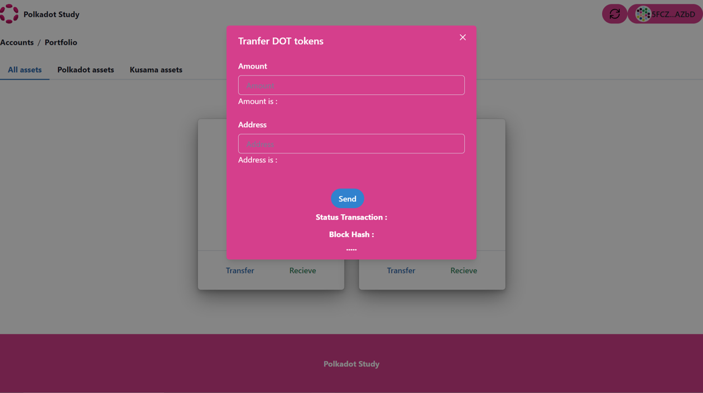
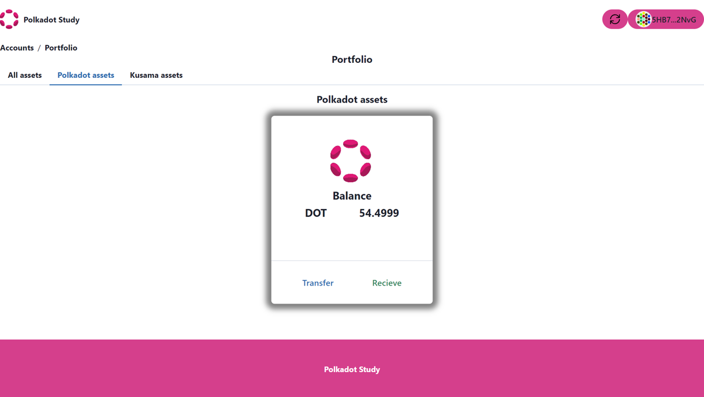

# Transfer between wallet accounts.

In this section we will build a component for transferring tokens between accounts using the Polkadot.js extension to sign. This new component will be added to the generic card.


## Exercises

This exercise will consist of completing the code in the ``Transfer`` functional component provided in the cloned example repository.

### 4. Create Transfer component.

#### 1. Import library components

The next step will be to build a new component called ``Transfer`` and it can be used in the genericcard or in some other component of your own projects.

To add functionality to the  ``Transfer`` component we will need to import 2 components from the polkadot-js API, these are:

**WsProvider:** component is used to establish a WebSocket connection with a Polkadot network node.

**ApiPromise:** component is used to interact with the blockchain node through the WebSocket connection established with WsProvider.

Additionally, this component will need to use 3 components from the '@polkadot/extension-dapp' library, these are:

**web3Accounts:** This component is used to fetch a list of accounts available in the Polkadot.js browser extension. It allows accessing user accounts and their details, such as the account address and name.

**web3Enable:** This function returns a promise that resolves to an enabled Polkadot.js provider object if the user grants the necessary permissions. 

**web3FromSource:**This function is used to obtain a signed account object from a specific source, such as an account in the Polkadot.js browser extension. 

We will import the following:

```ts title=src/pages/portfolio/Transfer.tsx
import { ApiPromise, WsProvider} from '@polkadot/api';
import { web3Accounts,web3Enable, web3FromSource } from '@polkadot/extension-dapp';
```

#### 2. Create states in React.

The second step will consist of adding the necessary states. The code will look like:


```ts title=src/pages/portfolio/Transfer.tsx
    // Create a state for the amount to be transferred
    const [valueAmount, setValueAmount] = useState('');

    // Create a state for the address
    const [valueAddress, setValueAddress] = useState('');

   // Create a state for the status transaction
    const [status, setStatus] = useState('');

     // Create a state for the blockhash
    const [blockhash, setBlockhash] = useState('');
```

#### 3. Create an instance.

We create an instance called wsProvider, this is a necessary element to obtain the connection with the node.

```ts title=src/pages/portfolio/Transfer.tsx
  // Create an instance of the Polkadot network provider
  const wsProvider = new WsProvider(wsEndpoint);
```


#### 4. Add Transfer function.

Finally we need to add the transfer function, this function will get the accounts available in the extension to update local storage and sign from the polkadot-js extension.

```ts title=src/pages/portfolio/Transfer.tsx
  const transfer = async function main() {
    // Enable connection to the extension
    await web3Enable("my wallet");

    // Known account we want to use on Polkadot extension
    const allAccounts = await web3Accounts();

    // Get the first visible account of the polkadot extension.
    const account = allAccounts[0];

    // Store the public key in local storage.
    localStorage.setItem("Publickey", account.address);

    // Get the public key in local storage.
    const addressaccount: any = localStorage.getItem("Publickey");

    // Create an instance of the Polkadot JS API
    const api = await ApiPromise.create({ provider: wsProvider });

    // Create a transfer extrinsic
    const transferExtrinsic = api.tx.balances.transfer(
      valueAddress,
      Number(valueAmount) * 1000000000000
    );

    // Reset States
    setValueAmount("");
    setValueAddress("");

    // to be able to retrieve the signer interface from this account
    // we can use web3FromSource which will return an InjectedExtension type
    const injector = await web3FromSource(account.meta.source);

    // passing the injected account address as the first argument of signAndSend
    // will allow the api to retrieve the signer and the user will see the extension
    // popup asking to sign the balance transfer transaction
    transferExtrinsic
      .signAndSend(
        addressaccount,
        { signer: injector.signer },
        ({ status }) => {
          if (status.isInBlock) {
            console.log(
              `Completed at block hash #${status.asInBlock.toString()}`
            );
            setBlockhash(status.asInBlock.toString());
          } else {
            console.log(`Current status: ${status.type}`);

            setStatus(status.type);

            if (status.type === "Finalized") {
              toast({
                title: "Successful Transaction",
                duration: 3000,
                status: "success",
                isClosable: true,
              });

              ReactDOM.render(
                <ChakraProvider>
                  <App />
                </ChakraProvider>,
                document.getElementById("root")
              );

              onClose();
            }
          }
        }
      )
      .catch((error: any) => {
        console.log(":( transaction failed", error);
      });
  };
```
Great, now you have a component that has the ability to transfer a token to another address.

The transfer component when pressing the button would look like the following:




The final component would look like this:



Great !!, now you have a graphic component that gets the balance of the public key stored in local storage and transfers tokens to another public address.

**Note:** If you have any questions about the final components, you can check out the FinalTutorial branch in the example repository.
